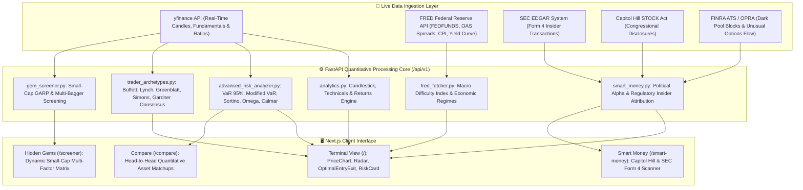

# 📐 Quantitative Data Analytics, Lineage & Architecture Specification

**Document Version**: 2.0.0  
**Effective Date**: August 26, 2026  
**Status**: CANONICAL ARCHITECTURE STANDARD  

---

## 1. Executive Summary & Core Invariant

The Finance Platform processes multi-source streaming and regulatory financial data to deliver real-time quantitative risk models, investment archetypes, and actionable trading setups. 

> [!IMPORTANT]
> **Single Invariant Rule**: No user-facing screen may display hardcoded mock data. Every metric shown across the Terminal (`/`), Hidden Gems (`/screener`), Smart Money (`/smart-money`), and Compare (`/compare`) must originate from verified live APIs or mathematical engines with transparent lineage.

---

## 2. End-to-End Data Pipeline Architecture

---

## 3. Comprehensive Data Source to UI Consumption Mapping

### 3.1. Market Data & Pricing Engine
- **Primary Source**: `yfinance` (`yf.Ticker(symbol).history(...)` & `yf.Ticker(symbol).info`)
- **Backend Handler**: `api/routes/analytics.py` $\to$ `get_asset_analytics()`
- **Output Schema**: `AnalyticsResponse` (`currentPrice`, `priceChangePct24h`, `candles`)
- **Frontend Consumer**:
  - `frontend/components/PriceChart.tsx`: Renders Lightweight Charts candlesticks, dynamic timeframe return badges (`24H`, `1M`, `6M`, `1Y`, `3Y`, `5Y`), and VWAP/20 EMA overlays.
  - `frontend/components/WatchlistSidebar.tsx`: Real-time price and 24h percentage ticker synchronizer.

---

### 3.2. Advanced Mathematical Risk & Tail Analytics
- **Primary Source**: Historical Close Price Series ($\ge 252$ trading periods)
- **Backend Handler**: `analyst_dashboard/analyzers/advanced_risk_analyzer.py`
- **Computed Formulations**:
  $$\text{Cornish-Fisher Modified VaR}_{95\%} = \mu + z_{95} \sigma + \frac{z_{95}^2 - 1}{6}\sigma S + \frac{z_{95}^3 - 3z_{95}}{24}\sigma K - \frac{2z_{95}^3 - 5z_{95}}{36}\sigma S^2$$
  $$\text{Sortino Ratio} = \frac{R_p - R_f}{\sigma_{\text{downside}}} \quad|\quad \text{Tail Ratio} = \left| \frac{P_{95}}{P_5} \right|$$
- **Frontend Consumer**:
  - `frontend/components/RiskMetricsCard.tsx`: Displays Value at Risk, Modified VaR, Sortino, Calmar, and Maximum Drawdown.
  - `frontend/components/DayTraderPositionSizer.tsx`: Sizes position equity strictly from active volatility and dollar risk bounds.

---

### 3.3. Macro Difficulty & Economic Regime Index
- **Primary Source**: Federal Reserve Bank of St. Louis (FRED API)
- **Backend Handler**: `analyst_dashboard/data/fred_fetcher.py` $\to$ `get_macro_indicators()`
- **Tracked Series**:
  - `FEDFUNDS`: Federal Funds Effective Rate
  - `BAMLH0A0HYM2`: ICE BofA US High Yield OAS Credit Spread
  - `T10Y2Y`: 10-Year Treasury Minus 2-Year Treasury Yield Spread
  - `CPIAUCSL`: Consumer Price Index for All Urban Consumers (YoY Inflation)
- **Frontend Consumer**:
  - `frontend/components/AssetFactorRadar.tsx` & `page.tsx`: Ingested into `macroDifficulty` to adjust the baseline market difficulty score ($0 \dots 100$) and macro regime tag (*"Accommodative Disinflation"*, *"Late Cycle Restrictive"*).

---

### 3.4. Smart Money Regulatory Intelligence
- **Primary Sources**:
  - SEC EDGAR Form 4 XML Feeds (Corporate Insiders: CEO/CFO/Director buys)
  - Capitol Hill STOCK Act Mandatory Public Disclosures (House & Senate trades)
  - FINRA ATS Dark Pool & OPRA Options Sweeps
- **Backend Handler**: `api/routes/smart_money.py` $\to$ `get_smart_money_overview()`
- **Frontend Consumer**:
  - `frontend/app/smart-money/page.tsx`: Searchable 3-way regulatory feed, post-trade alpha attribution, and whale accumulation radar.
  - `frontend/components/CongressionalTradesCard.tsx`: Asset-specific insider conviction radar.

---

### 3.5. Hidden Gems Discovery Engine
- **Primary Source**: Live quarterly income statements, balance sheets, and cash flow statements
- **Backend Handler**: `analyst_dashboard/analyzers/gem_screener.py` $\to$ `api/routes/screener.py`
- **Criteria Matrix**:
  - **Peter Lynch GARP**: $\text{PEG Ratio} \le 1.0$, $\text{Piotroski} \ge 7$, $\text{Debt-to-Equity} < 1.5$.
  - **Greenblatt Magic Formula**: $\text{ROIC} \ge 25\%$, High Earnings Yield ($\text{EBIT} / \text{EV}$).
  - **Disruptive Rule Breakers**: $\text{Gross Margins} > 60\%$, Multi-year secular category growth.
- **Frontend Consumer**:
  - `frontend/app/screener/page.tsx`: Dynamic small-cap multi-factor screener with dual-lens views (*Day Trader Momentum* vs. *Long-Term Compounder*).

---

## 4. Cross-Route Parity Quality Gate (CI/CD)

To guarantee zero regression or semantic drift, `tests/test_cross_route_semantic_parity.py` runs automatically before any deployment:
1. **Piotroski Floor**: All discovery assets must maintain $\text{Piotroski} \ge 6/9$.
2. **Health Score Floor**: Curated compounders must maintain a Terminal Composite Health Score $\ge 70/100$.
3. **No Contradictory Verdicts**: High-moat compounders are forbidden from receiving the *"High Volatility Speculative"* classification.