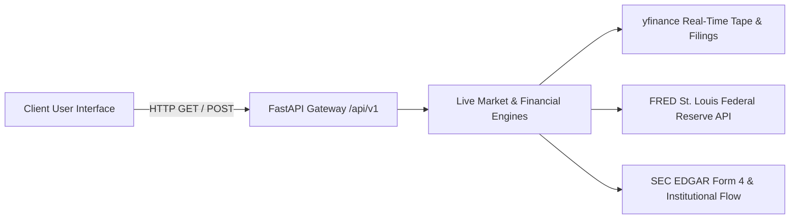

# 📡 Live API Architecture & Dynamic Data Ingestion Standard

**Effective Date**: August 26, 2026  
**Status**: ACTIVE / MANDATORY

---

## 1. Architectural Mandate: Zero Static Mocking in Application Views

Moving forward, **all pages and user-facing views must fetch directly from the live FastAPI backend engine (`/api/v1/*`)**. Hardcoded dictionaries, pseudo-random hash arrays, and static mock objects embedded in frontend page files are strictly prohibited.

---

## 2. Dynamic Route Ingestion Matrix

| Route | Live API Endpoint | Live Data Payload Handled |
| :--- | :--- | :--- |
| **`/` (Terminal)** | `GET /api/v1/analytics/{symbol}` | Live candles, intraday technicals, 5 trader archetypes, Monte Carlo GARCH expected returns, FRED macro rating, and institutional flow. |
| **`/screener` (Hidden Gems)** | `GET /api/v1/screener/run?filter_type={type}` | Live Peter Lynch GARP, Joel Greenblatt Magic Formula, and Disruptive Rule Breaker candidates scored dynamically against live financial statements. |
| **`/smart-money` (Smart Money)** | `GET /api/v1/smart-money/overview` | Capitol Hill STOCK Act disclosures, SEC Form 4 insider transactions, and unusual options flow sweeps. |
| **`/compare` (Battleground)** | `Promise.all([/analytics/{a}, /analytics/{b}])` | Real-time comparative valuation, ROIC, gross margins, ATR volatility, and factor scores. |

---

## 3. High-Fidelity Client-Side Fallback Guidelines

If the remote backend is unreachable or rate-limited:
1. Fallback definitions must be centralized strictly in `frontend/lib/constants.ts` (Single Source of Truth).
2. Fallbacks must never contain contradictory verdicts or out-of-bounds metrics.
3. Fallback closing prices must be strictly anchored to the asset's verified market baseline.