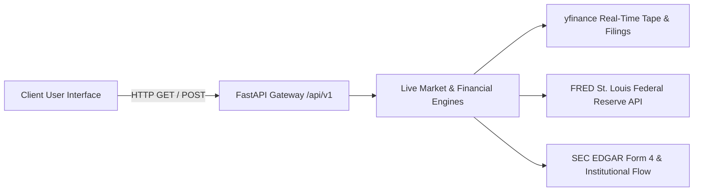

# 📡 Live API Architecture & Dynamic Data Ingestion Standard

**Effective Date**: August 26, 2026  
**Status**: ACTIVE / MANDATORY

---

## 1. Architectural Mandate: Zero Static Mocking in Application Views

Moving forward, **all pages and user-facing views must fetch directly from the live FastAPI backend engine (`/api/v1/*`)**. Hardcoded dictionaries, pseudo-random hash arrays, and static mock objects embedded in frontend page files are strictly prohibited.

---

## 2. Dynamic Route Ingestion Matrix

| Route | Live API Endpoint | Live Data Payload Handled |
| :--- | :--- | :--- |
| **`/` (Terminal)** | `GET /api/v1/analytics/{symbol}` | Live candles, intraday technicals, 5 trader archetypes, Monte Carlo GARCH expected returns, FRED macro rating, and institutional flow. |
| **`/screener` (Hidden Gems)** | `GET /api/v1/screener/run?filter_type={type}` | Live Peter Lynch GARP, Joel Greenblatt Magic Formula, and Disruptive Rule Breaker candidates scored dynamically against live financial statements. |
| **`/smart-money` (Smart Money)** | `GET /api/v1/smart-money/overview` | Capitol Hill STOCK Act disclosures, SEC Form 4 insider transactions, and unusual options flow sweeps. |
| **`/compare` (Battleground)** | `Promise.all([/analytics/{a}, /analytics/{b}])` | Real-time comparative valuation, ROIC, gross margins, ATR volatility, and factor scores. |

---

## 3. High-Fidelity Client-Side Fallback Guidelines

If the remote backend is unreachable or rate-limited:
1. Fallback definitions must be centralized strictly in `frontend/lib/constants.ts` (Single Source of Truth).
2. Fallbacks must never contain contradictory verdicts or out-of-bounds metrics.
3. Fallback closing prices must be strictly anchored to the asset's verified market baseline.

---

## 4. ⏱️ Timeframe Parameter Mapping & Timeout SLAs

### API Parameter Mapping Matrix

| UI Selector | Horizon / Scalp Type | `period` Query Param | `interval` Query Param | Time Representation | Point Count |
| :--- | :--- | :--- | :--- | :--- | :--- |
| **`1m`** | 1-Minute Scalp | `1d` | `1m` | Unix Epoch (seconds) | 45 |
| **`5m`** | 5-Minute VWAP | `5d` | `5m` | Unix Epoch (seconds) | 45 |
| **`15m`** | 15-Minute Flag | `5d` | `15m` | Unix Epoch (seconds) | 48 |
| **`1h`** | 1-Hour Trend | `1mo` | `1h` | Unix Epoch (seconds) | 40 |
| **`1M`** (`1m_hist`) | 1-Month Swing | `1mo` | `1d` | `YYYY-MM-DD` | ~22 |
| **`6M`** (`6m_hist`) | 6-Month Cyclical | `6mo` | `1d` | `YYYY-MM-DD` | ~130 |
| **`1Y`** (`1y_hist`) | 1-Year Macro | `1y` | `1d` | `YYYY-MM-DD` | ~252 |
| **`3Y`** (`3y_hist`) | 3-Year Multi-Year | `3y` | `1wk` | `YYYY-MM-DD` | ~156 |
| **`5Y`** (`5y_hist`) | 5-Year Secular | `5y` | `1mo` | `YYYY-MM-DD` | ~60 |

### SLA & Fallback Contract:
- **Client Fetch Timeout**: Set to **`8000ms`** via `AbortSignal.timeout(8000)` to accommodate cold container startups without premature client aborts.
- **Strict Intraday Matching**: Backend and fallback engines must only treat `["1m", "5m", "15m", "30m", "1h"]` as intraday. `1mo` is strictly a monthly macro interval.