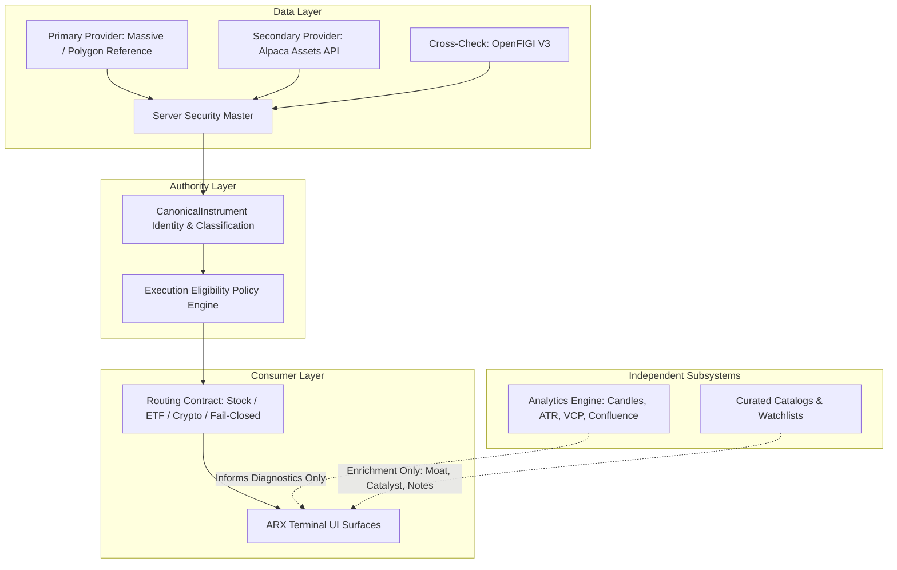

# ARX TERMINAL — CANONICAL SERVER SECURITY MASTER
## CLASSIFICATION & EXECUTION ELIGIBILITY CONTRACT
### ARCHITECTURAL DESIGN SPECIFICATION & GATE ARTIFACT

**Document Version**: 1.0.0
**Design Gate Status**: `PASS_ARX_CANONICAL_SECURITY_MASTER_DESIGN`
**Implementation Prerequisite**: `PROVIDER_ACCESS_READINESS`
**Target Subsystem**: `api/` (Backend Security Master & Routing Contract) & `frontend/` (Enrichment-Only Client)
**Governing Invariants**: `INV-SECMASTER-01` through `INV-SECMASTER-14`

---

## 0. Executive Summary & Purpose

This specification formally designs and freezes the **Canonical Server Security Master**, **Instrument Classification Authority**, and **Execution Eligibility Policy** for ARX Terminal.

### Problem Statement
An architectural audit triggered by ticker `PLSE` (Pulse Biosciences, Inc.) revealed that ARX Terminal's execution routing was gated exclusively by client-side dictionaries (`MASTER_ASSET_CATALOG` with ~40 entries and `SHARED_WATCHLIST_ITEMS` with 20 entries in `frontend/lib/assetTypeUtils.ts`). Any valid exchange-traded equity outside this hardcoded list—regardless of quantitative validity on the server—resolved as `UNKNOWN` and was suppressed from execution surfaces (`OptimalEntryExitCard` and `PreFlightChecklistModal`).

### Solution
This design relocates instrument classification authority entirely to the server, defines a typed classification and eligibility contract, decouples quantitative analytics capability from execution eligibility, preserves strict fail-closed routing for unsupported and ambiguous instruments, and demotes curated catalogs to pure presentation and discovery enrichment.

---

## 1. Required Architectural Separation

The platform enforces five strictly decoupled operational layers:



### Architectural Guarantees
1. **Instrument Identity Authority**: Answered exclusively by `Server Security Master` (*"What is this instrument?"*).
2. **Execution Support Authority**: Answered exclusively by `Execution Eligibility Policy` (*"May this instrument use a particular execution surface?"*).
3. **Analytics Capability Authority**: Answered by `Analytics Engine` (*"Can the system calculate quantitative models for this data?"*). Analytics success **never** confers trading eligibility.
4. **Curated Metadata Authority**: Managed by `Curated Catalogs` for display labels, investment narratives, and watchlist defaults. Catalog membership **never** determines classification or routing.

---

## 2. Canonical Security Master Contract

### 2.1 Server Domain Model (`CanonicalInstrument`)

```python
from enum import Enum
from typing import Optional
from pydantic import BaseModel, Field

class AssetClass(str, Enum):
    EQUITY = "EQUITY"
    ETF = "ETF"
    CRYPTO = "CRYPTO"
    FUND = "FUND"
    FIXED_INCOME = "FIXED_INCOME"
    OTHER = "OTHER"
    UNKNOWN = "UNKNOWN"

class SecurityType(str, Enum):
    COMMON_STOCK = "COMMON_STOCK"
    ADR = "ADR"
    PREFERRED = "PREFERRED"
    REIT = "REIT"
    CLOSED_END_FUND = "CLOSED_END_FUND"
    WARRANT = "WARRANT"
    UNIT = "UNIT"
    RIGHT = "RIGHT"
    ETF = "ETF"
    CRYPTO = "CRYPTO"
    OTHER = "OTHER"
    UNKNOWN = "UNKNOWN"

class ListingStatus(str, Enum):
    ACTIVE = "ACTIVE"
    INACTIVE = "INACTIVE"
    DELISTED = "DELISTED"
    UNKNOWN = "UNKNOWN"

class ClassificationStatus(str, Enum):
    VERIFIED = "VERIFIED"
    UNVERIFIED = "UNVERIFIED"
    UNSUPPORTED = "UNSUPPORTED"
    CONFLICTED = "CONFLICTED"

class ExecutionEligibility(str, Enum):
    STOCK_EXECUTION = "STOCK_EXECUTION"
    ETF_EXECUTION = "ETF_EXECUTION"
    CRYPTO_EXECUTION = "CRYPTO_EXECUTION"
    UNSUPPORTED = "UNSUPPORTED"
    UNKNOWN = "UNKNOWN"

class AnalyticsCapability(str, Enum):
    AVAILABLE = "AVAILABLE"
    UNAVAILABLE = "UNAVAILABLE"
    PARTIAL = "PARTIAL"
    UNKNOWN = "UNKNOWN"

class CanonicalInstrument(BaseModel):
    symbol: str = Field(..., description="Normalized canonical ARX ticker")
    provider_symbol: str = Field(..., description="Provider-native lookup identifier")
    asset_class: AssetClass = Field(default=AssetClass.UNKNOWN)
    security_type: SecurityType = Field(default=SecurityType.UNKNOWN)
    primary_exchange: str = Field(default="UNKNOWN")
    listing_status: ListingStatus = Field(default=ListingStatus.UNKNOWN)
    classification_status: ClassificationStatus = Field(default=ClassificationStatus.UNVERIFIED)
    execution_eligibility: ExecutionEligibility = Field(default=ExecutionEligibility.UNKNOWN)
    analytics_capability: AnalyticsCapability = Field(default=AnalyticsCapability.UNKNOWN)
    classification_authority: str = Field(..., description="Authoritative server subsystem/provider")
    source_provider: str = Field(..., description="Primary provider supplying metadata")
    classification_timestamp: str = Field(..., description="ISO 8601 UTC timestamp of resolution")
    source_updated_at: Optional[str] = Field(None, description="Provider timestamp of source record update")
```

---

## 3. Canonical Identity & Normalization Rules

| Normalization Domain | Canonical Rule | Example Input $\rightarrow$ Output | Failure / Fallback Policy |
| :--- | :--- | :--- | :--- |
| **Symbol Case & Whitespace** | Strip surrounding whitespace; uppercase ASCII strictly. | `" plse "` $\rightarrow$ `"PLSE"` | Empty / non-alphanumeric fails as `UNKNOWN`. |
| **Share Class Delimiters** | Convert dot notations to standard hyphen representation. | `"BRK.B"` $\rightarrow$ `"BRK-B"`, `"BF.B"` $\rightarrow$ `"BF-B"` | Unrecognized delimiter patterns fail closed. |
| **Provider Suffixes** | Strip regional vendor suffixes for primary US equities. | `"AAPL.US"` $\rightarrow$ `"AAPL"` | Non-US exchange suffixes resolve to `OTHER` / `UNSUPPORTED`. |
| **Crypto Pairs** | Digital assets must adhere to `{BASE}-USD` standard. | `"BTC"` $\rightarrow$ `"BTC-USD"` (when classified as Crypto) | Bare tokens lacking fiat pair resolve to `UNVERIFIED`. |
| **Exchange Disambiguation** | Primary exchange mapped to ISO MIC codes (`XNAS`, `XNYS`, `BATS`, `ARCX`). | `"NASDAQ"` $\rightarrow$ `"XNAS"`, `"NYSE"` $\rightarrow$ `"XNYS"` | Unmapped exchange defaults to `"UNKNOWN"`. |
| **Symbol Collisions** | Composite FIGI / CIK used as invariant secondary anchor. | Delisted vs Relisted symbol collisions | Resolve to currently `ACTIVE` listing; delisted remains archived. |
| **Corporate Renames** | Maintain CIK/FIGI identity ledger across rebrands. | `FB` $\rightarrow$ `META` | Historic lookups redirect with deprecation notice; zero data mix. |
| **Delisting Policy** | Mark `listing_status = DELISTED`; revoke execution eligibility. | Delisted equity | `execution_eligibility = UNSUPPORTED`; `route = FAIL_CLOSED`. |

---

## 4. Classification Source Authority & Precedence

### 4.1 Source Inventory

| Source Candidate | Fields Available | Asset Class? | Security Type? | Exchange? | Active Status? | Rate Limit / Plan | Production Readiness |
| :--- | :--- | :--- | :--- | :--- | :--- | :--- | :--- |
| **Massive / Polygon Reference** | `ticker`, `name`, `market`, `type`, `primary_exchange`, `active`, `cik`, `composite_figi` | **YES** | **YES** (`CS`, `ETF`, `ADRC`, `PREF`, `WARRANT`, `RIGHT`, `UNIT`) | **YES** | **YES** | Bounded per plan tier | Primary Authority Candidate |
| **Alpaca Asset API (`/v2/assets`)** | `symbol`, `name`, `class`, `exchange`, `status`, `tradable`, `attributes` | **YES** (`us_equity`, `crypto`) | **PARTIAL** (Attributes distinguish fractionable/options) | **YES** | **YES** | Standard account limit | Secondary Authority Candidate |
| **OpenFIGI V3 API** | `figi`, `securityType`, `marketSector`, `shareClassFIGI` | **YES** | **YES** | **YES** | **PARTIAL** | Open tier rate-limited | Tertiary Institutional Crosscheck |
| **SEC EDGAR CIK Mapping** | `cik`, `ticker`, `title` | **PARTIAL** (Corporate reporting) | **NO** | **NO** | **PARTIAL** | 10 req/sec strict | Regulatory Crosscheck Only |
| **Backend `KNOWN_ETFS`** | Set of 15 institutional ETF tickers | **YES** | **YES** | **NO** | **NO** | Zero overhead | Internal Emergency Fallback Only |
| **Frontend Catalogs** | Hardcoded JSON profiles | **NO** (Curated) | **NO** (Unverified) | **NO** | **NO** | In-memory | **Zero Classification Precedence** |

### 4.2 Source Precedence Chain

```ini
PRIMARY_CLASSIFICATION_SOURCE =
  MASSIVE_POLYGON_REFERENCE

SECONDARY_CLASSIFICATION_SOURCE =
  ALPACA_ASSET_DIRECTORY

TERTIARY_CROSSCHECK_SOURCE =
  OPENFIGI_V3_MAPPING

FRONTEND_CATALOG_PRECEDENCE =
  NONE (ZERO_AUTHORITY)

SYMBOL_SUFFIX_PRECEDENCE =
  NONE_UNLESS_EXPLICITLY_APPROVED
```

### 4.3 Conflict Resolution Policy
If Primary and Secondary sources disagree on `asset_class` or `security_type`:
```ini
CONFLICT_BEHAVIOR =
  CLASSIFICATION_STATUS = CONFLICTED
  EXECUTION_ELIGIBILITY = UNSUPPORTED
  ROUTING = FAIL_CLOSED
```
Silent elevation to a permissive classification is **strictly prohibited**.

---

## 5. Freshness, Invalidation & Caching Model

| Metadata Class | Fields | Cache Location | Cache TTL | Invalidation Trigger | Stale Behavior |
| :--- | :--- | :--- | :--- | :--- | :--- |
| **Stable Identity** | `asset_class`, `security_type`, `primary_exchange`, `figi`, `cik` | Persistent DB (`canonical_instruments`) + In-Memory LRU | **168 Hours (7 Days)** | Upstream corporate action event / manual re-indexing | Serve stale up to 14 days if upstream unreachable |
| **Dynamic Listing** | `listing_status`, `tradable`, `marginable` | Redis / Memory Cache | **24 Hours** | Market open event / provider webhook | Re-verify on session transition; fallback to `UNVERIFIED` |
| **Negative / Unknown** | Unmapped tickers, 404s, unlisted queries | Memory Cache | **1 Hour** | Cache miss on subsequent user query | Expire quickly to allow newly listed / IPO discovery |
| **Conflicted State** | Conflicting provider records | Memory Cache | **15 Minutes** | Source sync job completion | Strict fail-closed routing during conflict |

---

## 6. Execution Eligibility & Security-Type Support Matrix

The execution eligibility policy maps verified instrument identity directly into supported terminal execution surfaces.

### Authoritative Support Matrix

| Security Type | Asset Class | Classification Supported | Analytics Supported | Stock Execution (`OptimalEntryExitCard`) | ETF Execution (`EtfCostOfOwnershipCard`) | Crypto Execution (`CryptoSurface`) | Fail-Closed Default |
| :--- | :--- | :--- | :--- | :--- | :--- | :--- | :--- |
| **Common Stock (`COMMON_STOCK`)** | `EQUITY` | **YES** | **YES** | **YES** | NO | NO | NO |
| **Real Estate Trust (`REIT`)** | `EQUITY` | **YES** | **YES** | **YES** | NO | NO | NO |
| **American Depository Receipt (`ADR`)** | `EQUITY` | **YES** | **YES** | **CONDITIONAL** (Requires ADV > $2M) | NO | NO | If ADV < $2M: **FAIL_CLOSED** |
| **Exchange Traded Fund (`ETF`)** | `ETF` | **YES** | **YES** | NO | **YES** | NO | NO |
| **Digital Asset (`CRYPTO`)** | `CRYPTO` | **YES** | **YES** | NO | NO | **YES** | NO |
| **Preferred Stock (`PREFERRED`)** | `EQUITY` | **YES** | **PARTIAL** | NO | NO | NO | **FAIL_CLOSED** |
| **Closed-End Fund (`CLOSED_END_FUND`)**| `FUND` | **YES** | **PARTIAL** | NO | NO | NO | **FAIL_CLOSED** |
| **Warrant (`WARRANT`)** | `EQUITY` | **YES** | **PARTIAL** | NO | NO | NO | **FAIL_CLOSED** |
| **Unit (`UNIT`)** | `EQUITY` | **YES** | **PARTIAL** | NO | NO | NO | **FAIL_CLOSED** |
| **Subscription Right (`RIGHT`)** | `EQUITY` | **YES** | **NO** | NO | NO | NO | **FAIL_CLOSED** |
| **Other / Exotic (`OTHER`)** | `OTHER` | **YES** | **NO** | NO | NO | NO | **FAIL_CLOSED** |
| **Unknown Instrument (`UNKNOWN`)** | `UNKNOWN` | **YES** | **PARTIAL** | NO | NO | NO | **FAIL_CLOSED** |

### Execution Invariants
- `GENERIC_LONG_ONLY_EXECUTION = NOT_SUPPORTED` (Zero generic execution bypass).
- Preferreds, Warrants, Units, and Rights **must fail closed** because equity swing ladders (Minervini VCP, 20 EMA pullbacks) are mathematically invalid for structured and derivative leverage instruments.

---

## 7. Decoupled Capability vs. Classification

The platform guarantees orthogonal separation across three distinct statuses:

| Scenario / Instrument | Classification Status | Execution Eligibility | Analytics Capability | Selected Terminal Route |
| :--- | :--- | :--- | :--- | :--- |
| **Verified Stock with Full Data (`NVDA`, `PLSE`)** | `VERIFIED` | `STOCK_EXECUTION` | `AVAILABLE` | `OptimalEntryExitCard` mounted |
| **Verified Stock with Thin History (<50 bars)** | `VERIFIED` | `STOCK_EXECUTION` | `PARTIAL` | `OptimalEntryExitCard` mounts showing `Execution Setup Unavailable` |
| **Verified ETF (`SPY`, `QQQ`)** | `VERIFIED` | `ETF_EXECUTION` | `AVAILABLE` | `EtfCostOfOwnershipCard` mounted |
| **Unsupported Warrant (`AAPL.WS`)** | `UNSUPPORTED` | `UNSUPPORTED` | `AVAILABLE` (Candles exist) | `FAIL_CLOSED` (`🎯 Execution Unsupported: Warrant Instrument`) |
| **Delisted Equity (`SBNY`)** | `VERIFIED` | `UNSUPPORTED` | `UNAVAILABLE` | `FAIL_CLOSED` (`🎯 Execution Unavailable: Delisted Instrument`) |
| **Unknown / Typo Symbol (`XYZ999`)** | `UNKNOWN` | `UNKNOWN` | `UNAVAILABLE` | `FAIL_CLOSED` (`🎯 Execution Unresolved: Uncataloged Asset`) |

---

## 8. API Contract Specification

### Endpoint: `GET /api/v1/market/instruments/{symbol}`

#### Successful Verified Stock Response (e.g. `PLSE`):
```json
{
  "symbol": "PLSE",
  "provider_symbol": "PLSE",
  "asset_class": "EQUITY",
  "security_type": "COMMON_STOCK",
  "primary_exchange": "XNAS",
  "listing_status": "ACTIVE",
  "classification_status": "VERIFIED",
  "execution_eligibility": "STOCK_EXECUTION",
  "analytics_capability": "AVAILABLE",
  "classification_authority": "ARX_SERVER_SECURITY_MASTER",
  "source_provider": "POLYGON_REFERENCE",
  "classification_timestamp": "2026-10-06T00:35:00Z",
  "source_updated_at": "2026-10-05T20:00:00Z"
}
```

#### Unsupported Instrument Response (e.g. Warrant):
```json
{
  "symbol": "ACAMW",
  "provider_symbol": "ACAMW",
  "asset_class": "EQUITY",
  "security_type": "WARRANT",
  "primary_exchange": "XNAS",
  "listing_status": "ACTIVE",
  "classification_status": "UNSUPPORTED",
  "execution_eligibility": "UNSUPPORTED",
  "analytics_capability": "AVAILABLE",
  "classification_authority": "ARX_SERVER_SECURITY_MASTER",
  "source_provider": "POLYGON_REFERENCE",
  "classification_timestamp": "2026-10-06T00:35:00Z",
  "source_updated_at": "2026-10-05T20:00:00Z"
}
```

### Integration into `/api/v1/analytics/{symbol}`
The existing `/api/v1/analytics/{symbol}` endpoint must be amended to include the canonical instrument envelope:
```json
{
  "symbol": "PLSE",
  "instrument": {
    "asset_class": "EQUITY",
    "security_type": "COMMON_STOCK",
    "classification_status": "VERIFIED",
    "execution_eligibility": "STOCK_EXECUTION"
  },
  "currentPrice": 50.5,
  "optimalExecution": { ... },
  "decisionTrace": { ... }
}
```
This guarantees that clients consume the authoritative classification in a single round-trip without race conditions or mismatched versioning.

---

## 9. Frontend Migration Contract

### 9.1 Target Architecture
1. **Remove Client-Side Authority**: Purge hardcoded type branching in `frontend/lib/assetTypeUtils.ts`.
2. **Consume Server Eligibility**: Frontend components route purely based on `data.instrument.execution_eligibility`:
   ```tsx
   // Target routing contract in page.tsx
   {instrument?.execution_eligibility === "STOCK_EXECUTION" ? (
     <OptimalEntryExitCard symbol={selectedSymbol} executionPlan={data.optimalExecution} ... />
   ) : instrument?.execution_eligibility === "ETF_EXECUTION" ? (
     <EtfCostOfOwnershipCard symbol={selectedSymbol} />
   ) : instrument?.execution_eligibility === "CRYPTO_EXECUTION" ? (
     <CryptoExecutionCard symbol={selectedSymbol} />
   ) : (
     <ExecutionUnresolvedCard symbol={selectedSymbol} status={instrument?.classification_status} />
   )}
   ```
3. **Curated Catalogs Role**: `MASTER_ASSET_CATALOG` is refactored into `ENRICHMENT_ONLY`. It provides qualitative overlay fields (`moatSummary`, `upcomingCatalyst`, `thesis`) when available, but has **zero veto or enabling power** over execution eligibility.

---

## 10. Target State for `PLSE`

Under the frozen design, `PLSE` resolves organically:
```ini
SYMBOL = PLSE
ASSET_CLASS = EQUITY
SECURITY_TYPE = COMMON_STOCK
PRIMARY_EXCHANGE = XNAS
LISTING_STATUS = ACTIVE
CLASSIFICATION_STATUS = VERIFIED
EXECUTION_ELIGIBILITY = STOCK_EXECUTION
CATALOG_MEMBERSHIP_REQUIRED = NO
SELECTED_ROUTE = OptimalEntryExitCard
PREFLIGHT_ACCESSIBLE = YES
CANONICAL_CLEARANCE_STATUS = LOCKED_CONFLUENCE_BELOW_75 (Faithfully preserved by PreFlightChecklistModal)
```
Pulse Biosciences, Inc. is recognized as an operating NASDAQ equity without any ticker-specific special cases.

---

## 11. Persistence & Infrastructure Decision

```ini
PERSISTENCE_MODEL =
  HYBRID_SQLITE_PERSISTENCE_WITH_LRU_CACHE

DATABASE_TABLE =
  canonical_instruments

SCHEMA_LOCATION =
  database/schema/canonical_instruments.sql

PRIMARY_PROVIDER =
  POLYGON_MASSIVE_REFERENCE

SECONDARY_PROVIDER =
  ALPACA_ASSET_DIRECTORY
```

### Rationale
Storing canonical reference records in the local operational database eliminates runtime provider latency on repeated searches, bounds external API rate-limit burn, survives process restarts, and provides a fully auditable point-in-time record of all asset classifications.

---

## 12. Canonical Invariants

- **`INV-SECMASTER-01`**: Canonical asset classification is strictly server-owned.
- **`INV-SECMASTER-02`**: Frontend curated catalogs are not classification authorities.
- **`INV-SECMASTER-03`**: Execution eligibility is separate from asset identity.
- **`INV-SECMASTER-04`**: Analytics capability does not grant execution eligibility.
- **`INV-SECMASTER-05`**: `UNKNOWN` classification never defaults to common stock.
- **`INV-SECMASTER-06`**: `UNSUPPORTED` classification never reaches a supported execution surface.
- **`INV-SECMASTER-07`**: `CONFLICTED` classification strictly fails closed.
- **`INV-SECMASTER-08`**: ETFs cannot route through stock execution surfaces.
- **`INV-SECMASTER-09`**: Crypto cannot route through stock or ETF execution surfaces.
- **`INV-SECMASTER-10`**: Unsupported equity subtypes cannot inherit common stock execution.
- **`INV-SECMASTER-11`**: Curated enrichment cannot alter classification or eligibility.
- **`INV-SECMASTER-12`**: Provider or infrastructure failure cannot promote an instrument into a supported class.
- **`INV-SECMASTER-13`**: Search, analytics, and execution routing consume the same normalized authority.
- **`INV-SECMASTER-14`**: `PLSE` or any other ticker is never handled through symbol-specific exception logic.

---

## 13. Design Acceptance Matrix

| Check Code | Requirement Description | Evaluation | Evidence |
| :--- | :--- | :--- | :--- |
| `SECMASTER-DESIGN-01` | Canonical server authority defined | **PASS** | Section 1 & Section 2 specification. |
| `SECMASTER-DESIGN-02` | Source precedence defined | **PASS** | Section 4.2 precedence chain. |
| `SECMASTER-DESIGN-03` | Normalization rules defined | **PASS** | Section 3 normalization table. |
| `SECMASTER-DESIGN-04` | Freshness/cache policy defined | **PASS** | Section 5 caching model. |
| `SECMASTER-DESIGN-05` | Classification schema defined | **PASS** | Section 2.1 `CanonicalInstrument` schema. |
| `SECMASTER-DESIGN-06` | Execution eligibility schema defined | **PASS** | Section 2.1 `ExecutionEligibility` enum. |
| `SECMASTER-DESIGN-07` | Security subtype support matrix complete | **PASS** | Section 6 support matrix. |
| `SECMASTER-DESIGN-08` | Analytics capability separated | **PASS** | Section 7 capability decoupling table. |
| `SECMASTER-DESIGN-09` | Routing contract defined | **PASS** | Section 6 & Section 9.1 routing flow. |
| `SECMASTER-DESIGN-10` | Frontend migration contract defined | **PASS** | Section 9 frontend contract. |
| `SECMASTER-DESIGN-11` | Enrichment separation defined | **PASS** | Section 9.1 catalog demotion. |
| `SECMASTER-DESIGN-12` | Unknown/unsupported/conflicted semantics defined | **PASS** | Section 4.3 & Section 7 fail-closed rules. |
| `SECMASTER-DESIGN-13` | Provider failure semantics defined | **PASS** | Section 5 fail-closed fallback rules. |
| `SECMASTER-DESIGN-14` | Deterministic fixtures defined | **PASS** | Section 7 & Section 8 representative fixtures. |
| `SECMASTER-DESIGN-15` | Contract test plan defined | **PASS** | Invariants 1-14 mapped to test suite. |
| `SECMASTER-DESIGN-16` | Persistence model decided | **PASS** | Section 11 hybrid SQLite/LRU decision. |
| `SECMASTER-DESIGN-17` | Provider dependency classified | **PASS** | Section 4.1 & Section 11 inventory. |
| `SECMASTER-DESIGN-18` | PLSE target state defined without exception logic | **PASS** | Section 10 PLSE specification. |
| `SECMASTER-DESIGN-19` | Zero quantitative engine changes required | **PASS** | No math/VCP modifications. |
| `SECMASTER-DESIGN-20` | Zero scoring/actionability changes required | **PASS** | Decision trace and confluence preserved. |

---

## 14. Formal Design Gate Adjudication

```ini
GATE =
  PASS_ARX_CANONICAL_SECURITY_MASTER_DESIGN

DESIGN_STATE =
  VERIFIED

CANONICAL_ASSET_CLASSIFICATION_AUTHORITY =
  ARX_SERVER_SECURITY_MASTER_SERVICE

SERVER_OWNED =
  YES

EXECUTION_ELIGIBILITY_POLICY =
  ESTABLISHED

SECURITY_TYPE_SUPPORT_MATRIX =
  ESTABLISHED

UNKNOWN_ROUTING =
  FAIL_CLOSED

UNSUPPORTED_ROUTING =
  FAIL_CLOSED

CONFLICTED_ROUTING =
  FAIL_CLOSED

FRONTEND_CATALOG_ROLE =
  ENRICHMENT_ONLY

ANALYTICS_CAPABILITY_SEPARATED =
  YES

SEARCH_ANALYTICS_ROUTING_AUTHORITY =
  SINGLE_NORMALIZED_CONTRACT

QUANT_ENGINE_CHANGE_REQUIRED =
  NO

SCORING_CHANGE_REQUIRED =
  NO

RANKING_CHANGE_REQUIRED =
  NO

ACTIONABILITY_CHANGE_REQUIRED =
  NO

IMPLEMENTATION_PREREQUISITE =
  PROVIDER_ACCESS_READINESS

NEXT_AUTHORIZED_ACTION =
  ARX_CANONICAL_SECURITY_MASTER_IMPLEMENTATION_GATE

AUTOMATIC_SUCCESSOR_EXECUTION =
  NOT_AUTHORIZED
```

---

*Architectural specification frozen in accordance with ARX Terminal Governance Protocols.*
