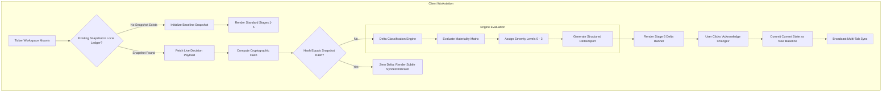
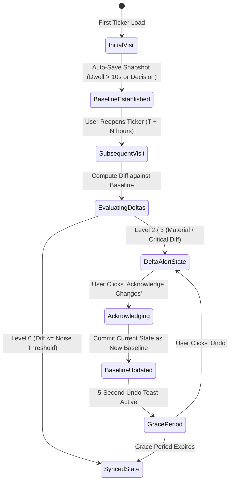

# ARX Terminal: Change Intelligence Engine Technical Architecture
## Technical Design Specification for Stage 6: The State Delta & Thesis Monitoring Subsystem

**Document ID**: `TECH-SPEC-ARX-CHANGE-INTELLIGENCE-VNEXT`  
**Version**: `1.0.0-PROD-SPEC`  
**Status**: `APPROVED_FOR_IMPLEMENTATION`  
**Component**: Stage 6 Change Intelligence Engine (`@arx/engine-change-intelligence`)  
**Target Milestone**: Phase 2 Strategic Differentiators (Sprint 3–4)  
**Classification**: Core Technical Architecture Specification  
**Governing Documents**:  
- [`docs/prd/PRD_INSTITUTIONAL_DECISION_WORKSTATION_VNEXT.md`](file:///c:/Users/akara/Documents/Projects/finance/docs/prd/PRD_INSTITUTIONAL_DECISION_WORKSTATION_VNEXT.md)  
- [`docs/ux/UX_DESIGN_SPEC_INSTITUTIONAL_WORKSTATION.md`](file:///c:/Users/akara/Documents/Projects/finance/docs/ux/UX_DESIGN_SPEC_INSTITUTIONAL_WORKSTATION.md)  
- [`docs/analytics/ANALYTICS_MEASUREMENT_FRAMEWORK_VNEXT.md`](file:///c:/Users/akara/Documents/Projects/finance/docs/analytics/ANALYTICS_MEASUREMENT_FRAMEWORK_VNEXT.md)  

---

## 1. Purpose & Product Objective

### 1.1 Answering "What Changed Since I Last Cared?"
Traditional financial platforms (Bloomberg, Koyfin, TradingView) treat market data as an ephemeral, stateless firehose. When an analyst returns to an asset they reviewed 48 hours ago, the platform forces them to pay a severe **"Re-Read Tax"**: re-inspecting price structure, re-checking momentum scores, re-evaluating volume flows, and re-reading notes to determine if the thesis remains valid.

```
LEGACY WORKFLOW (The Re-Read Tax):
Open CPRX ──► Read Chart ──► Read Setup Score ──► Read Conviction ──► Calculate Differences (Cognitive Drag: 45–120s)

CHANGE INTELLIGENCE TARGET WORKFLOW:
Open CPRX ──► Inspect Delta Banner (▲ Score 63→71 | Entered Buy Zone) ──► Review Only Diffs (TTFMI: <4s | TTC: <10s)
```

The **Change Intelligence Engine** treats investment theses as stateful, continuously monitored contracts. It computes mathematical deltas between an asset's live server-authoritative state and the user's previously acknowledged baseline snapshot.

---

## 2. Technical System Architecture



---

## 3. Snapshot Data Architecture & Schema

### 3.1 Snapshot Data Contracts (`types/change-intelligence.ts`)

```typescript
export type ExecutionState = 
  | 'IN_BUY_ZONE' 
  | 'APPROACHING_TARGET' 
  | 'WAITING_PULLBACK' 
  | 'STOPPED_OUT' 
  | 'NEUTRAL';

export type MarketRegime = 
  | 'RISK_ON' 
  | 'NEUTRAL' 
  | 'DEFENSIVE';

export type LiquidityTier = 
  | 'HIGH' 
  | 'MODERATE' 
  | 'RISK' 
  | 'UNKNOWN';

export interface ThesisSnapshot {
  schemaVersion: '1.0';
  ticker: string;
  timestamp: string;               // ISO 8601 UTC of snapshot creation
  acknowledgedAt: string;          // ISO 8601 UTC of last user acknowledgement
  setupScore: number;              // 0 - 100
  executionState: ExecutionState;
  entryLow: number;
  entryHigh: number;
  stopLoss: number;
  target1: number;
  target2: number;
  marketRegime: MarketRegime;
  liquidityTier: LiquidityTier;
  flowZScore: number;              // Standard deviations of institutional volume
  convictionDrivers: string[];     // Array of active driver IDs (e.g. 'vcp_drying_volume')
  validationSessionCount: number;  // Forward observed sessions (e.g. 5/20)
  snapshotHash: string;            // SHA-256 digest of canonical state
}
```

### 3.2 Canonical State Hashing Algorithm
To enable $O(1)$ equality checks before computing granular field-level diffs, the engine computes a deterministic SHA-256 hash across sorted, canonical state keys:

```typescript
export function computeSnapshotHash(snapshot: Omit<ThesisSnapshot, 'snapshotHash' | 'timestamp' | 'acknowledgedAt'>): string {
  const canonicalPayload = JSON.stringify({
    ticker: snapshot.ticker.toUpperCase(),
    setupScore: Math.round(snapshot.setupScore),
    executionState: snapshot.executionState,
    entryLow: Number(snapshot.entryLow.toFixed(2)),
    entryHigh: Number(snapshot.entryHigh.toFixed(2)),
    stopLoss: Number(snapshot.stopLoss.toFixed(2)),
    target1: Number(snapshot.target1.toFixed(2)),
    target2: Number(snapshot.target2.toFixed(2)),
    marketRegime: snapshot.marketRegime,
    liquidityTier: snapshot.liquidityTier,
    flowZScore: Number(snapshot.flowZScore.toFixed(1)),
    convictionDrivers: [...snapshot.convictionDrivers].sort(),
    validationSessionCount: snapshot.validationSessionCount
  });

  return crypto.subtle 
    ? sha256Browser(canonicalPayload) 
    : sha256Fallback(canonicalPayload);
}
```

---

## 4. Snapshot Storage & Multi-Tab Synchronization

### 4.1 Client Storage Strategy
1. **Primary Store**: IndexedDB (`arx_thesis_snapshots_v1`) with high storage quotas, supporting historical snapshot audit trails.
2. **Synchronous Cache**: In-memory LRU map + `localStorage` mirrors (`arx_active_snapshots`) for sub-millisecond initial render hydration without layout shifts (CLS $< 0.05$).
3. **Storage Quota Management**: Retains the most recent 100 ticker snapshots; automatically purges un-acknowledged snapshots older than 90 days.

### 4.2 Multi-Tab Synchronization via `BroadcastChannel`
When an analyst operates multiple workstation windows or tabs (e.g., Chart in Window A, Due Diligence in Window B), state updates synchronize instantly:

```typescript
const channel = new BroadcastChannel('arx_change_intelligence_sync');

// When user acknowledges changes in Tab A:
function broadcastBaselineUpdate(ticker: string, newSnapshot: ThesisSnapshot) {
  channel.postMessage({
    type: 'BASELINE_UPDATED',
    ticker,
    newSnapshot,
    senderId: window.name || 'tab_primary'
  });
}

// In Tab B:
channel.onmessage = (event) => {
  if (event.data.type === 'BASELINE_UPDATED' && event.data.ticker === currentActiveTicker) {
    applyOptimisticBaselineSync(event.data.newSnapshot);
  }
};
```

---

## 5. Delta Classification Engine & Materiality Rules

Not all price and score variations constitute actionable change. The **Delta Classification Engine** evaluates differences through a deterministic four-tier severity matrix:

```
┌────────────────────────────────────────────────────────────────────────────────────────────────────────┐
│ DELTA SEVERITY CLASSIFICATION MATRIX                                                                   │
├─────────┬──────────────────────┬─────────────────────────────────────────────────┬─────────────────────┤
│ LEVEL   │ SEVERITY             │ QUALIFYING CONDITIONS                           │ UI VISIBILITY       │
├─────────┼──────────────────────┼─────────────────────────────────────────────────┼─────────────────────┤
│ Level 0 │ No Material Change   │ Hash identical OR (ΔScore ≤ 2 AND No State Chg) │ Zero banner         │
│ Level 1 │ Minor / Informational│ ΔScore ∈ [±3, ±5] OR Minor driver text refresh  │ Subtle metadata tag │
│ Level 2 │ Material Change      │ ΔScore ≥ ±6 OR ΔFlow ≥ 1.5σ OR Target Adjusted  │ Prominent Banner    │
│ Level 3 │ Critical Alert       │ Execution State Change OR Stop Floor Adjusted   │ High-Alert Accent   │
│         │                      │ OR Regime Transition (RISK_ON ↔ DEFENSIVE)      │ Banner + Sound FX   │
└─────────┴──────────────────────┴─────────────────────────────────────────────────┴─────────────────────┘
```

### 5.1 Mathematical Materiality Thresholds

$$\begin{aligned}
\Delta \text{Setup} &= \text{Setup}_{\text{live}} - \text{Setup}_{\text{baseline}} \\
\text{ScoreSeverity} &= \begin{cases} 
0 & \text{if } |\Delta \text{Setup}| \le 2 \\
1 & \text{if } 3 \le |\Delta \text{Setup}| \le 5 \\
2 & \text{if } |\Delta \text{Setup}| \ge 6 
\end{cases}
\end{aligned}$$

```typescript
export interface DeltaItem {
  id: string;
  category: 'CONVICTION' | 'EXECUTION' | 'MARKET' | 'LIQUIDITY';
  severity: 0 | 1 | 2 | 3;
  direction: 'FAVORABLE' | 'ADVERSE' | 'NEUTRAL';
  label: string;
  previousValue: string | number;
  currentValue: string | number;
  explanation: string;
}

export interface DeltaReport {
  ticker: string;
  maxSeverity: 0 | 1 | 2 | 3;
  hasExecutionStateChanged: boolean;
  hasRegimeChanged: boolean;
  baselineTimestamp: string;
  items: DeltaItem[];
}
```

### 5.2 Category-Specific Materiality Rules
1. **Execution State Transition (Level 3 - Always Critical)**:
   - Any shift between `WAITING_PULLBACK`, `IN_BUY_ZONE`, `APPROACHING_TARGET`, `STOPPED_OUT`.
   - Direction: `WAITING_PULLBACK` $\to$ `IN_BUY_ZONE` is classified as `FAVORABLE` (Emerald).
   - Any transition to `STOPPED_OUT` is classified as `ADVERSE` (Rose).
2. **Invalidation Stop Loss Adjustments (Level 3 - Critical)**:
   - If the algorithmic stop level tightens or loosens by $> 1.5\%$.
3. **Macro Regime Transition (Level 3 - Critical)**:
   - Shift between `RISK_ON`, `NEUTRAL`, `DEFENSIVE`.
4. **Institutional Accumulation Surge (Level 2 - Material)**:
   - $|\Delta \text{FlowZScore}| \ge 1.5\sigma$ over trailing 48h.
5. **Validation Depth Progression (Level 1 - Informational)**:
   - Additional forward sessions logged (e.g. $3/20 \to 7/20$ sessions).

---

## 6. Delta Banner UX Contract & Presentation Geometry

When `maxSeverity >= 2`, the workstation renders the **Stage 6 Delta Banner** between Stage 1 (Orientation Header) and Stage 2 (65/35 Canvas).

```
┌────────────────────────────────────────────────────────────────────────────────────────────────────────┐
│ 🔔 THESIS DELTA DETECTED: CPRX (Changes since your review on 2026-09-01 at 15:30 EST)                  │
├────────────────────────────────────────────────────────────────────────────────────────────────────────┤
│ ▲ Setup Score: 63 ──► 71 (+8 pts) [Material Improvement]                                               │
│ ▲ Execution State: Transitioned from WAITING_PULLBACK ──► IN_BUY_ZONE ($18.10 - $18.55)               │
│ ▲ Institutional Money Flow: +2.4σ accumulation surge detected over trailing 48 hours                   │
│ ▬ Macro Regime: Remains supportive (RISK_ON · VIX 15.2)                                                │
│ ▼ Forward Validation: Still early (5/20 forward sessions observed in shadow tracking)                  │
├────────────────────────────────────────────────────────────────────────────────────────────────────────┤
│ [ Acknowledge Changes & Update Baseline ]           [ Inspect Confluence Delta ↗ ] [ View Raw Diff ]  │
└────────────────────────────────────────────────────────────────────────────────────────────────────────┘
```

### 6.1 Strict Semantic Token Alignment:
- **`▲` Emerald (`text-emerald-400`)**: Favorable shifts (Score improvement, entry zone entered, accumulation surge).
- **`▼` Rose (`text-rose-400`)**: Adverse shifts (Score degradation, stop triggered, distribution surge).
- **`◼` Amber (`text-amber-400`)**: Cautionary shifts (Elevated volatility, regime caution, thinning liquidity).
- **`▬` Slate (`text-slate-400`)**: Neutral or unchanged dimensions confirming stability.

---

## 7. Baseline Acknowledgement & Lifecycle State Machine



### 7.1 Baseline Update Protocol
1. User clicks `[ Acknowledge Changes & Update Baseline ]`.
2. Engine atomically overwrites the ticker's baseline record in IndexedDB/localStorage.
3. Broadcast channel notifies adjacent open tabs.
4. **Optimistic UI Transition**: Delta Banner smoothly collapses ($250\text{ms}$ ease-out transition) into a compact inline confirmation pill:
   `✓ Thesis Baseline Updated (Synced Today 12:15 UTC) · [Undo]`.
5. Emits `change_acknowledged` telemetry with latency and delta magnitude payloads.

---

## 8. Analytics & Telemetry Contract

The Change Intelligence Engine directly instruments the metrics defined in [`docs/analytics/ANALYTICS_MEASUREMENT_FRAMEWORK_VNEXT.md`](file:///c:/Users/akara/Documents/Projects/finance/docs/analytics/ANALYTICS_MEASUREMENT_FRAMEWORK_VNEXT.md):

```typescript
// Telemetry Payloads Emitted by Stage 6:

// 1. When Delta Banner renders above the fold:
analytics.track('delta_banner_viewed', {
  ticker: 'CPRX',
  maxSeverity: 3,
  scoreDelta: 8,
  stateTransition: 'WAITING_PULLBACK_TO_IN_BUY_ZONE',
  flowZDelta: 2.4,
  durationSinceBaselineHours: 138.5,
  ttvMs: performance.now() - sessionStart
});

// 2. When user expands an individual diff explanation:
analytics.track('delta_item_expanded', {
  ticker: 'CPRX',
  itemId: 'flow_accumulation_surge',
  category: 'CONVICTION'
});

// 3. When user commits new baseline:
analytics.track('change_acknowledged', {
  ticker: 'CPRX',
  durationToAcknowledgeMs: performance.now() - tickerOpenTimestamp,
  acknowledgedSeverity: 3
});
```

---

## 9. Future Multi-Device & Enterprise Roadmap

```
PHASE 2 (Current Sprint 3–4): Ticker-Level Change Intelligence
  ├── Client-side snapshot engine (IndexedDB + localStorage).
  ├── Real-time Stage 6 Delta Banner with Level 0–3 materiality matrix.
  └── Single-seat acknowledgement and baseline updates.

PHASE 3 (Sprint 5–6): Portfolio Attention Ledger ("What Needs Attention Today?")
  ├── Cross-ticker aggregation: Evaluates all watchlist and portfolio positions simultaneously.
  ├── "Things Requiring Attention Today" Discovery Feed:
  │     • CPRX: Transitioned to IN_BUY_ZONE
  │     • NVDA: Target 1 Reached (+12.4%)
  │     • META: Macro Regime Deteriorated to DEFENSIVE
  └── Morning Briefing Email / Slack webhook dispatch for investment committees.

PHASE 4 (Enterprise Multi-Seat): Committee Shared Baselines
  ├── Encrypted server-side sync of institutional research baselines.
  ├── Shared committee timestamps: "Thesis acknowledged by Robert (CIO) 2h ago".
  └── Audit trail of thesis evolution across investment committee rebalancing cycles.
```

---

*Certified as Authoritative Technical Architecture Specification for the ARX Change Intelligence Engine.*  
*Antigravity Principal Systems Architect & Quantitative Engineering Lead.*
