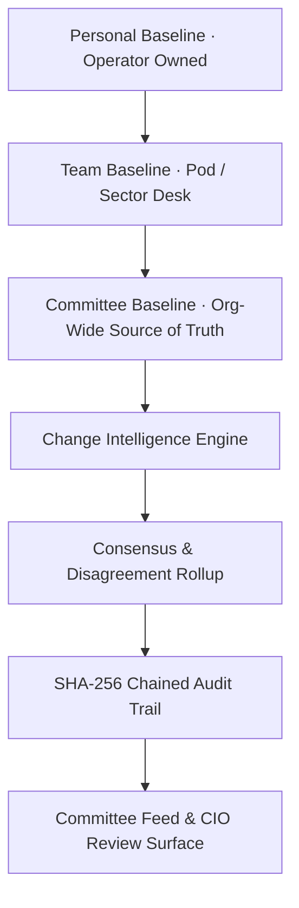
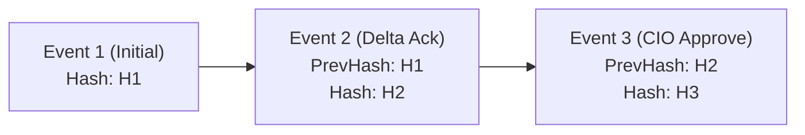

# ARX Terminal vNext: Committee Intelligence & Collaborative Review Architecture

**Document ID**: ARCH-GOV-COMMITTEE-INTELLIGENCE-VNEXT  
**Version**: 5.0.0-PROD  
**Status**: ACTIVE / SOURCE OF TRUTH  
**Sprint**: Sprint 5 (Shared Baselines, Role Permissions, Consensus Rollup, Immutable Audit Chains)  
**Parent Specifications**:
- `docs/architecture/CHANGE_INTELLIGENCE_ENGINE.md`
- `docs/architecture/DATA_QUALITY_AND_EDGE_CASE_GOVERNANCE.md`
- `docs/sprints/SPRINT_4_PORTFOLIO_INTELLIGENCE_PACKAGE.md`

---

## 1. Executive Vision & The Core Invariant

Sprint 5 extends ARX from **Individual Intelligence** to **Committee Decision Governance**:
$$\text{Personal Intelligence} \longrightarrow \text{Team Intelligence} \longrightarrow \text{Committee Governance} \longrightarrow \text{Immutable Regulatory Audit Trail}$$

> ### The Committee Isolation Invariant
> $$\mathbf{Shared\ Intelligence\ Must\ Never\ Overwrite\ Personal\ Intelligence}$$
> Personal baselines, notes, and local triage states remain client-owned and private. Committee baselines exist as an immutable, shared organizational overlay that requires formal sign-off and multi-party consensus.

---

## 2. Shared Baseline & Scope Hierarchy

### 2.1 Baseline Scopes
- **`PERSONAL`**: Visible to creator only. Unrestricted client-side edits.
- **`TEAM`**: Visible to sector/pod analysts and PMs. Collaborative research baseline.
- **`COMMITTEE`**: Organization-wide source of truth. Requires formal CIO approval to activate.

---

## 3. Role-Based Permissions & Governance Matrix

| Capability | Viewer | Analyst | Portfolio Manager | CIO | Admin |
| :--- | :---: | :---: | :---: | :---: | :---: |
| **View Workstation & Feed** | Yes | Yes | Yes | Yes | Yes |
| **View Audit Trail & Hashes** | Yes | Yes | Yes | Yes | Yes |
| **Create Research Notes** | No | Yes | Yes | Yes | No |
| **Submit Recommendations** | No | Yes | Yes | Yes | No |
| **Acknowledge Material Deltas** | No | No | Yes | Yes | No |
| **Create Committee Baseline (Pending)** | No | No | Yes | Yes | No |
| **Approve & Activate Baseline (CIO)** | No | No | No | Yes | No |
| **Override / Close Review Cycles** | No | No | No | Yes | No |
| **Alter / Delete Historical Audit Log** | **FORBIDDEN** | **FORBIDDEN** | **FORBIDDEN** | **FORBIDDEN** | **FORBIDDEN** |

---

## 4. Immutable Audit Storage & Hash-Chaining

### 4.1 The Immutability Invariant
$$\mathbf{Audit\ Records\ Must\ Be\ Append-Only}$$
$$\text{Prohibited: } \texttt{UPDATE audit\_log}, \texttt{DELETE audit\_log} \quad \vert \quad \text{Allowed: } \texttt{INSERT audit\_log}$$

### 4.2 Cryptographic Hash Chaining (Tamper Evidence)
Every audit event references the SHA-256 digest of the immediately preceding event:
$$H_n = \text{SHA256}(eventId + timestamp + actorId + action + H_{n-1})$$

If any actor modifies event attributes in storage, the chain verification fails instantly:
$$\text{verifyChain}(H_n) = \text{false} \implies \text{Tamper Alert Emitted}$$

---

## 5. Baseline Invariants & Conflict Resolution

### 5.1 Baseline Invariants
- **Invariant B1 (Single Active)**: $\text{ACTIVE} \le 1$ per `(committeeId, ticker)`. Activating baseline $B_2$ automatically supersedes $B_1$.
- **Invariant B2 (Immutability of Superseded)**: State transition $\text{ACTIVE} \to \text{SUPERSEDED}$ is one-way. Re-activating a superseded baseline is rejected.
- **Invariant B3 (Snapshot Provenance)**: Every baseline must reference a valid `snapshotHash`.

### 5.2 Deterministic Conflict Resolution Engine
When competing baselines emerge:
1. **Latest Approved Timestamp Wins**: If both are approved by authorized officers, the newer timestamp prevails.
2. **Approval Gate**: An unapproved pending baseline can never supersede an active approved baseline.
3. **Duplicate Suppression**: If competing records carry identical `snapshotHash`, duplicate conflict generation is suppressed.

---

## 6. Consensus & Disagreement Architecture

Committees rarely agree unanimously. ARX treats **disagreement as high-value signal**:
- Acknowledging a delta marks `ACKNOWLEDGED`.
- Challenging model output marks `DISAGREED` and requires a mandatory rationale string.
- Rollup calculation:
$$\mathbf{Consensus\ \% = \frac{\text{Acknowledged}}{\text{Total Responded}} \times 100}$$
- If a critical disagreement remains unresolved for $> 7\text{ days}$, status automatically escalates to `ESCALATED` and alerts the Committee Chair.

---

## 7. Sprint 5 Release Gates

| Gate ID | Target Requirement | Criteria | Status |
| :--- | :--- | :---: | :---: |
| **G5.1** | Role-Based Authorization | $100\%$ API permission enforcement | AUDITED |
| **G5.2** | Single Active Baseline | Exactly $\le 1$ active baseline per ticker | INVARIANT |
| **G5.3** | Approval Workflow | Unapproved baselines cannot activate | FAIL-CLOSED |
| **G5.4** | Deterministic Conflict Engine | Deterministic conflict resolution | VERIFIED |
| **G5.5** | Append-Only Audit Trail | Zero updates or deletes permitted | IMMUTABLE |
| **G5.6** | Hash Chain Verification | $100\%$ cryptographic chain validation | CRYPTO-CHECK |
| **G5.7** | Tamper Detection | Modifying historical record detected | TESTED |
| **G5.8** | Shared Isolation | Personal baselines unaffected by committee updates | AIR-GAPPED |
