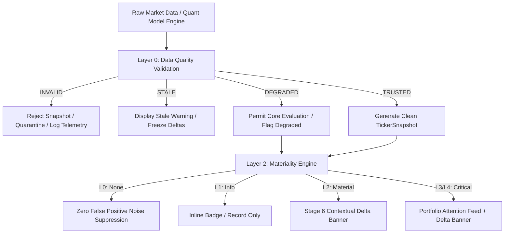

# ARX Terminal vNext: Data Quality & Edge Case Governance Architecture

**Document ID**: ARCH-GOV-DATA-QUALITY-VNEXT  
**Version**: 1.0.0-PROD  
**Status**: ACTIVE / SOURCE OF TRUTH  
**Applies To**: ARX Terminal vNext (Backend Ingestion, Change Intelligence Engine, Portfolio Aggregator)  
**Parent Specifications**:
- `docs/architecture/CHANGE_INTELLIGENCE_ENGINE.md`
- `docs/api/API_CONTRACTS_VNEXT.md`
- `docs/architecture/adrs/ADR-005-server-authoritative-quant-logic.md`
- `docs/architecture/adrs/ADR-008-materiality-governance.md`

---

## 1. Executive Summary & Core Invariant

The Change Intelligence Engine is only as trustworthy as its handling of bad, missing, stale, delayed, and contradictory market data.

> ### The Data Quality Invariant
> $$\mathbf{No\ Data \ne Bad\ Data \ne Change \ne Alert}$$
> **A data anomaly must never masquerade as a thesis mutation.** Data validation strictly precedes snapshot creation, materiality calculation, and attention allocation.

### Ingestion & Validation Pipeline



---

## 2. Data Quality Score Framework

Every candidate snapshot undergoes deterministic sanitization and receives an immutable `DataQuality` classification before any delta comparison:

```typescript
export type DataQualityStatus = 
  | "TRUSTED"    // All mandatory & auxiliary signals fresh, bounded, and verified
  | "DEGRADED"   // Core decision signals verified; non-critical auxiliary factors missing
  | "STALE"      // Signals exceed SLA freshness window; baseline/delta calculations frozen
  | "INVALID";   // Structural corruption, out-of-bounds metrics, or schema violation
```

### Status Definition Matrix

| Status | Verification Criteria | Engine Action | UI Surface Presentation |
| :--- | :--- | :--- | :--- |
| **`TRUSTED`** | All required fields present, timestamps $< \text{SLA}$, all numbers within valid ranges, zero contradictory states. | Full Materiality Engine execution; standard delta reporting. | Standard workstation rendering; zero warning indicators. |
| **`DEGRADED`** | Core fields (`setupScore`, `executionState`, `regime`, `spotPrice`) valid; auxiliary factors (e.g. insider trades, dark pool flow) missing or delayed. | Materiality Engine runs with missing factors masked (factor weight redistributed or held at zero). | Inline status pill: `[Data Degraded: Non-Critical Factors Delayed]`. |
| **`STALE`** | Snapshot timestamp exceeds maximum freshness threshold (e.g. macro $> 4\text{h}$, intraday $> 60\text{m}$ during open market). | **Freeze Materiality Engine**. Zero delta generation. Zero alerts emitted. | Pinned amber notice: `[Data Stale: Preserving Prior Session Baseline]`. |
| **`INVALID`** | Missing core fields, NaN/infinite values, impossible bounds (e.g. score $= 120$ or $< 0$), unknown enum states. | **Immediate rejection**. Candidate snapshot dropped. Telemetry logged. | Render error boundary: `[Snapshot Data Error: Awaiting Clean Tick]`. |

---

## 3. Structural Validation Contracts & Thresholds

### 3.1 Mandatory Core Field Contract
A snapshot is immediately classified as `INVALID` if any of the following fields are absent, null, or undefined:

```typescript
export interface MandatorySnapshotFields {
  ticker: string;              // Non-empty string, matches /^[A-Z]{1,5}$/
  snapshotId: string;          // Non-empty UUID or SHA-256 hash
  timestamp: string;           // Valid ISO 8601 string
  setupScore: number;          // Finite number
  executionState: string;      // Valid ExecutionState enum
  marketRegime: string;        // Valid MarketRegime enum
  liquidityTier: string;       // Valid LiquidityTier enum
  spotPrice: number;           // Finite positive number
}
```

### 3.2 Enum Validation Whitelist
Values outside these finite state vectors trigger instant snapshot rejection:

- **`ExecutionState`**:
  `["IN_BUY_ZONE", "APPROACHING_TARGET", "WAITING_PULLBACK", "STOPPED_OUT", "NEUTRAL"]`
- **`MarketRegime`**:
  `["RISK_ON", "NEUTRAL", "DEFENSIVE"]`
- **`LiquidityTier`**:
  `["HIGH", "MODERATE", "RISK"]`
- **`ValidationTier`**:
  `["THIN", "DEVELOPING", "ESTABLISHED"]`

### 3.3 Numeric Range Bounds

```typescript
export const NUMERIC_BOUNDS = {
  setupScore: { min: 0, max: 100 },
  spotPrice: { min: 0.0001, max: 10_000_000 },
  flowZScore: { min: -10.0, max: 10.0 },
  daysSinceBaseline: { min: 0, max: 3650 },
  factorWeight: { min: 0.0, max: 1.0 },
  pointsContribution: { min: -100, max: 100 },
} as const;
```

Any value where $x < \text{min}$ or $x > \text{max}$ or `Number.isNaN(x)` or `!Number.isFinite(x)` fails with `INVALID_NUMERIC_RANGE`.

### 3.4 Freshness SLA Window

| Signal Category | Normal Freshness SLA | Max Stale Threshold | Handling After Threshold |
| :--- | :---: | :---: | :--- |
| **Intraday Market Ticks** | $15\text{ seconds}$ | $5\text{ minutes}$ | Transition to `STALE`; display cached settlement. |
| **Quant Factor Scores** | $15\text{ minutes}$ | $60\text{ minutes}$ | Flag as `DEGRADED`; recalculate with cached factors. |
| **Macro Market Regime** | $60\text{ minutes}$ | $4\text{ hours}$ | Transition to `STALE`; suppress regime alerts. |
| **Portfolio Feed Deltas** | Market Open to Close | $24\text{ hours}$ | Exclude from active Attention Feed. |

---

## 4. Edge Case Governance Matrix

### EC-01: Scheduled Market Holidays & Weekend Closes
- **Scenario**: Trader opens terminal on Good Friday, Labor Day, or Sunday evening. Market feeds have not ticked in 48–72 hours.
- **Governing Rule**: Scheduled market closure is **not** an outage. It must never trigger stale warnings, alert storms, or delta updates.
- **Engine Behavior**:
  - The calendar service reports `isMarketSessionActive = false`.
  - The workstation renders the pinned settlement badge: `[Pinned Settlement · Session Closed]`.
  - Stale warning banners are explicitly suppressed.
  - Baseline timestamps reflect the Friday 16:00 ET closing bell.

### EC-02: Partial Data Provider Outage
- **Scenario**: SEC Form 4 insider transactions or social sentiment feeds are offline; core price bars, volume, and balance sheet metrics remain active.
- **Governing Rule**: A partial outage must not blind the trader to price/volume setups, nor may it cause artificial delta shifts due to missing factor weights.
- **Engine Behavior**:
  - Snapshot marked as `DEGRADED`.
  - Missing factor weight is renormalized or held at neutral ($0\text{ pts}$).
  - Delta banner indicates: *"Setup Score adjusted: 2 auxiliary data feeds offline."*
  - Telemetry logs `data_quality_degraded`.

### EC-03: Total Upstream Outage / 503 Gateway Error
- **Scenario**: Backend API or internet gateway fails completely.
- **Governing Rule**: Total disconnect must preserve client-side state without mutating baselines or clearing acknowledge records.
- **Engine Behavior**:
  - Client retrieves last persisted snapshot from local IndexedDB (`arx_change_intelligence_db`).
  - Terminal displays: `[Offline Mode: Displaying Cached Snapshot from Sep 05 16:00 ET]`.
  - Materiality calculations are suspended ($0\text{ deltas generated}$).
  - User is prevented from overwriting the baseline until connection integrity is restored.

### EC-04: Time Travel Detection (Stale Re-Delivery)
- **Scenario**: Network race condition or distributed queue delivers Snapshot $T_1$ (10:00:00) after Snapshot $T_2$ (10:05:00) has already been processed.
- **Governing Rule**: Time must be strictly monotonic. Older snapshots delivered out of sequence must be discarded.
- **Engine Behavior**:
  - If `newSnapshot.timestamp <= latestSnapshot.timestamp`:
    - Drop candidate snapshot immediately.
    - Log telemetry: `snapshot_time_reversal_detected` with `{ current: latestSnapshot.timestamp, rejected: newSnapshot.timestamp }`.
    - Zero state mutation.

### EC-05: Duplicate Delta Generation / Acknowledged Re-Triggering
- **Scenario**: Trader acknowledges a delta ($72 \to 82$). On tab reload or next poll, the server returns the same snapshot ($82$), re-generating the exact same delta.
- **Governing Rule**: An acknowledged delta remains acknowledged. Users must never be re-alerted to a previously settled thesis state.
- **Engine Behavior**:
  - Delta Engine checks hash of `(latestSnapshotId, baselineSnapshotId)`.
  - If `baselineSnapshot.snapshotId === latestSnapshot.snapshotId` or delta item hash matches `acknowledgedDeltaHash`, delta report is suppressed (`isMaterial = false`).
  - Telemetry logs `duplicate_delta_suppressed`.

### EC-06: Rapid Regime Flapping (Alert Storm Prevention)
- **Scenario**: Volatile market conditions trigger oscillation: `RISK_ON` $\to$ `DEFENSIVE` $\to$ `RISK_ON` within a 30-minute window.
- **Governing Rule**: Attention surfaces must not flap or trigger repeated alert soundings during intraday whip-saws.
- **Engine Behavior**:
  - Introduce **Regime Hysteresis Filter**: a regime change requires either a $2\sigma$ confirmation or must persist for $\ge 30\text{ minutes}$ before promoting to Portfolio Attention Feed.
  - Intermediate reversals are flagged as `REGIME_VOLATILITY_QUARANTINE`.
  - Single consolidated banner rendered: `[Market Regime Volatile: DEFENSIVE / RISK_ON oscillation detected]`.

### EC-07: Portfolio Attention Feed Flooding
- **Scenario**: Broad market flash crash causes 180 out of 200 portfolio tickers to cross stop-loss or entry thresholds simultaneously.
- **Governing Rule**: Attention feeds must never overwhelm human cognitive bandwidth. Unfiltered alert volume causes total disengagement.
- **Engine Behavior**:
  - Cap primary Attention Feed at **Top 10 Critical (L4) Events**, ranked by setup score magnitude and portfolio weight.
  - Next **20 Material (L3) Events** grouped into a collapsed disclosure section: `[+20 Additional Material Transitions]`.
  - Render an executive macro banner: `[Systemic Portfolio Event: 180 Assets Triggered — View Macro Stress Dashboard]`.

---

## 5. Telemetry & Audit Event Schema

All data quality decisions emit structured telemetry inheriting from `AnalyticsEvent`:

```typescript
export type DataQualityEventName =
  | "data_quality_trusted"
  | "data_quality_degraded"
  | "data_quality_stale"
  | "data_quality_invalid"
  | "snapshot_time_reversal_detected"
  | "duplicate_delta_suppressed"
  | "noise_change_suppressed"
  | "stale_snapshot_suppressed"
  | "regime_flapping_quarantined"
  | "portfolio_feed_flood_capped";
```

### Telemetry Payload Contract

```typescript
export interface DataQualityTelemetryPayload {
  ticker?: string;
  qualityStatus: DataQualityStatus;
  failedField?: string;
  failedValue?: unknown;
  freshnessAgeSec?: number;
  quarantineReason?: string;
}
```

---

## 6. Acceptance Criteria & Test Specifications

### AC-DQ-01: Out-of-Bounds Metric Rejection
- **Given** an upstream payload provides `setupScore: 120` or `setupScore: -5`.
- **When** passed into Data Quality Validator.
- **Then** validator returns `{ status: "INVALID", reason: "OUT_OF_BOUNDS_SCORE" }`.
- **And** snapshot is not written to IndexedDB.
- **And** zero deltas are generated.

### AC-DQ-02: Stale Macro Data Suppression
- **Given** a market regime snapshot has timestamp $> 4\text{ hours}$ old during active market hours.
- **When** processed by Materiality Engine.
- **Then** status is marked as `STALE`.
- **And** no `REGIME_CHANGE` alert is surfaced in Stage 6 or the Attention Feed.
- **And** UI displays `[Data Stale: Pinned to Last Verified Session]`.

### AC-DQ-03: Monotonic Time Enforcement
- **Given** client baseline exists with timestamp `2026-09-07T14:30:00Z`.
- **When** incoming network tick has timestamp `2026-09-07T14:20:00Z` (10 minutes behind).
- **Then** candidate snapshot is rejected with `snapshot_time_reversal_detected`.
- **And** existing baseline and latest records remain unmutated.

### AC-DQ-04: Duplicate Delta Deduplication
- **Given** a user has acknowledged a delta transition for `CPRX`.
- **When** the page refreshes and re-evaluates the same snapshot diff.
- **Then** `DeltaReport.isMaterial` evaluates to `false`.
- **And** `DeltaBanner` renders `null`.
- **And** `duplicate_delta_suppressed` event is recorded.

### AC-DQ-05: Feed Anti-Flood Capping
- **Given** 50 tickers experience simultaneous L4 transitions.
- **When** `PortfolioAttentionFeed` renders.
- **Then** exactly 10 top-priority items appear expanded.
- **And** remaining 40 items are cleanly aggregated into a single collapsible counter.
- **And** page load performance penalty is strictly $0\text{ms}$.

---

## 7. Operational Success Metric: Delta Trust Index (DTI)

$$\mathbf{Delta\ Trust\ Index\ (DTI) = 1 - \left( \frac{\text{False Positives + Bad Data Alerts}}{\text{Total Viewed Deltas}} \right)}$$

### SLA Targets:
- **`> 95.0%`**: **Exceptional / Production Certified**
- **`90.0% – 95.0%`**: **Acceptable / Normal Operations**
- **`< 90.0%`**: **Warning / Trigger Materiality & Data Quality Retuning**
