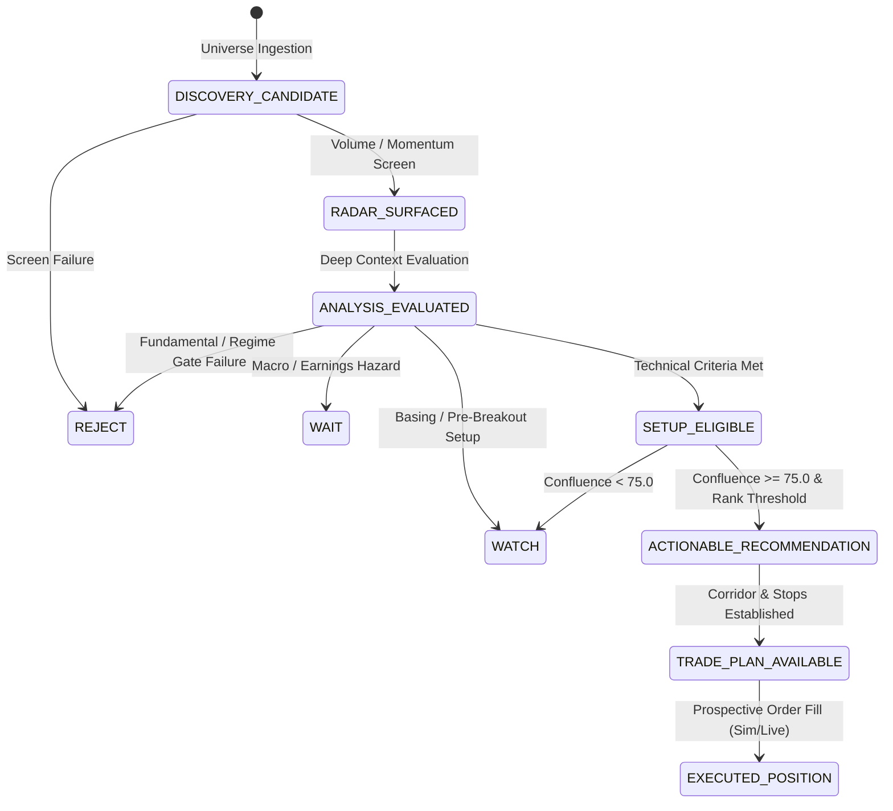

# ARX TERMINAL — PROSPECTIVE FULL DECISION CAPTURE DESIGN V1
## ARCHITECTURAL SPECIFICATION & SCIENTIFIC EVIDENCE CONTRACT
**Status:** DESIGN ONLY — FROZEN  
**Contract Version:** `1.0.0`  
**Governing Authority:** `ARX_GOVERNANCE_GATE`  
**Baseline Release Commit:** `eab11e3`  
**Created At UTC:** `2026-09-27T20:50:00Z`  
**Target Schema:** [`docs/governance/ARX_PROSPECTIVE_DECISION_CAPTURE_SCHEMA_V1.json`](file:///c:/Users/akara/Documents/Projects/finance/docs/governance/ARX_PROSPECTIVE_DECISION_CAPTURE_SCHEMA_V1.json)

---

## 1. GOVERNANCE & SCIENTIFIC MANDATE

### 1.1 Core Boundaries
```ini
MODEL_TUNING = PROHIBITED
FEATURE_CHANGES = PROHIBITED
THRESHOLD_CHANGES = PROHIBITED
FILTER_CHANGES = PROHIBITED
PRODUCTION_DECISION_LOGIC_CHANGES = PROHIBITED
HISTORICAL_OUTCOME_REINTERPRETATION = PROHIBITED
LEARNING_CLAIM = NOT_AUTHORIZED
PROSPECTIVE_CAPTURE_DESIGN = AUTHORIZED
OBSERVATION_ACTIVE = NO
PROSPECTIVE_DENOMINATOR = 0
```

### 1.2 The Empirical Gap
The historical recommendation outcome audit ([ARX_HISTORICAL_RECOMMENDATION_OUTCOME_AUDIT_V1.json](file:///c:/Users/akara/Documents/Projects/finance/docs/governance/ARX_HISTORICAL_RECOMMENDATION_OUTCOME_AUDIT_V1.json), commit `eab11e3`) established descriptive outcomes across 10 contemporaneously recorded recommendations (win rate: 25.0% across 4 mature entered trades). However, the historical evidence cannot support:
1. **False-Negative Analysis:** Unselected assets that subsequently rallied were never recorded.
2. **Filter Effectiveness:** Rejected assets were dropped without recording which filters caused rejection.
3. **Cross-Sectional Ranking Quality:** Relative ordinal ranking across the broader universe was not captured.
4. **Universe Coverage:** The full pool of candidate assets was unrecorded.

To support future scientifically valid evaluation across the complete confusion matrix ($TP, FP, FN, TN$), this document establishes the architecture for **Prospective Full Decision Capture**.

---

## 2. OBJECTIVES & ARCHITECTURAL SCOPE

The prospective evidence layer is a **passive, zero-side-effect observability harness** that contemporaneously records every material decision opportunity without mutating production behavior.

Prospectively, the capture engine answers:
1. **Scope:** What assets were in the investment universe?
2. **Evaluation:** Which assets did the production engine evaluate?
3. **Provenance:** What engine version, git commit, and configuration hash evaluated them?
4. **Inputs:** What exact point-in-time market, fundamental, and macro data were available?
5. **Features:** What numerical features were derived?
6. **Filters:** What gates fired, in what order, and what was the first-binding rule?
7. **Ranking:** What ordinal score and cross-sectional rank were assigned?
8. **Rejection Rationale:** Why was an asset rejected, watched, or suppressed?
9. **Trade Plan:** What execution corridor, stop loss, and targets were generated?
10. **Infrastructure Failures:** Did data outages, timeouts, or feed corruptions occur?
11. **Outcome Linkage:** What did the asset subsequently do under frozen outcome contracts?

---

## 3. NON-INTERFERENCE & OBSERVATIONAL INVARIANCE

The capture harness is strictly non-interfering:
```ini
CAPTURE_CHANGES_DECISION_OUTPUT = NO
```
The capture subsystem MUST NOT:
- Modify rankings, conviction scores, or recommendation states.
- Alter entry corridor, stop loss, or take profit levels.
- Mutate filter thresholds or evaluation criteria.
- Alter universe membership or force artificial pipeline scans.
- Generate synthetic trades or trigger simulated broker orders.
- Modify model weights, parameters, or learning state.

---

## 4. DECISION UNIT & PRODUCT-STATE VOCABULARY

Rather than collapsing all non-recommendations into a single generic "REJECT" bucket, the capture system reflects the authentic, discrete ARX product-state lifecycle:



### State Definitions
- `DISCOVERY_CANDIDATE`: Present in the broad universe filter.
- `RADAR_SURFACED`: Passed initial screens; surfaced on radar ribbon.
- `ANALYSIS_EVALUATED`: Full multi-factor evaluation pipeline executed.
- `SETUP_ELIGIBLE`: Passed structural formation gates (e.g. Minervini stage, base pattern).
- `WAIT`: High-conviction asset deferred due to impending binary events (earnings, FOMC).
- `WATCH`: Valid structure but not yet in trigger range or below confluence threshold.
- `REJECT`: Evaluated and failed one or more mandatory rules.
- `ACTIONABLE_RECOMMENDATION`: Score $\ge 75.0$, high conviction, approved for user presentation.
- `TRADE_PLAN_AVAILABLE`: Definitive corridor ($[\text{corridorMin}, \text{corridorMax}]$), stopLoss, and TP1/TP2 generated.
- `EXECUTED_POSITION`: Observed simulated or production execution fill.

---

## 5. POPULATION IDENTITY & SCOPE/EVALUATION MATRIX

To prevent replay data from masquerading as authentic production runs, prospective evidence enforces an orthogonal 2-dimensional classification matrix:

| Scope Dimension | Evaluation Dimension | Meaning | Empirical Classification |
|---|---|---|---|
| `IN_SCOPE` | `OBSERVED_PRODUCTION_EVALUATION` | Natural asset evaluated by live production engine | **VALID EMPIRICAL POPULATION** |
| `IN_SCOPE` | `NO_OBSERVED_PRODUCTION_EVALUATION` | Eligible asset skipped due to pipeline timeout/crash | **COVERAGE DEFECT (NOT FALSE NEGATIVE)** |
| `IN_SCOPE` | `EVALUATION_STATUS_UNKNOWN` | Ingestion status unresolved | **QUARANTINED** |
| `INTENTIONALLY_OUT_OF_SCOPE` | `OBSERVED_PRODUCTION_EVALUATION` | User manually requested an excluded asset (e.g. OTC/penny) | **INFORMATIONAL ONLY (EXCLUDED FROM DENOMINATOR)** |
| `INTENTIONALLY_OUT_OF_SCOPE` | `NO_OBSERVED_PRODUCTION_EVALUATION` | Deliberately excluded by universe criteria | **INTENTIONAL EXCLUSION** |
| `SCOPE_UNKNOWN` | Any | Metadata corrupt or missing | **QUARANTINED** |

---

## 6. FULL EVALUATION RECORD SPECIFICATION

Every asset evaluated during an analysis cycle produces a single immutable `DecisionEvent`:
```json
{
  "decisionId": "DEC_AAPL_20260928T133000Z_7ad44595_3f1a0e",
  "episodeId": "EP_AAPL_20260928T133000Z_9b2e41",
  "symbol": "AAPL",
  "instrumentId": "US_EQUITY_AAPL",
  "evaluationTimestampUtc": "2026-09-28T13:30:00.124Z",
  "marketSession": "REGULAR_SESSION",
  "evidenceOrigin": "NATURAL_PRODUCTION",
  "scopeStatus": "IN_SCOPE",
  "evaluationStatus": "OBSERVED_PRODUCTION_EVALUATION",
  "engineVersion": "2.5.0",
  "engineSha": "7ad44595826c147cc77f93cd676af520764c7442",
  "decisionEngineSha": "7ad44595826c147cc77f93cd676af520764c7442",
  "configHash": "c4ca4238a0b923820dcc509a6f75849b2cda1c986bf49e16a0852b968a55d388",
  "universeVersion": "UNIV_US_LARGE_MID_2026Q3",
  "universeSnapshotId": "UNIV_SNAP_20260928T130000Z_3829",
  "dataProvider": "YAHOO_FINANCE",
  "providerSourceTimestampUtc": "2026-09-28T13:29:45Z",
  "ingestionTimestampUtc": "2026-09-28T13:29:55Z",
  "freshnessStatus": "LIVE_AUTHORITATIVE",
  "marketRegime": "BULL",
  "decisionState": "ACTIONABLE_RECOMMENDATION",
  "actionabilityState": "ACTIONABLE",
  "confluenceScore": 84.5,
  "crossSectionalRank": 2,
  "crossSectionalPopulationSize": 382,
  "rejectionReason": {
    "isRejected": false,
    "firstBindingRuleId": null,
    "firstBindingRuleCategory": null,
    "primaryReasonText": "Qualified setup",
    "failedRuleIds": []
  },
  "tradePlanState": {
    "isPlanGenerated": true,
    "entryReferencePrice": 335.20,
    "corridorMin": 331.50,
    "corridorMax": 337.00,
    "stopLoss": 324.80,
    "takeProfit1": 360.50,
    "takeProfit2": 372.00,
    "riskRewardRatio": 2.45,
    "counterfactualEvaluationEligible": true
  }
}
```

---

## 7. POINT-IN-TIME FEATURE SNAPSHOT ARCHITECTURE

Each `DecisionEvent` links to an immutable `FeatureSnapshot` recording the exact numerical values ingested. Retroactive calculation of features after market movement is strictly prohibited:

```json
{
  "decisionId": "DEC_AAPL_20260928T133000Z_7ad44595_3f1a0e",
  "featureSnapshotHash": "8f3b2...64chars",
  "timestampUtc": "2026-09-28T13:30:00.124Z",
  "features": [
    {
      "featureName": "close",
      "featureValue": 335.20,
      "source": "YAHOO_FINANCE",
      "sourceTimestampUtc": "2026-09-28T13:29:45Z",
      "observedAtUtc": "2026-09-28T13:29:55Z",
      "availabilityStatus": "LIVE_AUTHORITATIVE",
      "version": "1.0.0"
    },
    {
      "featureName": "atr14",
      "featureValue": 5.42,
      "source": "ARX_FEATURE_ENGINE",
      "sourceTimestampUtc": "2026-09-28T13:29:55Z",
      "observedAtUtc": "2026-09-28T13:30:00Z",
      "availabilityStatus": "LIVE_AUTHORITATIVE",
      "version": "1.2.0"
    },
    {
      "featureName": "relativeStrength90d",
      "featureValue": 88.4,
      "source": "ARX_FEATURE_ENGINE",
      "sourceTimestampUtc": "2026-09-28T13:29:55Z",
      "observedAtUtc": "2026-09-28T13:30:00Z",
      "availabilityStatus": "LIVE_AUTHORITATIVE",
      "version": "1.0.0"
    }
  ]
}
```

---

## 8. FILTER / GATE TRACE & HIERARCHY

Every pipeline gate produces a deterministic `RuleEvaluation` record categorized into three governance tiers:

1. `MANDATORY_PRODUCT_CONSTRAINT`: Exchange rules, liquidity floors, minimum ADV, penny-stock boundaries.
2. `AUDITED_MODEL_RULE`: Minervini stage filter, VCP tightness criteria, Relative Strength thresholds, regime alignment.
3. `INFRASTRUCTURE_CONSTRAINT`: Data staleness, missing fundamentals, feed timeout.

```json
{
  "decisionId": "DEC_MDB_20260928T133000Z_7ad44595_1a2b3c",
  "ruleId": "RULE_MINERVINI_STAGE_2",
  "ruleVersion": "1.0.0",
  "ruleCategory": "AUDITED_MODEL_RULE",
  "evaluationOrder": 4,
  "inputValues": {
    "sma50": 365.20,
    "sma200": 378.40,
    "currentPrice": 360.75
  },
  "thresholdValue": "price > sma50 and sma50 > sma200",
  "passed": false,
  "isBinding": true,
  "failureMessage": "Asset is below 200 SMA (360.75 < 378.40); Stage 4 distribution"
}
```

---

## 9. FIRST-BINDING RULE ATTRIBUTION

When an asset fails multiple sequential gates, giving every failing filter equal credit corrupts filter-value analysis. ARX establishes the **First-Binding Rule Protocol**:
- The pipeline executes in deterministic, versioned topological order.
- The first rule that causes the asset to drop out of `SETUP_ELIGIBLE` or `ACTIONABLE_RECOMMENDATION` is designated `FIRST_BINDING_RULE`.
- All subsequent rule evaluations are recorded with `isBinding = false`.
- **Analytical Value:** Prevents redundant filters from falsely claiming credit for avoided losses already caught by primary liquidity or stage filters.

---

## 10. STRUCTURED REJECTION REASON CONTRACT

Free-text console logging is prohibited for decision provenance. Rejections must follow the structured JSON contract:
```json
{
  "decisionState": "REJECT",
  "isRejected": true,
  "firstBindingRuleId": "RULE_MINERVINI_STAGE_2",
  "firstBindingRuleCategory": "AUDITED_MODEL_RULE",
  "primaryReasonText": "Price below 200-day simple moving average",
  "failedRuleIds": [
    "RULE_MINERVINI_STAGE_2",
    "RULE_RELATIVE_STRENGTH_MIN_70"
  ],
  "infrastructureFailure": null
}
```

---

## 11. INFRASTRUCTURE FAILURE SEPARATION

A critical governance failure occurs if operational outages are classified as model rejections. ARX enforces strict separation:
```ini
INFRASTRUCTURE_FAILURE_IS_MODEL_REJECTION = NO
```
If an asset cannot be evaluated because:
- The data provider returned an HTTP 429 / 500
- The quote is stale (> 24 hours without exchange closure)
- The SEC EDGAR filing parser timed out
The record is emitted with `decisionState = UNVERIFIED`, `actionabilityState = DEGRADED`, and populated `infrastructureFailure`. It enters the **Infrastructure Defect Denominator**, NOT the Model Rejection pool.

---

## 12. CROSS-SECTIONAL RANKING INTEGRITY

Where ARX ranks assets cross-sectionally:
- Rank must NEVER be recorded without recording:
  1. `eligible_population_size` (the denominator of ranked candidates).
  2. `universe_snapshot_id` (the exact peer group).
  3. `ranking_version` (the sorting and tie-breaking algorithm).
- A raw score of 82.0 ranked 1st out of 50 candidates in a bear market carries entirely different information than 82.0 ranked 35th out of 40 in a bull expansion.

---

## 13. UNIVERSE SNAPSHOT CONTRACT

Every evaluation cycle references an immutable `UniverseSnapshot`:
```json
{
  "universeSnapshotId": "UNIV_SNAP_20260928T130000Z_3829",
  "snapshotTimestampUtc": "2026-09-28T13:00:00Z",
  "universeVersion": "US_LARGE_MID_V1_2",
  "membershipSource": "SEC_EDGAR_ACTIVE_10K + NASDAQ_NYSE_OFFICIAL",
  "membershipSha256": "4b7a1...64chars",
  "totalInScopeCount": 3829,
  "totalEvaluatedCount": 3825,
  "exclusionCountsByCategory": {
    "DELISTED_OR_HALTED": 2,
    "ADV_BELOW_10M_USD": 214,
    "PRICE_BELOW_5_USD": 381,
    "MISSING_FINANCIALS": 2
  }
}
```

---

## 14. OPPORTUNITY EPISODES & TEMPORAL DE-DUPLICATION

If an asset surfaces as a setup on Monday, and the setup persists on Tuesday, Wednesday, and Thursday without triggering entry:
- **Flawed Evaluation:** Counting Monday, Tuesday, Wednesday, and Thursday as 4 independent trading opportunities drastically biases win-rate and false-negative metrics.
- **Episode Contract:**
  - `episode_start`: The first session where the asset transitions to `SETUP_ELIGIBLE` or `ACTIONABLE_RECOMMENDATION`.
  - `episode_continuation`: Subsequent daily sessions where the setup pattern remains valid and price remains within tolerance without triggering entry.
  - `episode_reset`: Entry corridor or stop loss levels are structurally recomputed due to new base formation.
  - `episode_termination`: Entry triggers, 5-session window expires, or pre-entry invalidation occurs.
  - `re-entry`: After termination, any new setup begins a new, distinct `episodeId`.
- **Boundary Rule:** Realized returns are NEVER used to retroactively define episode boundaries.

---

## 15. CANONICAL DECISION IDENTITY

To eliminate collision risks across distributed workers and test re-runs:
```text
DEC_{symbol}_{ISO8601_compact}_{engineSha8}_{uuid6}
Example: DEC_NVDA_20260928T133000Z_7ad44595_3f1a0e
```

---

## 16. NATURAL PRODUCTION EVIDENCE & PROVENANCE TIERS

Prospective evidence strictly tags its operational origin:
```ini
EVIDENCE_ORIGIN = NATURAL_PRODUCTION / REPLAY / SIMULATION / TEST
```
- `NATURAL_PRODUCTION`: The sole tier authorized to increment the prospective empirical research denominator.
- `REPLAY`: Backtesting or point-in-time replay engines. Quarantined in replay storage.
- `SIMULATION`: Monte Carlo or synthetic scenarios.
- `TEST`: Unit, integration, or CI test fixtures.

---

## 17. TEST POLLUTION FIREWALL

Drawing on the architectural lessons of [TEST_POLLUTION_FORENSIC_MIGRATION_RECORD.md](file:///c:/Users/akara/Documents/Projects/finance/docs/governance/TEST_POLLUTION_FORENSIC_MIGRATION_RECORD.md):
```ini
PYTEST_RECORDS_IN_PRODUCTION_LEDGER = 0
REPLAY_RECORDS_IN_PRODUCTION_LEDGER = 0
SIMULATION_RECORDS_IN_PRODUCTION_LEDGER = 0
```
- **ContextVar Guard:** Execution context is governed by Python `ContextVar` (`CURRENT_EXECUTION_CONTEXT`).
- **Fail-Closed Gate:** If `pytest` or `unittest` is active in `sys.modules`, the capture hook automatically routes evidence to an in-memory/isolated test store. Any attempt to write test data to `/root/analyst_dashboard/data/governance.db` raises `RuntimeError("TestPollutionViolation")`.

---

## 18. WRITE-ONCE IMMUTABLE LEDGER SEMANTICS

Prospective decision evidence is **strictly append-only**:
- SQLite database tables enforce `BEFORE UPDATE` and `BEFORE DELETE` triggers that raise `ABORT`.
- Original decision-time fields are never overwritten after market outcomes become known.
- If an erroneous record must be marked, an append-only `DecisionCorrectionEvent` is recorded referencing the original `decisionId` with timestamp and rationale.

---

## 19. DATA AVAILABILITY SEMANTICS (EXPLICIT STATES)

Missing or degraded data must never be silently converted into numeric defaults:
```ini
UNKNOWN != ZERO
UNAVAILABLE != AUTHENTIC_ZERO
STALE != LIVE
ERROR != EMPTY_RESULT
FALLBACK != PRIMARY_AUTHORITY
```
- If a stock pays zero dividend, its dividend yield is `0.0` with status `AUTHENTIC_ZERO`.
- If dividend data are missing from the provider, yield is `null` with status `UNAVAILABLE`.
- Coercing missing indicators to `0` or forward-filling stale values without explicit `STALE` status constitutes a severe data defect.

---

## 20. OUTCOME LINKAGE ARCHITECTURE

Decision evidence and outcome evidence remain strictly decoupled in storage:
- **Decision Record:** Frozen contemporaneously at time $T$. Contains zero lookahead fields (`realizedReturn = null`, `outcome = PENDING`).
- **Outcome Link Record:** Created at time $T + k$ by the outcome evaluation engine under a certified governing contract (e.g. `ARX_PAPER_TRADING_OUTCOME_CONTRACT_V1.json` v1.0.1):
```json
{
  "outcomeLinkId": "OUT_DEC_AAPL_20260928T133000Z_7ad44595_3f1a0e",
  "decisionId": "DEC_AAPL_20260928T133000Z_7ad44595_3f1a0e",
  "episodeId": "EP_AAPL_20260928T133000Z_9b2e41",
  "governingContractId": "ARX_PAPER_TRADING_OUTCOME_CONTRACT_V1",
  "governingContractVersion": "1.0.1",
  "governingContractSha256": "0f13677667d6755ad97a63de9264bff8e3c77fd37642eca0f80bf3b95166c2c1",
  "outcomeStatus": "SUCCESS",
  "realizedGrossReturnPct": 7.42,
  "realizedNetSimulatedReturnPct": 7.17,
  "realizedRMultiple": 2.14,
  "recordedAtUtc": "2026-10-05T20:00:00Z"
}
```

---

## 21. COUNTERFACTUAL NON-RECOMMENDATION SUPPORT

To support future false-negative analysis without lookahead bias:
- For every evaluated asset (including `WATCH` and `REJECT`), if technical structure permits, the engine contemporaneously computes and stores a **shadow counterfactual execution plan**:
  - `entryReferencePrice`
  - `corridorMin` / `corridorMax`
  - `stopLoss` (e.g. 2x ATR or pattern swing low)
  - `takeProfit1` (e.g. 2:1 R:R)
- If the model rejects an asset because of a macro regime filter, but the asset subsequently triples, future research can deterministically evaluate whether the asset would have reached TP1 or stopped out under identical trade management rules.

---

## 22. STORAGE DESIGN & ARCHITECTURAL TRADEOFF MATRIX

| Storage Technology | Atomicity / ACID | Query Performance | Append-Only Enforcement | Hashing / Verification | Cold Storage / Backup | Recommendation |
|---|---|---|---|---|---|---|
| **SQLite (WAL Mode)** | **A+** (Native transactions) | **A+** (Indexed B-trees, sub-ms queries) | **A+** (Database triggers reject UPDATE/DELETE) | **A** (Deterministic table hashing) | **A** (Single-file snapshot) | **PRIMARY LIVE STORAGE** |
| **Append-Only JSONL** | **B** (Process-level flush) | **C** (Full scan required) | **A** (File append mode `a`) | **A+** (Line-by-line SHA256) | **A+** (Gzip/S3 streaming) | **WRITE-AHEAD AUDIT LOG** |
| **Partitioned Parquet** | **C** (Batch write) | **A+** (Columnar OLAP queries) | **B** (Immutable files, rewrites required for schema) | **A** (Parquet file footer hashes) | **A+** (DuckDB / S3 cold store) | **WEEKLY RESEARCH EXPORT** |
| **PostgreSQL / Relational** | **A+** | **A+** | **A** (Role-based permissions) | **B** | **B** (Network dependencies) | **EXCLUDED (External infra)** |

### Primary Architecture: Dual-Stream SQLite + Append-Only JSONL WAL
1. **Live Local Engine:** `SQLite` with `PRAGMA journal_mode = WAL;` and immutability triggers on the persistent volume mount `/root/analyst_dashboard/data/governance.db`.
2. **Crash-Resilient Audit Stream:** Contemporaneous write to an append-only, compressed JSONL audit log `/root/analyst_dashboard/data/decision_events_YYYYMMDD.jsonl.gz`.
3. **Weekly Research Sync:** Automated, deterministic conversion of mature episodes to partitioned Parquet for large-scale multi-factor regression analysis.

---

## 23. CONCRETE DATABASE DDL SPECIFICATION

```sql
PRAGMA foreign_keys = ON;
PRAGMA journal_mode = WAL;

-- 1. Universe Snapshots
CREATE TABLE IF NOT EXISTS prospective_universe_snapshots (
    universe_snapshot_id TEXT PRIMARY KEY,
    snapshot_timestamp_utc TEXT NOT NULL,
    universe_version TEXT NOT NULL,
    membership_source TEXT NOT NULL,
    membership_sha256 TEXT NOT NULL,
    total_in_scope_count INTEGER NOT NULL,
    total_evaluated_count INTEGER NOT NULL,
    exclusion_counts_json TEXT NOT NULL,
    created_at_utc TEXT NOT NULL
);

-- 2. Opportunity Episodes
CREATE TABLE IF NOT EXISTS prospective_episodes (
    episode_id TEXT PRIMARY KEY,
    symbol TEXT NOT NULL,
    episode_start_utc TEXT NOT NULL,
    episode_last_evaluated_utc TEXT NOT NULL,
    episode_status TEXT NOT NULL,
    sessions_observed_count INTEGER NOT NULL DEFAULT 1,
    initial_trade_plan_hash TEXT NOT NULL,
    created_at_utc TEXT NOT NULL
);

-- 3. Decision Events (Immutable Live Log)
CREATE TABLE IF NOT EXISTS prospective_decision_events (
    decision_id TEXT PRIMARY KEY,
    episode_id TEXT NOT NULL,
    symbol TEXT NOT NULL,
    instrument_id TEXT NOT NULL,
    evaluation_timestamp_utc TEXT NOT NULL,
    market_session TEXT NOT NULL,
    evidence_origin TEXT NOT NULL,
    scope_status TEXT NOT NULL,
    evaluation_status TEXT NOT NULL,
    engine_version TEXT NOT NULL,
    engine_sha TEXT NOT NULL,
    decision_engine_sha TEXT NOT NULL,
    config_hash TEXT NOT NULL,
    universe_version TEXT NOT NULL,
    universe_snapshot_id TEXT,
    data_provider TEXT NOT NULL,
    provider_source_timestamp_utc TEXT NOT NULL,
    ingestion_timestamp_utc TEXT NOT NULL,
    freshness_status TEXT NOT NULL,
    market_regime TEXT NOT NULL,
    decision_state TEXT NOT NULL,
    actionability_state TEXT NOT NULL,
    confluence_score REAL,
    cross_sectional_rank INTEGER,
    cross_sectional_population_size INTEGER,
    first_binding_rule_id TEXT,
    first_binding_rule_category TEXT,
    rejection_reason_json TEXT NOT NULL,
    trade_plan_json TEXT,
    infrastructure_failure_json TEXT,
    created_at_utc TEXT NOT NULL,
    FOREIGN KEY (episode_id) REFERENCES prospective_episodes(episode_id),
    FOREIGN KEY (universe_snapshot_id) REFERENCES prospective_universe_snapshots(universe_snapshot_id)
);

-- 4. Feature Snapshots
CREATE TABLE IF NOT EXISTS prospective_feature_snapshots (
    decision_id TEXT PRIMARY KEY,
    feature_snapshot_hash TEXT NOT NULL,
    timestamp_utc TEXT NOT NULL,
    features_json TEXT NOT NULL,
    FOREIGN KEY (decision_id) REFERENCES prospective_decision_events(decision_id)
);

-- 5. Rule Trace Logs
CREATE TABLE IF NOT EXISTS prospective_rule_evaluations (
    rule_eval_id INTEGER PRIMARY KEY AUTOINCREMENT,
    decision_id TEXT NOT NULL,
    rule_id TEXT NOT NULL,
    rule_version TEXT NOT NULL,
    rule_category TEXT NOT NULL,
    evaluation_order INTEGER NOT NULL,
    input_values_json TEXT NOT NULL,
    threshold_value TEXT,
    passed INTEGER NOT NULL,
    is_binding INTEGER NOT NULL,
    failure_message TEXT,
    FOREIGN KEY (decision_id) REFERENCES prospective_decision_events(decision_id)
);

-- 6. Outcome Linkage (Post-Hoc Settled Outcomes)
CREATE TABLE IF NOT EXISTS prospective_outcome_links (
    outcome_link_id TEXT PRIMARY KEY,
    decision_id TEXT NOT NULL UNIQUE,
    episode_id TEXT NOT NULL,
    trade_plan_id TEXT,
    governing_contract_id TEXT NOT NULL,
    governing_contract_version TEXT NOT NULL,
    governing_contract_sha256 TEXT NOT NULL,
    outcome_status TEXT NOT NULL,
    realized_gross_return_pct REAL,
    realized_net_simulated_return_pct REAL,
    realized_r_multiple REAL,
    recorded_at_utc TEXT NOT NULL,
    FOREIGN KEY (decision_id) REFERENCES prospective_decision_events(decision_id),
    FOREIGN KEY (episode_id) REFERENCES prospective_episodes(episode_id)
);

-- Database-Enforced Immutability Triggers
CREATE TRIGGER IF NOT EXISTS trg_prevent_update_prospective_decision_events
BEFORE UPDATE ON prospective_decision_events
BEGIN
    SELECT RAISE(ABORT, 'IMMUTABILITY_VIOLATION: Updates to prospective_decision_events are strictly prohibited.');
END;

CREATE TRIGGER IF NOT EXISTS trg_prevent_delete_prospective_decision_events
BEFORE DELETE ON prospective_decision_events
BEGIN
    SELECT RAISE(ABORT, 'IMMUTABILITY_VIOLATION: Deletions from prospective_decision_events are strictly prohibited.');
END;
```

---

## 24. DENOMINATOR CONTRACT & ACCOUNTING BOUNDARIES

To ensure mathematical rigor, all future prospective metrics must declare explicit, segregated denominators:
```ini
D_UNIVERSE = Total In-Scope Assets in Snapshot
D_EVALUATED = Total Assets Processed by Analysis Engine
D_ACTIONABLE = Total Assets reaching ACTIONABLE_RECOMMENDATION
D_RECOMMENDED = Total Assets with Published Trade Plans
D_NON_RECOMMENDED = D_EVALUATED - D_RECOMMENDED
D_COVERAGE_FAILURES = In-Scope Assets Dropped Due to Pipeline Faults
D_INFRASTRUCTURE_ERRORS = Evaluated Assets with Provider / Feed Faults
```
- Win rate is calculated strictly on mature, entered positions: $N(\text{SUCCESS}) / D_{\text{MATURE\_RESOLVED}}$.
- Total opportunity capture is evaluated against $D_{\text{EVALUATED}}$, never against an unconstrained global market index.

---

## 25. FUTURE CONFUSION MATRIX FORMULATION

When sufficient prospective maturity occurs, the research pipeline will populate the four-cell matrix without lookahead:

```text
                        Realized Success (TP1 before Stop)    Realized Failure (Stop before TP1)
Recommended (Actionable)              TP                                     FP
Not Recommended                       FN                                     TN
```

- **True Positive (TP):** Model issued `ACTIONABLE_RECOMMENDATION`; subsequent trade reached TP1 before stop.
- **False Positive (FP):** Model issued `ACTIONABLE_RECOMMENDATION`; subsequent trade reached stop before TP1.
- **False Negative (FN):** Model evaluated and rejected/suppressed (`WATCH` / `REJECT`); subsequent counterfactual shadow plan reached TP1 before stop.
- **True Negative (TN):** Model evaluated and rejected/suppressed (`WATCH` / `REJECT`); subsequent counterfactual shadow plan reached stop before TP1.
- **Quarantine Zone:** Signals classified as `UNMATURED`, `NEUTRAL` (horizon exit), `UNRESOLVED_INTRABAR_SEQUENCE`, or `OUTCOME_DATA_MISSING` are explicitly excluded from the 4-cell matrix.

---

## 26. COVERAGE QUALITY METRICS

Production pipeline health is monitored via three automated ratios:
$$\text{Universe Evaluation Rate} = \frac{D_{\text{EVALUATED}}}{D_{\text{UNIVERSE}}}$$
$$\text{Coverage Defect Rate} = \frac{D_{\text{COVERAGE\_FAILURES}}}{D_{\text{UNIVERSE}}}$$
$$\text{Infrastructure Degraded Rate} = \frac{D_{\text{INFRASTRUCTURE\_ERRORS}}}{D_{\text{EVALUATED}}}$$
A degradation in Universe Evaluation Rate below 98.0% emits a P1 Operational Alert.

---

## 27. FILTER-VALUE & SHAPLEY ATTRIBUTION SUPPORT

By capturing both `FIRST_BINDING_RULE` and all failed gates alongside counterfactual outcomes, ARX enables empirical filter attribution:
- **Avoided Downside ($TN$):** Total dollar or R-multiple losses prevented by a specific rule.
- **Missed Upside ($FN$):** Total profitable opportunities prematurely killed by a specific rule.
- **Net Filter Value ($NFV$):**
  $$NFV(\text{Rule}) = \sum \text{Downside Avoided} - \sum \text{Upside Forfeited}$$
- **Filter Overlap Matrix:** Quantifies when Rule B is 100% redundant with Rule A, identifying candidates for model simplification without performance loss.

---

## 28. RANKING-QUALITY METRICS

Prospective capture supports continuous evaluation of cross-sectional ranking efficacy:
- **Rank Information Coefficient (Rank IC):** Spearman rank correlation between model score at time $T$ and realized forward return at $T+5, T+20$.
- **Monotonicity Spread:** Forward return spread across quintiles ($Q_5 - Q_1$).
- **Cohort Normalization:** Ranking evaluations are strictly evaluated *within-date* and *within-engine-version* to eliminate cross-regime distortion.

---

## 29. VERSION BOUNDARIES & COMPATIBILITY COHORTS

Every prospective record embeds the complete provenance tuple:
```text
(engine_version, engine_sha, config_hash, universe_version)
```
- Any commit that modifies feature math, filter rules, or scoring weights creates a **new non-comparable cohort**.
- Pooling data across incompatible engine versions into a single empirical denominator is strictly prohibited unless authorized by a formal governance bridging amendment.

---

## 30. CAPTURE FAILURE BEHAVIOR (DUAL-MODE GOVERNANCE)

If the capture subsystem experiences a database lock, disk-full error, or write timeout:
1. **User Experience Layer (Fail-Open):** Live trading terminal responses to the end user MUST NOT hang, crash, or fail. The analytical payload is returned to the user with a `TELEMETRY_DEGRADED` warning.
2. **Empirical Research Layer (Fail-Closed):** The unlogged evaluation cycle is marked `INVALIDATED_EVALUATION_CYCLE`. Incomplete evaluation batches are quarantined and CANNOT enter the empirical research denominator.

---

## 31. PRIVACY, SCALE, LATENCY & RETENTION BUDGET

- **Scale:**
  - Evaluated Universe: ~500 to 3,000 assets per cycle.
  - Frequency: 1 scheduled batch cycle per trading day (market close) + on-demand user evaluations.
- **Storage Footprint:**
  - Per evaluation: ~8 KB (Decision event + features + rule traces).
  - Daily storage (3,000 assets): ~24 MB SQLite / ~6 MB compressed JSONL.
  - Annual volume: ~6 GB uncompressed. Readily handled by standard SSD volume mounts.
- **Latency Overhead:**
  - Database writes are batched in a single SQLite WAL transaction (`executemany`) or offloaded to a background Python worker queue.
  - Overhead per asset evaluation: **< 1.8 ms**.
- **Retention Policy:**
  - Hot live SQLite: Active 90-day rolling window.
  - Cold archive: Compressed Parquet / JSONL preserved indefinitely on cloud object storage.

---

## 32. OBSERVATION ACTIVATION GATE LIFECYCLE

Prospective empirical observation does NOT begin automatically upon file creation. It is bound by an 8-stage release gate:
```text
STAGE 1: DESIGNED (This gate — certified design specifications)
STAGE 2: IMPLEMENTED (Passive capture code written to governance modules)
STAGE 3: VERIFIED_IN_REPOSITORY (Unit & integration test suites passing; zero test pollution)
STAGE 4: COMMITTED (Clean git tree, conventional commit)
STAGE 5: PUSHED (origin/main parity verified)
STAGE 6: DEPLOYED (Container deployment on persistent host)
STAGE 7: VERIFIED_IN_PRODUCTION (Smoke check: live DB connection, WAL pragma confirmed)
STAGE 8: OBSERVATION_ACTIVE (Empirical denominator authorized to increment from 0)
```
Until Stage 8 is certified in production:
```ini
PROSPECTIVE_DENOMINATOR = 0
OBSERVATION_ACTIVE = NO
```

---

## 33. EMPIRICAL CONTAMINATION & HOLDOUT DISCIPLINE

To preserve the scientific integrity of prospective data:
- Prospective records collected during Phase 1 form a **Discovery Dataset**.
- If prospective records are inspected to identify model weaknesses, adjust parameters, or engineer new features, those specific records are classified:
  ```ini
  DISCOVERY_DATA = CONTAMINATED_FOR_UNTOUCHED_VALIDATION
  ```
- Validation of any subsequent model version requires an independent, untouched prospective holdout cohort. In-sample optimization on observed prospective errors is strictly prohibited.

---

## 34. DESIGN ARTIFACTS
- Schema Definition: [`docs/governance/ARX_PROSPECTIVE_DECISION_CAPTURE_SCHEMA_V1.json`](file:///c:/Users/akara/Documents/Projects/finance/docs/governance/ARX_PROSPECTIVE_DECISION_CAPTURE_SCHEMA_V1.json)
- Architecture Specification: [`docs/governance/ARX_PROSPECTIVE_FULL_DECISION_CAPTURE_DESIGN_V1.md`](file:///c:/Users/akara/Documents/Projects/finance/docs/governance/ARX_PROSPECTIVE_FULL_DECISION_CAPTURE_DESIGN_V1.md)

---

## 35. ADVERSARIAL DESIGN REVIEW (14 ATTACK VECTORS)

| # | Attack Vector / Failure Mode | Inherent Risk | Architectural Control Mechanism | Residual Risk |
|---|---|---|---|---|
| **AV-01** | Rejected records silently dropped | Critical | Capture hook triggered at pipeline entry prior to any filter evaluation. Rejection emits explicit `REJECT` state. | Low |
| **AV-02** | Test pollution in production ledger | Critical | Python `ContextVar` execution firewall + `sys.modules` pytest detection. Test writes rejected with `RuntimeError`. | Near Zero |
| **AV-03** | Replay contamination of empirical denominator | High | `evidenceOrigin` enum mandatory on all records. Denominator queries filter strictly on `NATURAL_PRODUCTION`. | Low |
| **AV-04** | Missing universe denominator | High | `UniverseSnapshot` required and foreign-keyed on every `DecisionEvent`. | Low |
| **AV-05** | Duplicate daily opportunities for same setup | High | `Episode` contract groups continuous sessions under single `episodeId`. Episode, not session, is unit of opportunity. | Low |
| **AV-06** | Stale-data coercion to authentic zero | High | Explicit `DataAvailabilityState` enum (`AUTHENTIC_ZERO` vs `UNAVAILABLE` vs `STALE`). Missing values serialize as null. | Low |
| **AV-07** | Current-data backfill into historical records | Critical | SQLite immutability triggers block `UPDATE` and `DELETE`. Records are write-once. | Near Zero |
| **AV-08** | Version ambiguity across model changes | High | Every decision embeds Git SHA, Config Hash, Engine SHA, and Universe Version. Multi-version pooling blocked. | Low |
| **AV-09** | Filter overlap double-counting | Medium | Topological rule execution with explicit `FIRST_BINDING_RULE` designation. Subsequent failures marked non-binding. | Low |
| **AV-10** | Missing first-binding reason | Medium | Schema strictly validates `firstBindingRuleId` is non-null whenever `isRejected == true`. | Low |
| **AV-11** | Coverage failure confused with model rejection | High | Operational errors categorized as `infrastructureFailure` and marked `UNVERIFIED`, excluded from model metrics. | Low |
| **AV-12** | UI actionability differing from engine state | Medium | Capture hook intercepts final API output model; identical serializable payload returned to frontend and written to DB. | Low |
| **AV-13** | Partial writes on crash | High | Atomic transactions wrapping `DecisionEvent` + `FeatureSnapshot` + `RuleEvaluations` in single SQLite WAL commit. | Low |
| **AV-14** | Duplicate event IDs | Medium | Deterministic canonical format combining Symbol, Timestamp, Git SHA prefix, and UUID suffix. Unique DB index. | Near Zero |

---

## 36. GATE SUMMARY & DECLARATION

This gate is strictly **DESIGN ONLY**. No runtime files were modified, no models tuned, no thresholds adjusted, and no prospective observation activated.

```ini
GATE = PASS
DESIGN_STATUS = COMPLETE
PRODUCTION_CODE_CHANGED = NO
DECISION_SCHEMA = FROZEN
EPISODE_CONTRACT = FROZEN
UNIVERSE_SNAPSHOT_CONTRACT = FROZEN
RULE_TRACE_CONTRACT = FROZEN
REJECTION_CAPTURE = DESIGNED
INFRASTRUCTURE_SEPARATION = DESIGNED
VERSION_PROVENANCE = DESIGNED
TEST_POLLUTION_FIREWALL = DESIGNED
PROSPECTIVE_DENOMINATOR = 0
OBSERVATION_ACTIVE = NO
TUNING_AUTHORIZED = NO
MODEL_LEARNING_CLAIM = NOT_AUTHORIZED
NEXT_ACTION = PROSPECTIVE_FULL_DECISION_CAPTURE_IMPLEMENTATION_GATE
```
