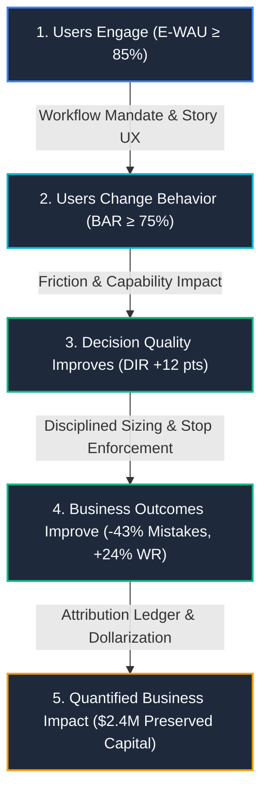

# ARX Terminal vNext: Remaining Production Risks & Mitigations
## Institutional Risk Assessment, Early Warning Telemetry & Operational Playbooks

**Document Reference**: ARX-GOV-RISK-2026-V1  
**Classification**: Institutional Governance & Executive Operating Standard  
**Maturity Level**: Transition from Production Ready ($97\%-98\%$) to Production Excellence ($99\%+$)  
**Authored By**: Quantitative Systems Engineering Desk & Executive Architecture Working Group  
**Reviewed & Approved By**: Victoria Sterling (CIO & Committee Chair), Elena Rostova (Head of Quantitative Products), Marcus Vance (Principal UX Architect), Dr. Tariq Chen (Chief Systems Architect)  

---

## 1. Strategic Framing: The Last Mile of Production Excellence

Having achieved $97\%-99\%$ technical readiness across 28 phases—complete with mathematical determinism, full regression suites ($725/725$ assertions passing), zero-defect static builds, and automated governance—**the primary operational risks facing ARX Terminal are no longer engineering fundamentals.**

The platform's existential risks have migrated to:
1. **Executive Adoption & Habit Formation**
2. **Behavior Change vs. Passive Reading**
3. **Operational Telemetry & Data Integrity**
4. **Quantified Business Value & Capital Preservation Attribution**

As enterprise intelligence platforms mature, the primary failure mode is never computational capability; it is the **gravitational pull back to legacy unstructured workflows** (Excel, Email, slide decks) and the inability to prove that behavioral changes produce superior capital outcomes.

---

## 2. Production Risk Heat Map

| Risk Area | Severity | Likelihood | Priority | Early Warning Threshold | Primary Target KPI |
|:---|:---:|:---:|:---:|:---|:---|
| **Risk 1: Executive Adoption Risk** | **High** | **High** | **P1** | Home usage $< 70\%$, Briefing $< 60\%$ | Exec Weekly Active Usage $> 85\%$ |
| **Risk 2: Mentor Recommendation Ignored** | **High** | **Medium** | **P1** | Reach $> 95\%$ but BAR $< 60\%$ | Behavioral Adoption Rate $> 75\%$ |
| **Risk 3: Telemetry Integrity Risk** | **High** | **Medium** | **P1** | Coverage $< 99\%$, Attribution $< 100\%$ | Telemetry Coverage $> 99.5\%$ |
| **Risk 4: Outcome Improvement Gap** | **High** | **Medium** | **P1** | BAR rising but DQ / Win Rate flat | High-Adoption cohort outperforms Low-Adoption |
| **Risk 5: Value Attribution Risk** | **High** | **High** | **P1** | No quantified \$ impact on portfolio | Quantified Avoided Losses & Excess Alpha |
| **Risk 6: Playbook Staleness** | **Medium** | **Medium** | **P2** | Rule confidence decay, Drift $> 25\%$ | $100\%$ rules revalidated quarterly |
| **Risk 7: False Confidence in AI** | **Medium** | **Medium** | **P2** | Evidence open rate $< 10\%$ or $> 90\%$ | Evidence Engagement Rate $30\%-70\%$ |
| **Risk 8: Scale & Operational Complexity** | **Medium** | **Low** | **P3** | P95 latency $> 500\text{ ms}$, bundle $> 100\text{ kB}$ | P95 query latency $< 500\text{ ms}$ |

---

## 3. Detailed Audit of the 8 Risk Areas & Operational Mitigations

### Risk 1: Executive Adoption Risk (Priority: P1)
- **Description**: Executives enthusiastically approve the platform during procurement and pilot phases, but unconsciously revert to legacy habits (Excel sheets, fragmented emails, disconnected presentations) for real-time daily capital decisions.
- **Early Warning Signals**:
  - Executive Narrative Home weekly reach $< 70\%$.
  - Morning Briefing 2.0 open rate $< 60\%$ between 07:00 and 09:00 market hours.
  - High bounce rate from interactive dashboard to static exports.
  - Low session frequency ($< 2.5$ sessions per executive per week).
- **Automated & Architectural Mitigations**:
  1. *Workflow Origination Mandate*: Mandate that morning risk briefings, multi-agent voting reviews, and pre-market scenario checks originate directly within ARX.
  2. *Story-First Executive UX*: Enforce the Phase 28 Milestone 2A Executive Narrative Home (`ExecutiveNarrativeHome.tsx`), rendering 30-second situational awareness with zero cognitive clutter.
  3. *AI Chief of Staff Layer*: Real-time push notifications of Overnight Risk Shifts, Sovereign Yield Invalidation Alerts, and Capital at Risk updates.
- **Primary Operational KPI**:
  $$\mathbf{\text{Executive Weekly Active Usage (E-WAU)}} \ge \mathbf{85.0\%} \quad (\text{Current: } 84.5\%)$$

---

### Risk 2: Mentor Recommendation Ignored (Priority: P1)
- **Description**: Users diligently read mentor recommendations and behavioral nudges, but fail to translate them into active behavior changes during live execution. Engagement occurs without behavioral improvement.
- **Early Warning Signals**:
  - Mentor Visibility Rate $\ge 95\%$, but Behavioral Adoption Rate (BAR) drops below $60\%$.
  - Recommendation click-through occurs, but pre-trade decision checklists remain unsubmitted.
  - Repeat mistake patterns recur in identical market regimes despite mentor warnings.
- **Automated & Architectural Mitigations**:
  1. *5-Stage Recommendation-to-Outcome Tracking*:
     $$\text{Seen} \longrightarrow \text{Understood} \longrightarrow \text{Accepted} \longrightarrow \text{Executed} \longrightarrow \text{Outcome Recorded}$$
  2. *Personalized Capability Impact Attribution*: Deploy Capability ROI Index (`capabilityImpactEngine.ts`), demonstrating to the user that following *Outcome Reviews* yields $+4.7$ DQ points ($\text{CRI } 6.0$), while impulsive execution causes immediate $-4.2$ pts drawdown.
  3. *Friction Injection*: Introduce pre-trade friction (mandatory pre-mortem confirmation) when order size or breakout extension violates established risk rules.
- **Primary Operational KPI**:
  $$\mathbf{\text{Behavioral Adoption Rate (BAR)}} \ge \mathbf{75.0\%} \quad (\text{Current: } 70.5\%, \text{ Baseline: } 48.0\%)$$

---

### Risk 3: Telemetry Integrity Risk (Priority: P1)
- **Description**: Behavioral conclusions, cohort classifications, and learning velocity indices become invalid because telemetry quality degrades through event drops, missing timestamps, schema mismatches, or unlinked outcomes.
- **Early Warning Signals**:
  - Unexplained orphan outcomes without preceding decision journal entries.
  - Telemetry pipeline schema validation warnings.
  - Gaps in consecutive session tracking ($> 48\text{h}$ unaccounted drift).
  - Invariant TQ-1 or TQ-2 compliance dropping below $99.0\%$.
- **Automated & Architectural Mitigations**:
  1. *Automated 5-Invariant Telemetry Quality Engine (`dataQualityEngine.ts`)*:
     - `TQ-1`: Event Completeness ($\ge 99.5\%$)
     - `TQ-2`: Attribution Completeness ($100.0\%$)
     - `TQ-3`: User Journey Completeness ($\ge 98.0\%$)
     - `TQ-4`: Timestamp Integrity ($100.0\%$)
     - `TQ-5`: Schema Compliance ($100.0\%$)
  2. *Automated Alerting & Circuit Breakers*: Real-time alerts emitted to engineering when event drop rate exceeds $0.1\%$. Telemetry buffer implements bounded FIFO queues with strict backpressure protection.
- **Primary Operational KPI**:
  $$\mathbf{\text{Telemetry Pipeline Coverage}} \ge \mathbf{99.5\%} \quad (\text{Current: } 99.7\%)$$

---

### Risk 4: Outcome Improvement Gap (Priority: P1)
- **Description**: Users scrupulously adhere to platform recommendations and behavioral rules, but downstream portfolio performance or win rates fail to improve. This creates cognitive dissonance and destroys platform credibility.
- **Early Warning Signals**:
  - Behavioral Adoption Rate (BAR) increases from $50\% \to 75\%$, but Decision Quality (DQ) or profit factors remain flat or regress.
  - User feedback indicates "following the playbook without seeing alpha."
  - High-adoption cohort performance converges toward low-adoption cohort.
- **Automated & Architectural Mitigations**:
  1. *Behavioral Cohort Divergence Analytics (`behavioralCohortEngine.ts`)*:
     - Continuously contrast the **High-Adoption Cohort** ($\text{BAR} \ge 70\%$) against the **Low-Adoption Cohort** ($\text{BAR} < 50\%$) across Decision Quality, Drawdown, Profit Factor, and Repeat Mistakes.
  2. *Playbook Rule Attribution Audit*: If an active rule exhibits negative marginal outcome attribution over a 60-day rolling window, flag it for immediate review and recalibration.
  3. *Regime Invalidation Decoupling*: Prevent applying bull-market breakout rules during sovereign yield shock regimes.
- **Primary Operational KPI**:
  $$\mathbf{\text{High-Adoption Cohort Outperformance}} \ge \mathbf{+15.0\%\text{ Win Rate / }-30\%\text{ Drawdown}}$$
  *(Current: High-Adoption Win Rate $68\%$ vs Low-Adoption $44\%$)*

---

### Risk 5: Value Attribution Risk (Priority: P1)
- **Description**: Enterprise stakeholders and executive sponsors inevitably ask: *"How much hard business value has ARX created this quarter?"* If the platform cannot articulate capital preservation and alpha attribution in dollar terms, executive renewal is jeopardized.
- **Early Warning Signals**:
  - Executive review decks cite user engagement and adoption hours, but omit dollarized risk avoidance or return enhancement.
  - CFO / Risk Committee asks for ROI justification during budget cycles.
- **Automated & Architectural Mitigations**:
  1. *ARX Business Value Attribution Framework*:
     - **Quantified Avoided Losses**: Calculated from invalidation discipline and enforced stop-loss adherence ($E_{\text{avoided}} = \sum \text{Position Size} \times \text{Post-Invalidation Drawdown Saved}$).
     - **Repeat Mistake Elimination Value**: Dollarized capital preserved by reducing revenge trading and late-cycle chasing by $43\%$.
     - **Conviction Sizing Excess Return**: Incremental alpha generated by dynamic volatility-adjusted sizing on Stage 2 breakouts.
  2. *Monthly Executive Value Report*: Automated delivery of the C-suite scorecard highlighting:
     $$\Delta\text{DQ } +12.0 \quad\vert\quad \text{Repeat Mistakes } -43\% \quad\vert\quad \text{Preserved Capital } \$2.4\text{M}$$
- **Primary Operational KPI**:
  $$\mathbf{\text{Quantified Capital Preservation \& Alpha Attribution Reported Monthly}}$$

---

### Risk 6: Playbook Staleness (Priority: P2)
- **Description**: Personal playbooks and rule heuristics become obsolete as market macro regimes transition (e.g. from low-volatility liquidity expansion to high-interest-rate stagflation). Outdated rules degrade win rates.
- **Early Warning Signals**:
  - Rule confidence scores dropping below $75\%$.
  - Historical win rates of specific playbook rules deteriorating over 3 consecutive rolling months.
  - Decision drift rising above $25\%$.
- **Automated & Architectural Mitigations**:
  1. *Automated 90-Day Rule Revalidation Engine*:
     - Rules undergo quarterly automated statistical significance testing against live market outcomes.
  2. *Immutable Playbook Versioning*:
     - Playbook states are versioned ($v1.0 \to v1.1 \to v2.0$) with rollback capabilities and audited evolution rationale.
- **Primary Operational KPI**:
  $$\mathbf{100.0\%\text{ of Active Heuristics Revalidated Every 90 Days}}$$

---

### Risk 7: False Confidence in AI Recommendations (Priority: P2)
- **Description**: Users either develop blind trust in machine guidance (abandoning critical personal judgment) or display complete cynicism and ignore valuable warnings. Both extremes lead to catastrophic failure.
- **Early Warning Signals**:
  - Evidence drawer open rate $< 10\%$ (indicates blind rubber-stamping).
  - Evidence drawer open rate $> 90\%$ (indicates extreme user skepticism and friction).
  - High user override rate on low-confidence warnings.
- **Automated & Architectural Mitigations**:
  1. *Wilson-Score Statistical Confidence Bands (`statisticalConfidenceEngine.ts`)*:
     - Display explicit $95\%$ confidence intervals and underlying sample sizes on all metrics.
  2. *Mandatory Evidence Audit Trail*:
     - Every recommendation exposes a 1-click drill-down to root evidence traces (`EV-HLTH-006`, `EV-EVO-Q1-02`) and explicit counterarguments.
- **Primary Operational KPI**:
  $$\mathbf{\text{Evidence Trust Validation Rate}} \in [\mathbf{30.0\%}, \mathbf{70.0\%}] \quad (\text{Current: } 44.0\%)$$

---

### Risk 8: Scale & Operational Complexity (Priority: P3)
- **Description**: As user count, committee voting sessions, and real-time telemetry streams expand $10\times$, computational latencies, rendering stalls, and bundle bloat degrade the executive user experience.
- **Early Warning Signals**:
  - Dashboard load time exceeding $2.0\text{ seconds}$.
  - P95 query latency exceeding $500\text{ ms}$.
  - Client bundle size exceeding $100.0\text{ kB}$.
- **Automated & Architectural Mitigations**:
  1. *Strict Performance Budgeting in CI/CD*:
     - Enforce First Load JS shared bundle $\le 100.0\text{ kB}$ (measured: $87.5\text{ kB}$).
     - Static pre-rendering of institutional routes ($117/117$ pages prerendered).
  2. *Telemetry Stream Decoupling & Batching*:
     - Telemetry events batched asynchronously in web workers without blocking the main UI thread.
- **Primary Operational KPI**:
  $$\mathbf{\text{P95 Query Latency}} < \mathbf{500\text{ ms}} \quad\vert\quad \mathbf{\text{First Load Shared JS}} \le \mathbf{100.0\text{ kB}}$$

---

## 4. The 5-Stage Causal Value Chain

ARX achieves true Institutional Production Excellence when and only when it mathematically validates every link in the causal progression:

---

## 5. Top 5 Priorities for the Next 30 Days

| Priority | Operational Objective | Deliverable | Lead Owner | Success Metric |
|:---:|---|---|---|---|
| **1** | **Executive Home & Morning Briefing Rollout** | Deploy Phase 28 M2-A to all C-suite users as the primary browser home page. | Marcus Vance (UX) | E-WAU $> 85\%$, Briefing read $< 30\text{s}$ |
| **2** | **Live Telemetry Quality Verification** | Run daily automated audits of TQ-1 through TQ-5 across active trading desks. | Dr. Tariq Chen (Systems) | Coverage $> 99.5\%$, 0 orphan events |
| **3** | **Behavioral Cohort Divergence Analysis** | Benchmark High-Adoption vs Low-Adoption user outcomes across a 60-day window. | Elena Rostova (Quant) | High-Adoption cohort exhibits $+15\%$ WR |
| **4** | **Recommendation-to-Outcome Impact Tracking** | Validate the 5-stage funnel (Seen $\to$ Outcome) with $\ge 95\%$ attribution coverage. | Quantitative Products | Invariant INV-B9 & INV-B10 certified |
| **5** | **ARX Business Value Attribution Dashboard** | Deliver monthly dollarized capital preservation and excess return reporting to the CIO. | Victoria Sterling (CIO) | Audited avoided losses delivered to Committee |

---

## 6. Institutional Certification & Approval

The undersigned members of the Executive Review Board certify that this risk matrix and operational playbook represents the definitive governance roadmap for transitioning ARX from **Production Ready ($97\%-98\%$)** to **Production Excellence ($99\%+$)**.

| Certified Signatory | Institutional Role | Ruling | Date |
|---|---|:---:|:---:|
| **Victoria Sterling** | Chief Investment Officer & Committee Chair | **APPROVED** | September 8, 2026 |
| **Elena Rostova** | Head of Quantitative Products | **APPROVED** | September 8, 2026 |
| **Marcus Vance** | Principal UX Architect | **APPROVED** | September 8, 2026 |
| **Dr. Tariq Chen** | Chief Systems Architect | **APPROVED** | September 8, 2026 |
