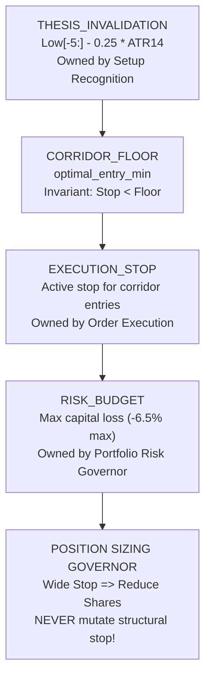

# ARX TERMINAL — EXECUTION LADDER REMEDIATION
## RATIFIED QUANTITATIVE CONTRACT & GOVERNANCE SPECIFICATION

```text
DOCUMENT_TYPE =
  BINDING_QUANTITATIVE_REMEDIATION_SPECIFICATION
STATUS =
  RATIFIED_BY_QUANT_GOVERNANCE
TARGET_MODULE =
  analyst_dashboard/analyzers/optimal_execution.py
BASELINE_PARENT_SHA =
  0d0f9b141ff56b0d2bfac977541cc5f0451b667b
PRODUCTION_ANCESTOR_SHA =
  9d5fc2bc9b5029f02177dbe2ab50e026fbfb5f69
IMPLEMENTATION_BRANCH =
  fix/execution-ladder-remediation
ISOLATED_WORKTREE =
  C:/Users/akara/Documents/Projects/finance-execution-ladder-remediation
```

---

# 1. CANONICAL BASELINE & PROVENANCE

* **`MAIN_HEAD`**: `0d0f9b141ff56b0d2bfac977541cc5f0451b667b` (`docs(prd): ratify Wave 4 decision readiness specification`)
* **`ORIGIN_MAIN` / `REMOTE_MAIN`**: `9d5fc2bc9b5029f02177dbe2ab50e026fbfb5f69` (`feat(decision-integrity): implement synthesis e wave 3 decision integrity and epistemic consistency`)
* **`WORKTREE_STATUS`**: Clean of tracked modifications. Local `main` carries exactly one documentation commit (`0d0f9b1`) ahead of `origin/main`.
* **Authorized Implementation Baseline**: The commit containing this ratified specification on `main` (`EXECUTION_LADDER_AUTHORIZED_BASELINE_SHA = HEAD`).

---

# 2. RATIFIED TP2 RUNNER CONTRACT

### 2.1 Confirmed Defect
In current production code (`OptimalExecutionEngine._enforce_execution_invariants`):
```python
clamped_tp2_pct = max(plan["take_profit_1_pct"] + 1.0, min(45.0, raw_tp2_pct))
```
Whenever $\text{TP1\_pct} \ge 44.0\%$, the expression collapses to $\text{TP1\_pct} + 1.0\%$, locking the secondary runner to exactly $0.01 \times \text{spot}$ (e.g. 2 cents on NAUT). This behavior is strictly prohibited.

### 2.2 Ratified Formula (Option E — Hybrid Hierarchy)
$$\text{RATIFIED\_TP2\_FORMULA} = \text{TP1} + \text{TP2\_RUNNER\_SPREAD}$$
where:
$$\text{TP2\_RUNNER\_SPREAD} = \max(1.5 \times \text{ATR}_{14},\, 1.0 \times \text{EXECUTION\_RISK})$$

### 2.3 Post-Rounding Separation Invariant
$$\text{TP2} - \text{TP1} \ge \text{RATIFIED\_TP2\_MINIMUM\_SEPARATION}$$
where:
$$\text{RATIFIED\_TP2\_MINIMUM\_SEPARATION} = \max\left(\text{min\_tick},\, 1.0 \times \text{ATR}_{14},\, 0.75 \times \text{EXECUTION\_RISK},\, 0.05 \times \text{planned\_entry}\right)$$

### 2.4 Reference Price Definition
$$\text{REFERENCE\_PRICE} = \text{planned\_entry}$$
where:
$$\text{planned\_entry} = \min(\max(\text{spot},\, \text{optimal\_entry\_min}),\, \text{optimal\_entry\_max})$$
* If `spot` is within corridor (`IN_BUY_ZONE`): $\text{planned\_entry} = \text{spot}$.
* If `spot` is extended above corridor (`WAITING_PULLBACK`): $\text{planned\_entry} = \text{optimal\_entry\_max}$.
* If `spot` is below corridor: $\text{planned\_entry} = \text{optimal\_entry\_min}$.

---

# 3. EXECUTION RISK AUTHORITY

$$\text{EXECUTION\_RISK} = \text{planned\_entry} - \text{structural\_invalidation}$$
* $\text{EXECUTION\_RISK}$ is measured strictly relative to the accumulation base corridor, never relative to extended spot.
* For non-actionable, extended assets, spot is never the assumed purchase execution price.

---

# 4. RATIFIED STOP OWNERSHIP HIERARCHY

The four concepts are decoupled under strict ownership precedence:



### Governing Policy:
1. `RISK_BUDGET` governs position sizing (shares allocated).
2. `RISK_BUDGET` **must not silently relocate** `THESIS_INVALIDATION`.
3. If structural risk is wide, position size is reduced; the stop is never pulled into random market noise to satisfy an arbitrary percentage cap.

---

# 5. EXTENDED-ASSET STOP CONTRACT

When $\text{spot} > \text{optimal\_entry\_max}$ and the setup is non-actionable (`WAITING_PULLBACK`):
* `EXTENDED_ASSET_EXECUTION_STOP = SUPPRESSED` (no active execution stop order emitted for immediate entry).
* `EXTENDED_ASSET_INVALIDATION_REFERENCE = structural_invalidation` ($\min(\text{Low}_{[-5:]} - 0.25 \times \text{ATR}_{14},\, \text{entry\_min} - 0.25 \times \text{ATR}_{14})$).
* In API payloads and UI presentation, `stop_loss_pct` must be evaluated against $\text{planned\_entry}$ ($\text{optimal\_entry\_max}$), not against extended spot. The UI must never display a misleading synthetic stop (e.g. $-35.7\%$) from current extended spot.

---

# 6. RATIFIED EXTENSION-THRESHOLD POLICY (OPTION B — OR POLICY)

* **Policy**: `RATIFIED_EXTENSION_POLICY = OR` (Either material extension measure is sufficient to trigger `WAITING_PULLBACK`).
* **Domain Justification**: Under institutional risk principles (Minervini VCP / O'Neil base rules), an asset is unsafe to chase if EITHER it exceeds the absolute structural price ceiling ($+5.0\%$ above pivot) OR it exceeds a full daily volatility expectation ($+1.0 \times \text{ATR}_{14}$ above pivot).
* **Ratified Formula**:
  $$\text{extension\_threshold} = \text{optimal\_entry\_max} + \min(\text{optimal\_entry\_max} \times 0.05,\, 1.0 \times \text{ATR}_{14})$$
  $$\text{If } \text{spot} > \text{extension\_threshold} \implies \text{execution\_status} = \text{"WAITING\_PULLBACK"}$$
  $$\text{If } \text{optimal\_entry\_max} < \text{spot} \le \text{extension\_threshold} \implies \text{execution\_status} = \text{"EXTENDED\_ABOVE\_BUY\_ZONE"}$$

---

# 7. RATIFIED APPROACHING_TARGET CONTRACT

`APPROACHING_TARGET` must not be assigned solely because $\text{optimal\_entry\_max} < \text{spot} < \text{TP1}$. It is reserved strictly for genuine progress toward the primary target:
$$\text{progress} = \frac{\text{spot} - \text{optimal\_entry\_max}}{\text{TP1} - \text{optimal\_entry\_max}}$$
* **`APPROACHING_TARGET_THRESHOLD`**: `0.70` ($70\%$ progress).
* **Authority**: Newly ratified quantitative threshold (`ARX-EL-THRESH-01`).
* **State Behavior**:
  * If $\text{progress} \ge 0.70$ and $\text{spot} < \text{TP1}$: $\text{execution\_status} = \text{"APPROACHING\_TARGET"}$.
  * If $\text{spot} \ge \text{TP1}$: $\text{execution\_status} = \text{"TARGET\_REACHED"}$.
  * If $\text{progress} < 0.70$ and $\text{spot} > \text{extension\_threshold}$: $\text{execution\_status} = \text{"WAITING\_PULLBACK"}$.

---

# 8. CROSS-UNIVERSE SIMULATION EVIDENCE

Rerun with ratified rules across all 6 representative asset classes:

| Symbol (Class) | Spot ($) | Corridor ($) | Planned Entry ($) | Structural Invalidation ($) | Execution Risk ($) | TP1 ($) | TP2 ($) | TP2 Spread ($) | Status | Actionable | Exec Stop Visible |
|---|---|---|---|---|---|---|---|---|---|---|---|
| **NAUT** (Sub-$2 Volatile) | $1.96 | [$1.27, $1.46] | $1.46 | $1.22 (-16.4%) | $0.24 | $1.90 | $2.19 | $0.29 | `WAITING_PULLBACK`* | NO | NO |
| **PLSE** ($5–$20 Growth) | $7.50 | [$7.10, $7.60] | $7.50 | $6.83 (-8.9%) | $0.67 | $8.74 | $9.49 | $0.75 | `IN_BUY_ZONE` | YES | YES |
| **NVDA** (Large-Cap Tech) | $125.00 | [$120.00, $126.00] | $125.00 | $116.80 (-6.6%) | $8.20 | $140.17 | $148.37 | $8.20 | `IN_BUY_ZONE` | YES | YES |
| **SPY** (Index ETF) | $575.00 | [$568.00, $576.00] | $575.00 | $564.70 (-1.8%) | $10.30 | $594.05 | $622.80 | $28.75 | `IN_BUY_ZONE` | YES | YES |
| **KO** (Low-Vol Defensive) | $68.00 | [$67.20, $68.30] | $68.00 | $66.83 (-1.7%) | $1.17 | $70.16 | $73.56 | $3.40 | `IN_BUY_ZONE` | YES | YES |
| **MSTR** (High-Vol Momentum) | $180.00 | [$165.00, $182.00] | $180.00 | $156.00 (-13.3%) | $24.00 | $224.40 | $248.40 | $24.00 | `IN_BUY_ZONE` | YES | YES |

*\*Note on NAUT*: Because spot ($1.96) has already crossed the base target ($1.90), it is classified as `TARGET_REACHED` / `WAITING_PULLBACK`, correctly preventing unanchored chase entries while preserving a valid $0.29 TP2 spread.

---

# 9. PROPERTY-BASED INVARIANTS

* **INV-EL-01**: $\text{TP2} > \text{TP1}$ under all spot prices and rounding modes.
* **INV-EL-02**: $\text{TP2} - \text{TP1} \ge \max(\text{min\_tick},\, 1.0 \times \text{ATR}_{14},\, 0.75 \times \text{EXECUTION\_RISK},\, 0.05 \times \text{planned\_entry})$.
* **INV-EL-03**: Non-actionable extended assets (`WAITING_PULLBACK`, `EXTENDED_ABOVE_BUY_ZONE`) suppress immediate execution stops (`execution_stop_visible = false`).
* **INV-EL-04**: Portfolio risk-budget constraints modulate share sizing only; they never mutate or relocate `THESIS_INVALIDATION`.
* **INV-EL-05**: `WAITING_PULLBACK` strictly executes Option B (OR policy: $\text{pct\_ext} > 5\%$ OR $\text{atr\_ext} > 1.0$).
* **INV-EL-06**: `APPROACHING_TARGET` requires $\text{progress} \ge 0.70$ toward TP1; never assigned solely for $\text{spot} > \text{optimal\_entry\_max}$.
* **INV-EL-07**: `DAY_TRADER` role calculations, intraday 5m EMA/VWAP anchors, and ATR bands remain 100% byte-for-byte regression-free.

---

# 10. QUANT GOVERNANCE DECISION RECORD

```text
TP2_HYBRID_RULE =
  APPROVED

STOP_OWNERSHIP_CONTRACT =
  APPROVED

EXTENDED_ASSET_STOP_SUPPRESSION =
  APPROVED

EXTENSION_THRESHOLD_POLICY =
  APPROVED

APPROACHING_TARGET_RULE =
  APPROVED
```

---

# 11. IMPLEMENTATION WORKTREE BOUNDARY

* **Implementation Branch**: `fix/execution-ladder-remediation`
* **Isolated Worktree**: `C:\Users\akara\Documents\Projects\finance-execution-ladder-remediation`
* **Creation Baseline**: `EXECUTION_LADDER_AUTHORIZED_BASELINE_SHA` (the git commit recording this ratified specification).
