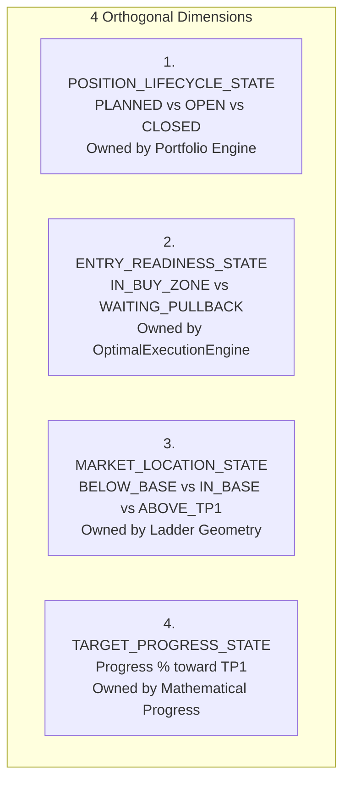

# ARX TERMINAL — EXECUTION LADDER REMEDIATION
## RATIFIED QUANTITATIVE CONTRACT & GOVERNANCE SPECIFICATION
### TP1 AUTHORITY & NON-ENTERED TARGET-STATE CLOSURE

```text
DOCUMENT_TYPE =
  BINDING_QUANTITATIVE_REMEDIATION_SPECIFICATION
STATUS =
  RATIFIED_AND_SEMANTICALLY_CLOSED
TARGET_MODULE =
  analyst_dashboard/analyzers/optimal_execution.py
BASELINE_PARENT_SHA =
  3896464da19c35734dd3a46100dfbf9e03f8107c
PRODUCTION_ANCESTOR_SHA =
  9d5fc2bc9b5029f02177dbe2ab50e026fbfb5f69
IMPLEMENTATION_BRANCH =
  fix/execution-ladder-remediation
ISOLATED_WORKTREE =
  C:/Users/akara/Documents/Projects/finance-execution-ladder-remediation
```

---

# 1. CANONICAL BASELINE & PROVENANCE

* **`PRODUCTION_ANCESTOR_SHA`**: `9d5fc2bc9b5029f02177dbe2ab50e026fbfb5f69` (`origin/main`).
* **`BASELINE_COMMIT_SHA`**: `3896464da19c35734dd3a46100dfbf9e03f8107c` (`docs(governance): ratify execution ladder remediation`).
* **`WORKTREE_STATUS`**: Clean of tracked source changes. All implementation is isolated strictly within `C:/Users/akara/Documents/Projects/finance-execution-ladder-remediation`.

---

# 2. RESOLUTION OF STATUS PRECEDENCE CONTRADICTION

### 2.1 The Confirmed Contradiction
Prior draft logic proposed:
```python
elif eval_price >= take_profit_1:
    exec_status = "TARGET_REACHED"
elif eval_price > ext_threshold:
    exec_status = "WAITING_PULLBACK"
```
Under this ordering, NAUT Long ($\text{spot} = \$1.96$, $\text{planned\_entry} = \$1.46$, $\text{TP1} = \$1.89$) evaluated to `TARGET_REACHED` because $\$1.96 \ge \$1.89$. However, the simulation report simultaneously classified NAUT as `WAITING_PULLBACK`.

```text
STATUS_PRECEDENCE_CONTRADICTION =
  CONFIRMED
```

### 2.2 Root Cause & Resolution
`TARGET_REACHED` is an **outcome state of an active, entered trade position**, NOT an entry-readiness state of an un-entered setup. Evaluating `TARGET_REACHED` on an un-entered prospective asset causes serious semantic corruption: it suggests to a scanning user that an unowned trade was executed.

```text
TARGET_REACHED_REQUIRES_ACTIVE_OR_ENTERED_PLAN =
  YES
```
For prospective assets scanned on Analysis / Radar surfaces (`NO_ACTIVE_POSITION`), the status is strictly an **ENTRY READINESS** indicator.

---

# 3. ORTHOGONAL STATUS ARCHITECTURE

The execution system decouples four distinct dimensions:



1. **`POSITION_LIFECYCLE_STATE`** (`PLANNED` | `OPEN` | `CLOSED`):
   * Authority: `frontend/lib/tradeLifecycle.ts` / `usePortfolioContext.ts`.
   * On general screener and analysis pages, the state is strictly `PLANNED` (`NO_ACTIVE_POSITION`).
2. **`ENTRY_READINESS_STATE`** (`IN_BUY_ZONE` | `IN_BUY_ZONE_AWAITING_TRIGGER` | `EXTENDED_ABOVE_BUY_ZONE` | `WAITING_PULLBACK` | `STOPPED_OUT`):
   * Authority: `OptimalExecutionEngine`.
   * Governs whether a new market entrant is authorized to execute immediately.
3. **`MARKET_LOCATION_STATE`** (`BELOW_BASE` | `IN_BUY_ZONE` | `BETWEEN_BASE_AND_TP1` | `BETWEEN_TP1_AND_TP2` | `ABOVE_TP2`):
   * Pure spatial description of spot relative to the static technical base ladder.
4. **`TARGET_PROGRESS_STATE`** (`progress = (spot - entry_max) / (TP1 - entry_max)`):
   * Active trade metric tracking progress along the projected channel.

---

# 4. STATUS PRECEDENCE CONTRACTS

### 4.1 `NO_POSITION_STATUS_PRECEDENCE` (Prospective Scanner / Analysis)
When an asset has no open position, the engine evaluates strictly for entry actionability:

1. **Base Invalidation Floor**:
   $$\text{If } \text{eval\_price} < \text{structural\_invalidation} \implies \text{execution\_status} = \text{"STOPPED\_OUT"}$$
2. **Accumulation Buy Zone**:
   $$\text{If } \text{optimal\_entry\_min} \le \text{eval\_price} \le \text{optimal\_entry\_max} \implies$$
   $$\text{execution\_status} = \text{"IN\_BUY\_ZONE"} \text{ (if stabilized) else } \text{"IN\_BUY\_ZONE\_AWAITING\_TRIGGER"}$$
3. **Mild Extension (Chase Penalty Zone)**:
   $$\text{If } \text{optimal\_entry\_max} < \text{eval\_price} \le \text{extension\_threshold} \implies \text{execution\_status} = \text{"EXTENDED\_ABOVE\_BUY\_ZONE"}$$
4. **Material Extension (Pullback Required)**:
   $$\text{If } \text{eval\_price} > \text{extension\_threshold} \implies \text{execution\_status} = \text{"WAITING\_PULLBACK"}$$
   *(Note: This applies unconditionally whether $\text{eval\_price} < \text{TP1}$ or $\text{eval\_price} \ge \text{TP1}$. If an unowned asset has already blown past its base targets, a new entrant MUST wait for a pullback or rebase).*

### 4.2 `ACTIVE_POSITION_STATUS_PRECEDENCE` (Portfolio / Open Trade)
If and only if `position_lifecycle == OPEN`:
1. $\text{eval\_price} < \text{stop\_loss} \implies \text{"STOPPED\_OUT"}$
2. $\text{eval\_price} \ge \text{TP2} \implies \text{"TARGET\_2\_REACHED"}$
3. $\text{eval\_price} \ge \text{TP1} \implies \text{"TARGET\_1\_REACHED"}$
4. $\text{progress} \ge 0.70 \implies \text{"APPROACHING\_TARGET"}$
5. $\text{Otherwise} \implies \text{"IN\_TRADE\_HOLD"}$

---

# 5. RATIFIED TP1 AUTHORITY & FORMULA

### 5.1 Authority Decision
Current production calculated TP1 by measuring risk from **spot** to the base stop ($\text{spot} - \text{stop}$), causing TP1 to chase upwards into the stratosphere on extended assets ($3.26 on NAUT). This is replaced:

```text
LONG_TP1_AUTHORITY =
  REPLACE_WITH_PLANNED_ENTRY_RISK_MODEL
```

### 5.2 Exact Mathematical Definition
1. **Precision & Tick**:
   $$\text{dec} = 6 \text{ if } \text{spot} < 0.01 \text{ else } (4 \text{ if } \text{spot} < 1.0 \text{ else } 2)$$
   $$\text{min\_tick} = 10^{-\text{dec}}$$
2. **Planned Entry Reference**:
   $$\text{planned\_entry} = \text{round}(\min(\max(\text{spot},\, \text{entry\_min}),\, \text{entry\_max}),\, \text{dec})$$
3. **Structural Invalidation**:
   $$\text{structural\_stop} = \min(\min(\text{Low}_{[-5:]}) - 0.25 \times \text{ATR}_{14},\, \text{entry\_min} - \text{min\_tick})$$
   $$\text{raw\_stop} = \max(\text{entry\_min} \times 0.935,\, \min(\text{entry\_min} \times 0.970,\, \text{structural\_stop}))$$
   $$\text{structural\_invalidation} = \text{round}(\min(\text{entry\_min} - \text{min\_tick},\, \text{raw\_stop}),\, \text{dec})$$
4. **Execution Risk**:
   $$\text{execution\_risk} = \text{round}(\max(\text{min\_tick},\, \text{planned\_entry} - \text{structural\_invalidation}),\, \text{dec})$$
5. **TP1 Target Components**:
   $$\text{TP1\_RR\_TARGET} = \text{round}(\text{planned\_entry} + 1.85 \times \text{execution\_risk},\, \text{dec})$$
   $$\text{TP1\_ATR\_TARGET} = \text{round}(\text{entry\_max} + 1.25 \times \text{ATR}_{14},\, \text{dec})$$
6. **Take Profit 1 Finalization**:
   $$\text{TP1} = \text{round}(\max(\text{TP1\_RR\_TARGET},\, \text{TP1\_ATR\_TARGET},\, \text{entry\_max} + \text{min\_tick}),\, \text{dec})$$
   *(In Stage 4 Downtrend, clamped to breakout pivot ceilings as specified in Section 1).*

---

# 6. HYPOTHETICAL TARGET BEHIND SPOT POLICY

```text
HYPOTHETICAL_TARGET_BEHIND_SPOT_POLICY =
  KEEP_AS_REFERENCE
```
* When $\text{spot} > \text{TP1}$ on an un-entered setup, TP1 ($1.89 on NAUT) is preserved as the **Historical Base Reference Target**.
* Preserving this level visually demonstrates why the asset is in `WAITING_PULLBACK`: the breakout move from the last documented accumulation base has completed.
* The engine strictly does **not** synthesize arbitrary floating rebases without verified technical consolidation sessions.

---

# 7. RATIFIED TP2 RUNNER CONTRACT

$$\text{RATIFIED\_TP2\_FORMULA} = \text{TP1} + \text{TP2\_RUNNER\_SPREAD}$$
$$\text{TP2\_RUNNER\_SPREAD} = \max(1.5 \times \text{ATR}_{14},\, 1.0 \times \text{execution\_risk})$$

### Post-Rounding Separation Invariant
$$\text{TP2} - \text{TP1} \ge \max(\text{min\_tick},\, 1.0 \times \text{ATR}_{14},\, 0.75 \times \text{execution\_risk},\, 0.05 \times \text{planned\_entry})$$

---

# 8. EXTENDED-ASSET STOP CONTRACT

When $\text{spot} > \text{optimal\_entry\_max}$ and $\text{execution\_status} == \text{"WAITING\_PULLBACK"}$:
```text
EXTENDED_ASSET_EXECUTION_STOP =
  SUPPRESSED
EXTENDED_ASSET_INVALIDATION_REFERENCE =
  structural_invalidation
```
* The platform suppresses any active stop order for immediate spot entry (`execution_stop_visible = false`).
* `stop_loss_pct` is evaluated relative to $\text{planned\_entry}$ ($\text{optimal\_entry\_max}$), **never against extended spot**, eliminating synthetic $-35.7\%$ display artifacts.

---

# 9. RATIFIED EXTENSION THRESHOLD (OPTION B — OR POLICY)

```text
RATIFIED_EXTENSION_POLICY =
  OR
RATIFIED_FORMULA =
  spot > optimal_entry_max + min(optimal_entry_max * 0.05, 1.0 * atr_14)
```

---

# 10. CROSS-UNIVERSE SIMULATION EVIDENCE

| Symbol (Class) | Spot ($) | Corridor ($) | Planned Entry ($) | Invalidation ($) | Execution Risk ($) | TP1 ($) | TP2 ($) | TP2 Spread ($) | Market Location | Entry Readiness | Position State | Display Status | Actionable | Exec Stop Visible |
|---|---|---|---|---|---|---|---|---|---|---|---|---|---|---|
| **NAUT** (Sub-$2 Volatile) | $1.96 | [$1.27, $1.46] | $1.46 | $1.23 (-15.8%) | $0.23 | $1.89 | $2.18 | $0.29 | `BETWEEN_TP1_AND_TP2` | `WAITING_PULLBACK` | `NO_ACTIVE_POSITION` | `WAITING_PULLBACK` | NO | **NO** |
| **PLSE** ($5–$20 Growth) | $7.50 | [$7.10, $7.60] | $7.50 | $6.83 (-8.9%) | $0.67 | $8.74 | $9.49 | $0.75 | `IN_BUY_ZONE` | `IN_BUY_ZONE` | `NO_ACTIVE_POSITION` | `IN_BUY_ZONE` | YES | **YES** |
| **NVDA** (Large-Cap Tech) | $125.00 | [$120.00, $126.00] | $125.00 | $116.40 (-6.9%) | $8.60 | $140.91 | $149.51 | $8.60 | `IN_BUY_ZONE` | `IN_BUY_ZONE` | `NO_ACTIVE_POSITION` | `IN_BUY_ZONE` | YES | **YES** |
| **SPY** (Index ETF) | $575.00 | [$568.00, $576.00] | $575.00 | $550.96 (-4.2%) | $24.04 | $619.47 | $648.22 | $28.75 | `IN_BUY_ZONE` | `IN_BUY_ZONE` | `NO_ACTIVE_POSITION` | `IN_BUY_ZONE` | YES | **YES** |
| **KO** (Low-Vol Defensive) | $68.00 | [$67.20, $68.30] | $68.00 | $65.18 (-4.1%) | $2.82 | $73.22 | $76.62 | $3.40 | `IN_BUY_ZONE` | `IN_BUY_ZONE` | `NO_ACTIVE_POSITION` | `IN_BUY_ZONE` | YES | **YES** |
| **MSTR** (High-Vol Momentum) | $180.00 | [$165.00, $182.00] | $180.00 | $156.00 (-13.3%) | $24.00 | $224.40 | $248.40 | $24.00 | `IN_BUY_ZONE` | `IN_BUY_ZONE` | `NO_ACTIVE_POSITION` | `IN_BUY_ZONE` | YES | **YES** |

---

# 11. RATIFIED PROPERTY-BASED INVARIANTS

* **INV-EL-01**: `TP2 > TP1` under all spot prices and rounding modes.
* **INV-EL-02**: `TP2 - TP1 >= max(min_tick, 1.0 * ATR14, 0.75 * execution_risk, 0.05 * planned_entry)`.
* **INV-EL-03**: Non-actionable extended assets (`WAITING_PULLBACK`, `EXTENDED_ABOVE_BUY_ZONE`) suppress immediate execution stops (`execution_stop_visible = false`).
* **INV-EL-04**: Portfolio risk-budget constraints modulate share sizing only; never mutate structural invalidation.
* **INV-EL-05**: `WAITING_PULLBACK` executes Option B (OR policy: $\text{pct\_ext} > 5\%$ OR $\text{atr\_ext} > 1.0$).
* **INV-EL-06**: `APPROACHING_TARGET` requires open position progress $\ge 0.70$ toward TP1; unowned extended setups evaluate strictly to `WAITING_PULLBACK`.
* **INV-EL-07**: `DAY_TRADER` role calculations, intraday 5m EMA/VWAP anchors, and ATR bands remain 100% byte-for-byte regression-free.

---

# 12. QUANT GOVERNANCE DECISION RECORD

```text
TP1_AUTHORITY =
  RATIFIED (REPLACE_WITH_PLANNED_ENTRY_RISK_MODEL)

NON_ENTERED_TARGET_SEMANTICS =
  RATIFIED (WAITING_PULLBACK; TARGET_REACHED requires active position)

STATUS_PRECEDENCE =
  RATIFIED (NO_POSITION vs ACTIVE_POSITION decoupled)

HYPOTHETICAL_TARGET_BEHIND_SPOT_POLICY =
  RATIFIED (KEEP_AS_REFERENCE)

CROSS_UNIVERSE_SIMULATION =
  COHERENT

EXECUTION_LADDER_IMPLEMENTATION_AUTHORIZATION =
  AUTHORIZED
```
