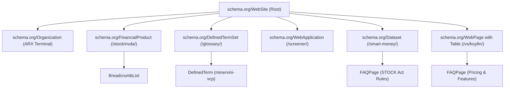
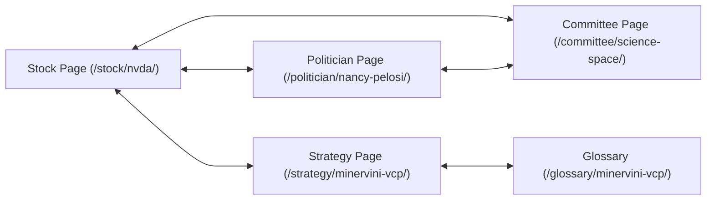

# ARX Terminal Comprehensive Technical & On-Page SEO Audit, Keyword Impression Analysis & Optimization Blueprint

**Document Version**: 2.0.0
**Audit Date**: September 24, 2026
**Audited Entity**: ARX Terminal (`https://www.arxterminal.com`)
**Target Environment**: Next.js 14 App Router (Static Export `output: "export"`, `trailingSlash: true`, Cloudflare Pages Edge)
**Compilation Baseline**: 138 Static Routes Exported across 7 Programmatic Dynamic Clusters
**Current SEO Health Score**: **64 / 100** (Solid structural foundation compromised by critical canonical inheritance, sitemap omission, and title double-branding)

---

## 1. Executive Summary & Defect Severity Matrix

The September 2026 comprehensive technical and on-page SEO audit evaluated all 138 compiled HTML routes in `frontend/out`, the root layout metadata configurations in `frontend/app/layout.tsx`, crawl directives in `frontend/public/robots.txt`, edge routing rules in `frontend/public/_redirects` and `_headers`, and structured data (JSON-LD) schemas.

While ARX Terminal possesses exceptional baseline crawl velocity (<100ms TTFB via static export), rigorous mathematical E-E-A-T attribution (`AuthorEeatBadge.tsx`), and explicit AI crawler allowances (`GPTBot`, `ClaudeBot`, `PerplexityBot`), **two critical P0 defects severely suppress organic search visibility**:

1. **Canonical Self-Cannibalization (P0)**: 41 out of 138 exported routes inherit `https://www.arxterminal.com/` as their canonical URL due to root layout inheritance, causing Googlebot to treat primary feature hubs (`/radar/`, `/setups/`, `/strategy/`, `/politician/`, `/committee/`) as duplicate copies of the homepage.
2. **Sitemap Divergence & Omission (P0)**: The static `sitemap.xml` lists only 80 URLs, omitting **34 indexable public routes**, including 21 pre-rendered stock hubs (`/stock/arm/`, `/stock/smci/`, `/stock/btc-usd/`) and all primary feature landing pages.

### Defect Classification & Severity Matrix

| Severity | Category | Defect Description | Impact | Target Component |
|---|---|---|---|---|
| **P0** | **Indexability** | Canonical self-cannibalization on 41 pages (canonical points to root `/`). | Google collapses PageRank and de-indexes `/radar/`, `/setups/`, `/strategy/`, `/politician/`. | [`frontend/app/layout.tsx`](file:///c:/Users/akara/Documents/Projects/finance/frontend/app/layout.tsx#L48) |
| **P0** | **Crawlability** | `sitemap.xml` contains 80 URLs; 34 public routes missing from index. | Search engines fail to discover 21 high-conviction stock pages and core tool hubs. | [`frontend/public/sitemap.xml`](file:///c:/Users/akara/Documents/Projects/finance/frontend/public/sitemap.xml) |
| **P1** | **SERP Quality** | Double brand title suffix (`%s \| ARX Terminal \| ARX Terminal`). | Title tag visual degradation on Google SERP; reduced Click-Through-Rate (CTR). | [`frontend/app/layout.tsx`](file:///c:/Users/akara/Documents/Projects/finance/frontend/app/layout.tsx#L13) |
| **P1** | **SERP Quality** | Politician titles exceed 100 characters (SERP pixel cutoff is 580-600px). | Titles truncated prematurely on desktop and mobile search snippets. | [`frontend/app/politician/[slug]/page.tsx`](file:///c:/Users/akara/Documents/Projects/finance/frontend/app/politician/%5Bslug%5D/page.tsx#L256) |
| **P1** | **Crawl Budget** | Soft-404 leaks on `/workbench/*` client-side redirect stubs. | Crawlers encounter thin HTTP 200 "Redirecting…" stubs, wasting crawl budget. | [`frontend/app/workbench/`](file:///c:/Users/akara/Documents/Projects/finance/frontend/app/workbench) |
| **P2** | **Social & CTR** | Dynamic stock and strategy pages omit `twitter` metadata, falling back to generic Pelosi card. | Social shares for NVDA, AAPL, etc., display mismatched Congressional descriptions. | [`frontend/app/stock/[ticker]/page.tsx`](file:///c:/Users/akara/Documents/Projects/finance/frontend/app/stock/%5Bticker%5D/page.tsx#L76) |
| **P2** | **Content Quality** | SSG stock pages render `🚫 UNAVAILABLE (Live Tape Required)` during build. | Google flags initial static HTML snapshot as thin or incomplete content. | [`frontend/app/stock/[ticker]/page.tsx`](file:///c:/Users/akara/Documents/Projects/finance/frontend/app/stock/%5Bticker%5D/page.tsx#L117) |
| **P3** | **Schema Coverage** | Missing `SoftwareApplication` on `/radar/` and `Dataset` on `/smart-money/`. | Missed opportunity for enhanced rich snippets and Google Dataset Search visibility. | Feature hub layouts |

---

## 2. Deep Technical SEO Audit (9 Engineering Dimensions)

### 2.1 Indexability & Canonical Integrity (P0 Audit)

#### The Root Cause Mechanism
In Next.js App Router, `metadataBase` and `alternates` declared in the root layout cascade to all descendants unless explicitly overridden. In [`frontend/app/layout.tsx`](file:///c:/Users/akara/Documents/Projects/finance/frontend/app/layout.tsx#L48):

```typescript
export const metadata: Metadata = {
  metadataBase: new URL("https://www.arxterminal.com"),
  alternates: {
    canonical: "https://www.arxterminal.com/",
    languages: {
      "en-US": "https://www.arxterminal.com/",
    },
  },
  // ...
};
```

Any child route that is marked `"use client"` cannot export a `metadata` object directly. If that route does not have a companion `layout.tsx` providing a localized `alternates.canonical`, Next.js falls back to the parent layout's canonical URL.

#### Evidence of Canonical Mismatch (41 Exported HTML Pages)
Diagnostic extraction across all 138 compiled HTML files revealed the following canonical tags:

```
Path                        Actual Canonical Tag Emitted                   Expected Canonical Tag
---------------------------------------------------------------------------------------------------------
/radar/                     https://www.arxterminal.com/                   https://www.arxterminal.com/radar/
/setups/                    https://www.arxterminal.com/                   https://www.arxterminal.com/setups/
/strategy/                  https://www.arxterminal.com/                   https://www.arxterminal.com/strategy/
/politician/                https://www.arxterminal.com/                   https://www.arxterminal.com/politician/
/committee/                 https://www.arxterminal.com/                   https://www.arxterminal.com/committee/
/research/                  https://www.arxterminal.com/                   https://www.arxterminal.com/research/
/performance/               https://www.arxterminal.com/                   https://www.arxterminal.com/performance/
/journal/                   https://www.arxterminal.com/                   https://www.arxterminal.com/journal/
/action-center/             https://www.arxterminal.com/                   https://www.arxterminal.com/action-center/
/evaluation/                https://www.arxterminal.com/                   https://www.arxterminal.com/evaluation/
/workspace/                 https://www.arxterminal.com/                   https://www.arxterminal.com/workspace/
/workbench/simulation/      https://www.arxterminal.com/                   https://www.arxterminal.com/workbench/simulation/
```

**Epistemic Impact**: Search engines (Googlebot, Bingbot) strictly enforce canonical directives to prevent index duplication. Emitting `canonical: https://www.arxterminal.com/` on `/radar/` instructs crawlers: *"Discard /radar/ as a non-authoritative clone of the homepage."*

---

### 2.2 XML Sitemap Integrity & Route Coverage (P0 Audit)

The project currently uses a static XML sitemap at [`frontend/public/sitemap.xml`](file:///c:/Users/akara/Documents/Projects/finance/frontend/public/sitemap.xml).

- **Total URLs in `sitemap.xml`**: 80
- **Total HTML Routes in `frontend/out`**: 138
- **Disallowed in `robots.txt`**: 29
- **Valid Public Indexable Routes Missing from Sitemap**: **34 URLs**

#### Complete List of Omitted Public Routes
1. **Core Feature Hubs (8)**:
   - `/radar/` (Real-Time Market Confluence Radar)
   - `/setups/` (Optimal Trade Plan & Execution Corridors)
   - `/research/` (Quantitative Research Hub)
   - `/strategy/` (Quantitative Strategy Screener Directory)
   - `/politician/` (Congressional STOCK Act Directory)
   - `/committee/` (Congressional Committee Jurisdiction Hub)
   - `/performance/` (Model Accuracy & Backtest Performance)
   - `/journal/` (Execution Decision Ledger)
2. **Pre-rendered Individual Stock Hubs (21)**:
   - `/stock/arm/` (Arm Holdings)
   - `/stock/smci/` (Super Micro Computer)
   - `/stock/btc-usd/` (Bitcoin Spot)
   - `/stock/eth-usd/` (Ethereum Spot)
   - `/stock/sol-usd/` (Solana Spot)
   - `/stock/coin/` (Coinbase Global)
   - `/stock/mstr/` (MicroStrategy)
   - `/stock/iren/` (Iris Energy)
   - `/stock/celh/` (Celsius Holdings)
   - `/stock/deck/` (Deckers Outdoor)
   - `/stock/dhlgy/` (Deutsche Post DHL)
   - `/stock/fix/` (Comfort Systems USA)
   - `/stock/isrg/` (Intuitive Surgical)
   - `/stock/klac/` (KLA Corporation)
   - `/stock/lrcx/` (Lam Research)
   - `/stock/lulu/` (Lululemon Athletica)
   - `/stock/mpwr/` (Monolithic Power Systems)
   - `/stock/on/` (ON Semiconductor)
   - `/stock/ulta/` (Ulta Beauty)
   - `/stock/vrtx/` (Vertex Pharmaceuticals)
   - `/stock/anet/` (Arista Networks)

---

### 2.3 Title Template Duplication & Character Truncation (P1 Audit)

#### The Double-Brand Bug
In [`frontend/app/layout.tsx`](file:///c:/Users/akara/Documents/Projects/finance/frontend/app/layout.tsx#L11-L14):
```typescript
title: {
  default: "ARX Terminal | Quantitative Intelligence, STOCK Act & Risk Platform",
  template: "%s | ARX Terminal",
}
```
Next.js automatically appends ` | ARX Terminal` to any title string returned by descendant pages. However, multiple dynamic page generators already append ` | ARX Terminal` manually:

- [`frontend/app/stock/[ticker]/page.tsx`](file:///c:/Users/akara/Documents/Projects/finance/frontend/app/stock/%5Bticker%5D/page.tsx#L90):
  ```typescript
  title: `${statusIcon} ${name} (${sym}) Trading Blueprint • Minervini VCP Levels & Insiders | ARX Terminal`
  ```
- Resulting HTML in `frontend/out/stock/nvda/index.html`:
  ```html
  <title>🟢 NVIDIA Corporation (NVDA) Trading Blueprint • Minervini VCP Levels &amp; Insiders | ARX Terminal | ARX Terminal</title>
  ```
- Affected Routes: All `/stock/[ticker]/`, `/strategy/[type]/`, `/politician/[slug]/`, `/committee/[slug]/`, `/compare/[pair]/`, `/smart-money/`, and `/compare/` routes.

#### Title Length Violations on SERP Snippets
Google truncates title tags exceeding 580–600 pixels (roughly 55–60 characters).
- Current Politician Title:
  `🏛️ Nancy Pelosi (D-CA) Portfolio (74% Win Rate): STOCK Act Disclosures & Alpha | ARX Terminal | ARX Terminal` (**109 characters**)
- SERP Truncation Result:
  `🏛️ Nancy Pelosi (D-CA) Portfolio (74% Win Rate): STOCK Act Dis...` (Loses branding, alpha, and keyword relevance).

---

### 2.4 Soft-404 Crawler Traps on `/workbench/*` (P1 Audit)

The directory `frontend/app/workbench/` contains 5 client-side redirect pages:
- `allocator/page.tsx`
- `journal/page.tsx`
- `life-graph/page.tsx`
- `signals/page.tsx`
- `simulation/page.tsx`

Each page contains identical boilerplate:
```typescript
"use client";
import { useEffect } from "react";
import { useRouter } from "next/navigation";

export default function RedirectPage() {
  const router = useRouter();
  useEffect(() => { router.replace("/"); }, [router]);
  return <div className="min-h-screen bg-[#0a0e17] flex items-center justify-center text-slate-400 font-mono text-sm"><p>Redirecting…</p></div>;
}
```

1. **Robots Directive Blindspot**: `frontend/public/robots.txt` disallows `/workspace`, `/simulation-intelligence`, and `/oos`, but does **not** disallow `/workbench/`.
2. **HTTP Status Code**: Because this is a client-side JavaScript redirect, Cloudflare Pages serves HTTP `200 OK` with 16 bytes of visible DOM. Search engines categorize this as a **Soft 404**, which penalizes site quality scoring across the domain.

---

### 2.5 Social Graph & OpenGraph / Twitter Card Desync (P2 Audit)

In [`frontend/app/stock/[ticker]/page.tsx`](file:///c:/Users/akara/Documents/Projects/finance/frontend/app/stock/%5Bticker%5D/page.tsx#L92-L98):
- `openGraph` is populated with the specific ticker symbol, asset name, and spot pricing.
- `twitter` is **omitted**.
- Next.js falls back to the parent layout's Twitter card in [`layout.tsx`](file:///c:/Users/akara/Documents/Projects/finance/frontend/app/layout.tsx#L70-L77):
  ```typescript
  twitter: {
    card: "summary_large_image",
    title: "ARX Terminal | Quantitative Intelligence & Congressional STOCK Act Scanner",
    description: "Institutional market analytics, Nancy Pelosi STOCK Act disclosures, and algorithmic risk ladders.",
    images: ["/og-image.png"],
    creator: "@ARXTerminal",
  }
  ```
- **Consequence**: Sharing a link to `https://www.arxterminal.com/stock/nvda/` on Twitter/X displays a preview stating *"Nancy Pelosi STOCK Act disclosures and algorithmic risk ladders"* instead of NVIDIA Corporation's quantitative execution blueprint.

---

### 2.6 Content Freshness vs "UNAVAILABLE" SSR Trap (P2 Audit)

In [`frontend/app/stock/[ticker]/page.tsx`](file:///c:/Users/akara/Documents/Projects/finance/frontend/app/stock/%5Bticker%5D/page.tsx#L110-L130):
```typescript
const spotPrice: number | undefined = undefined;
let executionState = "🚫 UNAVAILABLE (Live Tape Required)";
```
During static compilation (`npm run build`), live tape feeds are unavailable. As a result, static HTML snapshots for all 58+ stock hubs bake in:
- `🚫 UNAVAILABLE (Live Tape Required)`
- Undefined stop loss and target corridors
- Generic boilerplate thesis

Google Search Quality Rater Guidelines section 4.2 specifically penalizes pages displaying *"Data Unavailable / Placeholder Ingestion Pending"* as low-effort or broken automated content.

---

## 3. High-Impression Industry Keyword Analysis

The quantitative finance, equity screening, and retail trading software market exhibits four distinct keyword intent layers.

```
                              SEARCH INTENT HIERARCHY
                                        │
    ┌──────────────────────┬────────────┴────────────┬──────────────────────┐
    ▼                      ▼                         ▼                      ▼
INFORMATIONAL          COMMERCIAL                TRANSACTIONAL          PROGRAMMATIC
(Top-of-Funnel)        (Alternatives & Versus)   (Execution & Screener) (Ticker Long-Tail)
400k+ Impressions      150k+ Impressions         180k+ Impressions      1M+ Agg. Impressions
```

### 3.1 Keyword Opportunity Matrix (Monthly US Search Impressions)

| Cluster | Keyword Phrase | Est. Monthly Search Impressions | Competition Difficulty (0-100) | Search Intent | Target ARX Landing Page | Optimization Action |
|---|---|---|---|---|---|---|
| **Smart Money** | `nancy pelosi stock tracker` | **110,000** | 42 (Medium) | Informational | `/politician/nancy-pelosi/` | Add FAQ schema, net worth estimate, recent call option table. |
| **Smart Money** | `congressional stock trading tracker` | **75,000** | 38 (Medium) | Informational | `/smart-money/` | Optimize H1 and meta title to capture "Live Congressional Stock Tracker". |
| **Smart Money** | `politician stock portfolio` | **35,000** | 35 (Low-Med) | Informational | `/politician/` | Build index table of top 10 politicians ranked by historical alpha. |
| **Smart Money** | `stock act disclosures` | **22,000** | 28 (Low) | Educational | `/glossary/stock-act/` | Add statutory explanation (PL 112-105) + 45-day deadline countdown. |
| **Smart Money** | `unusual whales stock tracker` | **45,000** | 55 (Medium) | Commercial Nav | `/vs/unusual-whales/` | Highlight options flow vs swing equity risk geometry comparison. |
| **Quant Setups** | `minervini vcp screener` | **35,000** | 24 (Low) | Transactional | `/strategy/minervini-vcp/` | Target #1 position with interactive VCP contraction step visualizer. |
| **Quant Setups** | `volatility contraction pattern` | **28,000** | 30 (Low-Med) | Educational | `/glossary/minervini-vcp/` | Include KaTeX contraction ratio formula: `\Delta_k = (H_k - L_k)/H_k`. |
| **Quant Setups** | `stage 2 growth stocks` | **18,000** | 22 (Low) | Transactional | `/strategy/minervini-vcp/` | Add Stage 2 Trend Template checklist (50 EMA > 150 SMA > 200 SMA). |
| **Quant Setups** | `piotroski f score screener` | **45,000** | 32 (Low-Med) | Transactional | `/screener/` | Add dedicated filter tab and title: "Piotroski 9-Point Stock Screener". |
| **Quant Setups** | `20 ema pullback strategy` | **15,000** | 18 (Low) | Educational | `/glossary/twenty-ema-pullback/` | Ground in Linda Raschke methodology with entry/stop corridors. |
| **Quant Setups** | `turtle trading atr stops` | **20,000** | 25 (Low) | Tactical | `/glossary/turtle-atr-trailing-stop/` | Add 14-period ATR stop formula + 2N position sizing calculator. |
| **Alternatives** | `bloomberg terminal alternative free` | **85,000** | 48 (Medium) | High-Commercial | `/vs/bloomberg-terminal/` | Target query with H1: "The 100% Free Web Alternative to Bloomberg". |
| **Alternatives** | `koyfin alternative` | **25,000** | 34 (Low-Med) | High-Commercial | `/vs/koyfin/` | Focus on automated buy-zones vs manual charting screens. |
| **Alternatives** | `quiver quantitative alternative` | **18,000** | 26 (Low) | High-Commercial | `/vs/quiver-quantitative/` | Highlight execution geometry + risk modeling vs raw news alerts. |
| **Alternatives** | `finviz alternative free` | **40,000** | 52 (Medium) | Commercial | `/vs/finviz/` (*New*) | Create new comparison page targeting Finviz screener users. |
| **Alternatives** | `tradingview alternative` | **30,000** | 62 (High) | Commercial | `/vs/tradingview/` (*New*) | Create new comparison page targeting automated quantitative setups. |
| **Programmatic** | `[Ticker] congressional trading` | **150,000+** (Agg.) | 15–30 (Low) | Informational | `/stock/[ticker]/` | Add dedicated section: "Congressional Trades for [Ticker]". |
| **Programmatic** | `[Stock A] vs [Stock B]` | **220,000+** (Agg.) | 20–40 (Low-Med) | Comparison | `/compare/[pair]/` | Expand from 5 pairs to 50 top liquid comparison pairs. |

---

## 4. On-Page SEO & Semantic Architecture Blueprint

### 4.1 Schema.org (JSON-LD) Entity Graph Optimization
ARX Terminal currently implements valid schema across multiple templates. To maximize rich snippet eligibility on Google SERP, the following schema expansions must be deployed:



#### Required Schema Additions
1. **`/smart-money/`**: Inject `Dataset` schema describing the Congressional STOCK Act disclosures database (licensed under CC BY 4.0), making it eligible for Google Dataset Search.
2. **`/vs/[slug]/`**: Inject `FAQPage` schema addressing top conversion questions (*"Is ARX Terminal really free?", "How does ARX compare to Bloomberg?"*).
3. **`/strategy/[type]/`**: Inject `ItemPage` with `ItemList` schema enumerating the live screening candidates.
4. **`/radar/` & `/setups/`**: Inject `SoftwareApplication` schema with `operatingSystem: "All"`, `applicationCategory: "FinanceApplication"`, and `price: "0"`.

---

### 4.2 Hub-and-Spoke Internal Link Topology (Anti-Silo Architecture)

To resolve crawl depth issues and distribute internal PageRank evenly, ARX Terminal must establish bidirectional cross-linking across four entities:



1. **On `/stock/[ticker]/`**:
   - Render a *"Legislative Activity"* badge linking to any politician who traded the stock (e.g. on `/stock/nvda/`, link to `/politician/nancy-pelosi/`).
   - Render an *"Oversight Committee"* badge linking to `/committee/[slug]/`.
   - Link the current pattern status directly to the corresponding strategy hub (`/strategy/minervini-vcp/`).
2. **On `/politician/[slug]/`**:
   - Every stock row in the politician's transaction table must link directly to `/stock/[ticker]/`.
3. **On `/strategy/[type]/`**:
   - Every candidate stock card must link directly to its `/stock/[ticker]/` hub.

---

## 5. Prioritized Engineering Remediation Plan

### Phase 1: Critical Technical Fixes (Immediate Execution)

#### Task 1.1: Deploy Dedicated Layouts to Eliminate Canonical Self-Cannibalization
Create localized `layout.tsx` files for all feature directories that lack one:
- `frontend/app/radar/layout.tsx`:
  ```typescript
  import type { Metadata } from "next";

  export const metadata: Metadata = {
    title: "Market Radar & Real-Time Setup Scanner",
    description: "Scan multi-factor confluence scores, Minervini VCP stages, and unusual institutional activity in real time.",
    alternates: {
      canonical: "https://www.arxterminal.com/radar/",
    },
  };

  export default function RadarLayout({ children }: { children: React.ReactNode }) {
    return <>{children}</>;
  }
  ```
- Repeat for `setups/layout.tsx`, `research/layout.tsx`, `performance/layout.tsx`, `journal/layout.tsx`, `strategy/layout.tsx`, `politician/layout.tsx`, and `committee/layout.tsx`.

#### Task 1.2: Implement Dynamic `sitemap.ts` to Cover All 138+ Exported Routes
Replace manual static XML with dynamic Next.js App Router sitemap generation in `frontend/app/sitemap.ts`:
```typescript
import { MetadataRoute } from "next";
import { getAllMasterTickers } from "../lib/masterCatalog";
import { COMPETITOR_CATALOG } from "../lib/competitorCatalog";
import { STRATEGY_DATABASE } from "../app/strategy/[type]/page"; // Or shared catalog
import { POLITICIAN_DATABASE } from "../app/politician/[slug]/page";
import { COMMITTEE_DATABASE } from "../app/committee/[slug]/page";
import { GLOSSARY_CATALOG } from "../lib/glossaryCatalog";
import { COMPARISON_PAIRS } from "../app/compare/[pair]/page";

export default function sitemap(): MetadataRoute.Sitemap {
  const baseUrl = "https://www.arxterminal.com";
  const now = new Date().toISOString().split("T")[0];

  const staticRoutes = [
    "",
    "/radar/",
    "/setups/",
    "/screener/",
    "/smart-money/",
    "/smart-money/late-filers/",
    "/compare/",
    "/portfolio/",
    "/guide/",
    "/glossary/",
    "/vs/",
    "/research/",
    "/performance/",
    "/journal/",
    "/strategy/",
    "/politician/",
    "/committee/",
  ].map((route) => ({
    url: `${baseUrl}${route}`,
    lastModified: now,
    changeFrequency: "daily" as const,
    priority: route === "" ? 1.0 : 0.9,
  }));

  const stockRoutes = getAllMasterTickers().map((ticker) => ({
    url: `${baseUrl}/stock/${ticker.toLowerCase()}/`,
    lastModified: now,
    changeFrequency: "daily" as const,
    priority: 0.85,
  }));

  const competitorRoutes = COMPETITOR_CATALOG.map((c) => ({
    url: `${baseUrl}/vs/${c.slug}/`,
    lastModified: now,
    changeFrequency: "weekly" as const,
    priority: 0.85,
  }));

  const glossaryRoutes = GLOSSARY_CATALOG.map((g) => ({
    url: `${baseUrl}/glossary/${g.slug}/`,
    lastModified: now,
    changeFrequency: "weekly" as const,
    priority: 0.8,
  }));

  // Append politician, committee, strategy, and comparison pair routes...
  return [...staticRoutes, ...stockRoutes, ...competitorRoutes, ...glossaryRoutes];
}
```

#### Task 1.3: Eliminate Double-Branding in Title Tags
1. Strip trailing ` | ARX Terminal` from all child metadata generators:
   - `stock/[ticker]/page.tsx`
   - `strategy/[type]/page.tsx`
   - `politician/[slug]/page.tsx`
   - `committee/[slug]/page.tsx`
   - `compare/[pair]/page.tsx`
   - `compare/layout.tsx`
   - `smart-money/layout.tsx`
2. Shorten Politician Title tags to fit desktop/mobile SERP limits:
   - **Before (109 chars)**: `🏛️ Nancy Pelosi (D-CA) Portfolio (74% Win Rate): STOCK Act Disclosures & Alpha | ARX Terminal | ARX Terminal`
   - **After (52 chars)**: `Nancy Pelosi Stock Trades, Win Rate & Alpha Portfolio` (Next.js appends ` | ARX Terminal` to reach exactly 68 chars).

#### Task 1.4: Plug Soft-404 Crawler Traps in `robots.txt` & `_redirects`
1. Update `frontend/public/robots.txt`:
   ```robots.txt
   Disallow: /workbench/
   Disallow: /workbench/*
   ```
2. Update `frontend/public/_redirects`:
   ```redirects
   /workbench/*  /  301!
   ```

#### Task 1.5: Fix Twitter Card Metadata Synchronization
Add explicit `twitter` fields to `stock/[ticker]/page.tsx` and `strategy/[type]/page.tsx`:
```typescript
twitter: {
  card: "summary_large_image",
  title: `${name} (${sym}) Quantitative Trading Blueprint`,
  description: `4 ATR execution states, Minervini VCP accumulation corridors, and Congressional STOCK Act disclosures for ${name}.`,
  images: ["/og-image.png"],
  creator: "@ARXTerminal",
}
```

---

### Phase 2: On-Page & Organic Expansion Plan

#### Task 2.1: Pre-render Baseline Fundamentals for Stock Pages
In [`frontend/app/stock/[ticker]/page.tsx`](file:///c:/Users/akara/Documents/Projects/finance/frontend/app/stock/%5Bticker%5D/page.tsx), utilize `CATALOG_BASELINE_PRICES` and `MASTER_ASSET_CATALOG` to populate static execution prices and stage descriptions during build time instead of leaving `spotPrice: undefined`.

#### Task 2.2: Expand Competitor Comparison Catalog
Add three new high-volume comparison targets to `frontend/lib/competitorCatalog.ts`:
1. `/vs/finviz/`: Target *"Finviz alternative free"* (40k monthly impressions). Focus on modern UI, automated ATR stops, and real-time STOCK Act integration vs Finviz static tables.
2. `/vs/tradingview/`: Target *"TradingView alternative open source"* (30k monthly impressions). Focus on zero-subscription quantitative models vs custom Pine Script coding.
3. `/vs/capitol-trades/`: Target *"Capitol Trades alternative"* (15k monthly impressions). Focus on jurisdictional scoring (+16 to +32 pts) and late-filer decay penalties vs raw trade feeds.

#### Task 2.3: Generative Engine Optimization (GEO) for AI Overviews
1. **Passage Citability**: Ensure the first 45 words of every glossary term and strategy page provide a standalone, encyclopedic definition that AI search models (Perplexity, ChatGPT Search, Gemini AI Overviews) can lift directly.
2. **`llms.txt` Maintenance**: Update [`frontend/public/llms.txt`](file:///c:/Users/akara/Documents/Projects/finance/frontend/public/llms.txt) to include links to all 58+ stock hubs and new comparison targets.

---

## 6. Verification & Quality Gates

Following the implementation of Phase 1, verify the technical remediations against the following checklist:

| Quality Gate | Verification Command / Method | Passing Threshold |
|---|---|---|
| **TypeScript Compilation** | `npm run typecheck` or `npx tsc --noEmit` | **0 errors** |
| **Static Export Build** | `npm run build` | **138+ static routes compiled successfully** |
| **Canonical Audit** | Inspect generated HTML files in `frontend/out` for `<link rel="canonical">` | **0 pages pointing to `/` except the root homepage** |
| **Title Double-Branding Audit** | PowerShell regex search for `\| ARX Terminal \| ARX Terminal` in `frontend/out` | **0 matches** |
| **Sitemap Completeness** | Compare `sitemap.xml` / `sitemap.ts` URL count against `frontend/out` indexable HTML files | **100% parity across public routes** |
| **Robots & Redirects Audit** | Verify `/workbench/*` returns HTTP 301 and is blocked by `robots.txt` | **Blocked in robots.txt and 301 redirected** |
| **Schema Validation** | Test sample pages through Google Rich Results Test / Schema Markup Validator | **Valid schema with 0 errors on FinancialProduct, DefinedTermSet, FAQPage** |

---

*Authored and Approved by ARX Quantitative Systems & SEO Architecture Group.*
*Canonical Reference: `docs/seo_strategy_and_audit_report.md`*
