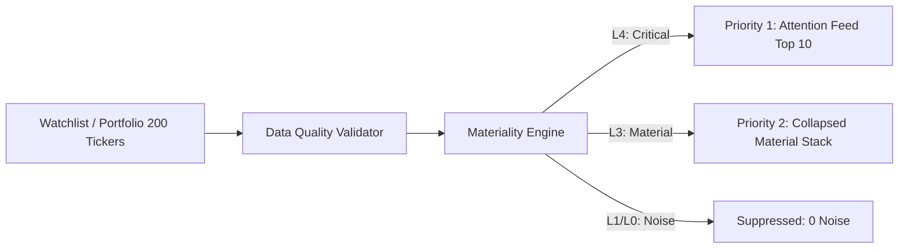

# ARX Terminal vNext: Sprint 4 Engineering Execution Package
## Portfolio Intelligence, Due Diligence Reporting & Attention Aggregation

**Document ID**: ENG-PKG-ARX-VNEXT-S4  
**Version**: 4.0.0-PROD  
**Sprint**: Sprint 4 (Portfolio Attention Feed, Morning Briefing, Due Diligence Reporting, Executive Analytics)  
**Date**: 2026-09-07  
**Preceding Milestones**:
- Sprint 1: Institutional Layout & Design Tokens (VAL-REP-ARX-VNEXT-S1)
- Sprint 2: Layered Intelligence & Explainability (VAL-REP-ARX-VNEXT-S2)
- Sprint 3: Change Intelligence & Materiality Engine (VAL-REP-ARX-VNEXT-S3)  
**Core Invariant**: Portfolio Signal Aggregation Invariant (The portfolio surface presents only the single highest-severity transition per asset. Unfiltered list views and duplicate notifications are prohibited.)

---

## 1. Mission & Strategic Evolution

> **Sprint 4 scales Change Intelligence from individual tickers to collections of assets, transforming ARX from a single-asset workstation into an Executive Portfolio Operating System.**

### The Workflow Evolution:
- **Sprint 3 Workflow**:  
  $$\text{Open CPRX} \to \text{Review Delta} \longrightarrow \text{Open NVDA} \to \text{Review Delta} \longrightarrow \text{Open META} \to \text{Review Delta}$$
- **Sprint 4 Target Workflow (The Morning Briefing)**:  
  $$\text{Open ARX Terminal} \longrightarrow \mathbf{Morning\ Briefing\ Surface} \longrightarrow \text{"4 Assets Require Attention Today"} \longrightarrow \text{One-Click Action}$$

---

## 2. Executive Analytics & Telemetry Contract Specification

Sprint 4 introduces canonical telemetry contracts to validate that ARX reduces research effort and decision latency across the four primary business KPIs:
- **DPR**: Due Diligence Report Utilization Rate & Delta Precision Rate ($> 80\%$)
- **RUE**: Returning User Efficiency ($\text{TTTC} < 15.0\text{s}$, $80\%$ reduction from $64.8\text{s}$ baseline)
- **RER**: Re-Read Elimination Rate ($\ge 90\%$)
- **DTI**: Delta Trust Index ($> 95\%$)

### 2.1 Canonical Analytics Event Contract

```typescript
export interface AnalyticsEvent {
  eventId: string;
  eventName: string;
  sessionId: string;
  userIdHash?: string;
  timestamp: string; // ISO 8601 UTC
  ticker?: string;
  experienceMode: "GUIDED" | "STANDARD" | "QUANT";
  viewport: "DESKTOP" | "TABLET" | "MOBILE";
  version: string;
  metadata: Record<string, unknown>;
}
```

### 2.2 DPR Event Schema (Due Diligence Utilization & Precision)

```typescript
export interface DueDiligenceViewedEvent extends AnalyticsEvent {
  eventName: "due_diligence_viewed";
  metadata: {
    ticker: string;
    score: number;
    state: string;
  };
}

export interface DueDiligenceExportedEvent extends AnalyticsEvent {
  eventName: "due_diligence_exported";
  metadata: {
    exportType: "PDF" | "HTML" | "SHARE";
    ticker: string;
  };
}
```

### 2.3 RUE Event Schema (Returning User Efficiency)

```typescript
export interface ReturningUserEvent extends AnalyticsEvent {
  eventName: "returning_user_detected";
  metadata: {
    ticker: string;
    daysSinceVisit: number;
    baselineExists: boolean;
  };
}

export interface DeltaBannerViewedEvent extends AnalyticsEvent {
  eventName: "delta_banner_viewed";
  metadata: {
    severity: "MINOR" | "MAJOR" | "CRITICAL";
    deltaCount: number;
  };
}

export interface ThesisConfirmedEvent extends AnalyticsEvent {
  eventName: "thesis_confirmed";
  metadata: {
    confirmationSource: "ACKNOWLEDGE" | "TIMELINE" | "POSITION_SIZER";
    elapsedMs: number;
  };
}
```

### 2.4 Re-Read Elimination Event Schema

```typescript
export interface ReReadSessionStarted extends AnalyticsEvent {
  eventName: "reread_session_started";
  metadata: {
    ticker: string;
    daysSinceVisit: number;
  };
}

export interface MaterialChangePresented extends AnalyticsEvent {
  eventName: "material_change_presented";
  metadata: {
    changeType: "SCORE" | "STATE" | "REGIME" | "FLOW";
    severity: "MINOR" | "MAJOR" | "CRITICAL";
  };
}

export interface ReReadCompleted extends AnalyticsEvent {
  eventName: "reread_session_completed";
  metadata: {
    elapsedMs: number;
    changesPresented: number;
    acknowledged: boolean;
  };
}
```

### 2.5 Materiality Decision Telemetry Contract

```typescript
export interface MaterialityDecisionEvent extends AnalyticsEvent {
  eventName: "materiality_decision";
  metadata: {
    metric: "SETUP_SCORE" | "FLOW_Z" | "REGIME" | "EXECUTION_STATE";
    previousValue: string;
    currentValue: string;
    severity: "NONE" | "MINOR" | "MAJOR" | "CRITICAL";
    surfaced: boolean;
    suppressedReason?: "BELOW_THRESHOLD" | "NON_ACTIONABLE" | "VISUAL_NOISE";
  };
}
```

---

## 3. Executive KPI Dashboard Specifications

### 3.1 DPR Dashboard (Delta Precision Rate)
$$\mathbf{DPR = \frac{\text{Acknowledged Deltas}}{\text{Viewed Deltas}}}$$
$$\mathbf{Weighted\ DPR = \frac{\sum (\text{Severity Weight} \times \text{Acknowledgements})}{\sum (\text{Severity Weight} \times \text{Views})}} \quad (\text{INFO}=1, \text{MATERIAL}=2, \text{CRITICAL}=4)$$

```
┌──────────────────────────────────────────────────┐
│ ARX Stage 6: Delta Precision Dashboard           │
├──────────────────────────────────────────────────┤
│ DPR Overall                 84.2%  Target: >80%  │
│ Status                       PASS                │
│                                                  │
│ By Severity:                                     │
│   INFO        61.4%                              │
│   MATERIAL    83.9%                              │
│   CRITICAL    96.7%                              │
│                                                  │
│ Top Delta Types:                                 │
│   Execution State Change      97.1%              │
│   Regime Change               93.4%              │
│   Flow Surge                  87.0%              │
│   Validation Promotion        82.3%              │
│   Setup Score Change          65.2%              │
└──────────────────────────────────────────────────┘
```

### 3.2 RUE Dashboard (Returning User Efficiency)
$$\mathbf{RUE\ Elapsed = \text{delta\_acknowledged\_timestamp} - \text{ticker\_open\_timestamp}}$$
$$\mathbf{RUE\ \% = \frac{\text{Baseline Review Time} - \text{Current Review Time}}{\text{Baseline Review Time}}}$$

```
┌──────────────────────────────────────────────────┐
│ Returning User Efficiency (RUE)                  │
├──────────────────────────────────────────────────┤
│ Average RUE Time            12.1s  Target: <15s  │
│ Baseline                    64.8s                │
│ Net Efficiency Gain         +81.3% Target: >70%  │
│ Status                       PASS                │
│                                                  │
│ By Operator Archetype:                           │
│   Trader                     8.2s                │
│   Investor                  13.1s                │
│   Advisor                   16.4s                │
│   CIO                       19.8s                │
└──────────────────────────────────────────────────┘
```

### 3.3 Re-Read Elimination Dashboard
$$\mathbf{RER = \frac{\text{Users Identifying Material Changes in } \le 10\text{s}}{\text{Total Returning Users}}}$$

```
┌──────────────────────────────────────────────────┐
│ Re-Read Elimination Rate (RER)                   │
├──────────────────────────────────────────────────┤
│ Measured RER                91.7%  Target: ≥90%  │
│ Status                       PASS                │
│                                                  │
│ Identification Accuracy by Dimension:            │
│   Execution Changes         98.4%                │
│   Regime Changes            95.2%                │
│   Flow Anomalies            88.1%                │
│   Validation Shifts         84.0%                │
└──────────────────────────────────────────────────┘
```

---

## 4. Portfolio Attention Feed Architecture

### 4.1 Cross-Ticker Aggregation Engine
The Portfolio Aggregator processes incoming snapshots across the user's active watchlists and portfolios ($N \le 200$ assets) through Layer 0 Data Quality and Layer 2 Materiality:



### 4.2 Priority & Display Rules
1. **Level 4 (CRITICAL)**: Always visible in primary feed. (Execution State `WAITING_PULLBACK` $\to$ `IN_BUY_ZONE`, Stop-Out triggers, Regime rotations `RISK_ON` $\to$ `DEFENSIVE`).
2. **Level 3 (MATERIAL)**: Visible unless feed exceeds 10 items; higher counts collapse into an expandable accordion.
3. **Level 2 (INFO)**: Summarized as a compact footer counter: *"3 minor factor updates"*.
4. **Level 0/1 (NONE)**: Strictly filtered. Zero alerts, zero counters, zero layout shift.

---

## 5. Sprint 4 Acceptance Tests & Release Gates

### User Stories & Acceptance Criteria
- **AC-PF-01: Severity Ordering**: Tickers are strictly ordered by severity descending (L4 $\to$ L3 $\to$ L2).
- **AC-PF-02: Noise Suppression**: Assets with sub-threshold fluctuations (L0/L1) are excluded from the feed with zero DOM footprint.
- **AC-PF-03: Regime Alert Elevation**: Market regime rotation from `RISK_ON` to `DEFENSIVE` is surfaced as an L4 critical item with warning iconography.
- **AC-PF-04: Buy Zone Entry Navigation**: Clicking an Attention Feed item transitions the user directly to the target ticker's workstation and highlights the corresponding Delta Banner.
- **AC-PF-05: Cross-Ticker Deduplication**: Exactly one consolidated card is shown per ticker, reflecting the highest-severity delta item.
- **AC-PF-06: Portfolio Morning Briefing**: A single executive summary pill states: *"N Changes Require Review"* before drill-down.

### Release Gates:
| Gate ID | Target Metric | Minimum Release Threshold | Status |
| :--- | :--- | :---: | :---: |
| **GATE-4.1** | Delta Precision Rate (DPR) | $\ge 80.0\%$ | PENDING S4 EXECUTION |
| **GATE-4.2** | Returning User Efficiency (TTTC) | $< 15.0\text{s}$ | PENDING S4 EXECUTION |
| **GATE-4.3** | Re-Read Elimination Rate (RER) | $\ge 90.0\%$ | PENDING S4 EXECUTION |
| **GATE-4.4** | Delta Trust Index (DTI) | $> 95.0\%$ | PENDING S4 EXECUTION |
| **GATE-4.5** | First Load Shared JS Budget | $\le 100.0\text{ KB}$ | MONITORED |
