# ARX State Transition & Posture State Machine

## 1. Overview

This document specifies the deterministic finite state transitions between `DecisionPosture` states based on market events, data eligibility, and user context changes.

---

## 2. Deterministic State Resolution Precedence Hierarchy

The state engine evaluates conditions in a strict 7-step precedence sequence:

```
1. EVIDENCE ELIGIBILITY GATE
   Is minimum data present for evaluation? If NO → Posture = RESEARCH (Eligibility = INELIGIBLE)

2. DOMAIN-SPECIFIC ASSESSMENTS
   Evaluate Price Trend, Company Health, Smart Money, Macro Regime

3. OVERALL EVIDENCE ASSESSMENT
   Synthesize domain signals → FAVORABLE | MIXED | UNFAVORABLE | INSUFFICIENT_EVIDENCE

4. RISK & SETUP INVALIDATION
   Check if price has breached hard Setup Invalidation Level (e.g. -7% from entry)

5. USER CONTEXT RESOLUTION
   Incorporate Ownership (state + source), Time Horizon, and Intent

6. POSTURE RESOLUTION
   Deterministically resolve Posture: RESEARCH | WATCH | ACQUIRE | HOLD | TRIM | EXIT_REVIEW | AVOID

7. AVAILABLE ACTIONS RESOLUTION
   Determine enabled context-aware CTAs (Set Alert, Calculate Size, Review Invalidation)
```

---

## 3. State Transition Diagram

```mermaid
stateDiagram-v2
    [*] --> RESEARCH: Unheld or researching asset
    
    RESEARCH --> AVOID: Balance sheet leverage > 3.0x OR Heavy Breakdown
    RESEARCH --> WATCH: Fundamentals sound, but price < 50D SMA
    RESEARCH --> ACQUIRE: Fundamentals sound AND Price in Buy Zone (> 50D SMA)
    
    WATCH --> ACQUIRE: Price reclaims 50D SMA with volume confirmation
    WATCH --> AVOID: Fundamental deterioration / breakdown below key floor
    
    ACQUIRE --> HOLD: Position declared/imported (Ownership = OWNED)
    ACQUIRE --> WATCH: Price breaks below buy zone before fill
    
    HOLD --> TRIM: Price exceeds Target 1 (+20%) OR Momentum divergence
    HOLD --> EXIT_REVIEW: Price breaches Setup Invalidation Level (-7%)
    
    TRIM --> HOLD: Position de-risked; pullback finds support at 20 EMA
    TRIM --> EXIT_REVIEW: Continued deterioration through trailing stop
    
    EXIT_REVIEW --> [*]: Position closed / Removed from portfolio
```



---

## 4. Transition Rules & Trigger Table

| Source State | Event / Trigger Condition | Destination State | System Action / Non-Prescriptive UI Label |
| :--- | :--- | :--- | :--- |
| **`RESEARCH`** | ROIC $> 15\%$ & Price $< 50\text{D SMA}$ | **`WATCH`** | Label: *"Wait for Trigger"*. Primary action: `[ Set Alert on 50D SMA ]`. |
| **`RESEARCH`** | ROIC $> 15\%$ & Price in Buy Zone ($> 50\text{D SMA}$) | **`ACQUIRE`** | Label: *"Actionable Setup"*. Primary action: `[ Calculate Position Size ]`. |
| **`WATCH`** | Price crosses above 50D SMA on $+30\%$ RVOL | **`ACQUIRE`** | Notification: *"Setup triggered: Price reclaimed 50D SMA"*. |
| **`ACQUIRE`** | User declares position (`Ownership = OWNED`) | **`HOLD`** | Label: *"Thesis Intact"*; Render position monitor. |
| **`HOLD`** | Price exceeds Take-Profit Target 1 ($+20\%$) | **`TRIM`** | Label: *"Consider Trimming"*. Non-prescriptive profit review. |
| **`HOLD`** | Price closes below Setup Invalidation Level ($-7\%$) | **`EXIT_REVIEW`** | Label: *"Thesis Needs Review"*. Primary action: `[ Review Invalidation Criteria ]`. |
| **`ANY`** | Key domain observations missing / incomplete | **`RESEARCH`** | Label: *"Assessment Unavailable — Data Incomplete"*. |
