# ARX State Transition & Posture State Machine

## 1. Overview

This document specifies the deterministic finite state transitions between `DecisionPosture` states based on market events and user context changes.

---

## 2. State Transition Diagram

```mermaid
stateDiagram-v2
    [*] --> RESEARCH: User discovers or searches unheld asset
    
    RESEARCH --> AVOID: Balance sheet leverage > 3.0x OR Negative Regime
    RESEARCH --> WATCH: Fundamentals sound, but price < 50D SMA
    RESEARCH --> ACQUIRE: Fundamentals sound AND Price in Buy Zone (> 50D SMA)
    
    WATCH --> ACQUIRE: Price reclaims 50D SMA with RVOL > 1.3x
    WATCH --> AVOID: Fundamental deterioration / breakdown below key floor
    
    ACQUIRE --> HOLD: Position established in portfolio (Ownership = OWNED)
    ACQUIRE --> WATCH: Price breaks below buy zone before fill
    
    HOLD --> TRIM: Price exceeds Target 1 (+20%) OR Momentum divergence
    HOLD --> EXIT_REVIEW: Price breaches hard Invalidation Level (-7%)
    
    TRIM --> HOLD: Position de-risked; pullback finds support at 20 EMA
    TRIM --> EXIT_REVIEW: Continued deterioration through trailing stop
    
    EXIT_REVIEW --> [*]: Position closed / Removed from portfolio
```

---

## 3. Transition Rules & Trigger Table

| Source State | Event / Trigger Condition | Destination State | System Action / UI Notification |
| :--- | :--- | :--- | :--- |
| **`RESEARCH`** | ROIC $> 15\%$ & Price $< 50\text{D SMA}$ | **`WATCH`** | Label: *"Wait for Trigger"*. Primary action: Set Alert on 50D SMA. |
| **`RESEARCH`** | ROIC $> 15\%$ & Price in Buy Zone ($> 50\text{D SMA}$) | **`ACQUIRE`** | Label: *"Actionable Setup"*. Primary action: Open Position Sizer. |
| **`WATCH`** | Price crosses above 50D SMA on $+30\%$ RVOL | **`ACQUIRE`** | Trigger Push/In-App Alert: *"Setup triggered: Price reclaimed 50D SMA"*. |
| **`ACQUIRE`** | User adds shares to portfolio (`Ownership = OWNED`) | **`HOLD`** | Transform terminal to *"Thesis Intact"*; Render position P&L tracker. |
| **`HOLD`** | Price exceeds Take-Profit Target 1 ($+20\%$) | **`TRIM`** | Label: *"Consider Trimming"*. Suggest securing $25\%-50\%$ partial gains. |
| **`HOLD`** | Price closes below Invalidation Stop Floor ($-7\%$) | **`EXIT_REVIEW`** | Label: *"Thesis Needs Review"*. Alert user that original setup is invalidated. |
| **`ANY`** | Financial filings missing / Volume $< 50\text{k shares}$ | **`INSUFFICIENT`** | Disable posture rating; display missing data transparency notice. |
